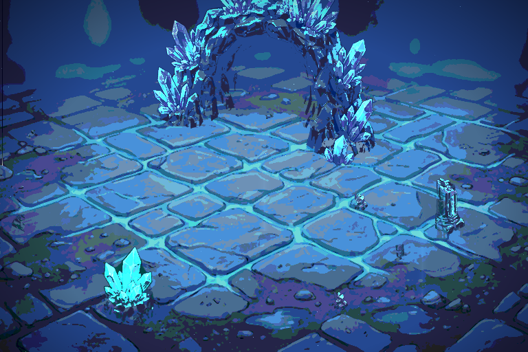

# Carte d'entrée — grotte de cristal, décor en calques

Une **carte de décor** à la manière des fonds de sol de PMD : pas un donjon en
tuiles, mais une scène peinte, livrée en **huit calques indépendants**.



| Dossier | Contenu |
|---|---|
| `calques/` | un PNG par couche, plus `compose.png` et `lueurs_dpla.json` |
| `aseprite/` | `carte_entree.aseprite` — groupes, fusions, 12 images, tag |
| `tiled/` | `carte_entree.tmx` — un `imagelayer` par couche |
| `apercus/` | `carte_entree.gif` |
| `sources_ia/` | les quatre planches peintes |

Format 768 × 512, sur la grille 8 px du projet.

## Chaque couche est dessinée séparément

C'est le point qui change tout. Découper une image unique après coup ne donne
jamais de vrais calques : les objets restent collés au fond, on ne peut ni
déplacer l'arche ni retirer un rocher. Les couches sont donc **produites
séparément** :

* `01_fond.png` — le vide de la caverne, en pleine page ;
* `02_sol.png` — le dallage, en pleine page ;
* `03_structure.png` — l'arche seule, **sur fond noir** ;
* `04_objets.png` — six accessoires isolés, **sur fond noir**.

Les deux dernières sont détourées par seuil de luminance, puis débarrassées de
leurs pixels isolés — les résidus de fond que laisse un détourage brut.

## Les huit calques

| Calque | Rôle | Fusion |
|---|---|---|
| `00_fond` | vide de la caverne, silhouettes lointaines | normal |
| `01_sol` | dallage, alpha dégradé sur la ligne d'horizon | normal |
| `02_structure` | l'arche de cristal, pied posé sur l'horizon | normal |
| `03_objets` | accessoires, triés par profondeur | normal |
| `04_lueurs` | pixels de cristal, **animés en DPLA** | **Addition** |
| `05_lumiere` | puits de lumière | **Addition** |
| `06_particules` | poussière en dérive | **Addition** |
| `07_bordure_avant` | vignette | **Multiply** |

## Ce que le montage fait tout seul

* **Le sol s'arrête à l'horizon.** Son alpha est dégradé sur 26 px, sinon la
  coupure entre le fond et le dallage est une ligne franche très visible.
* **L'arche est posée pied sur l'horizon**, pas suspendue. Un premier montage
  la centrait sur la ligne et elle flottait.
* **Les objets respectent un écart minimal** et laissent le passage central
  dégagé. Sans contrainte de distance ils s'entassaient d'un côté en se
  chevauchant. Ils sont aussi triés par profondeur — les plus bas devant — et
  grandissent légèrement à mesure qu'ils se rapprochent.
* **Les lueurs sont extraites, pas redessinées** : les pixels franchement cyan
  et clairs de la structure et des objets forment le calque `04_lueurs`, qui
  est ensuite animé.

## L'animation

Les cristaux vibrent par **substitution de palette**, au format DPLA, sur la
palette 11 — celle que le jeu réserve aux lueurs. Le paramètre `depuis=3`
laisse fixes les trois premiers crans de la rampe : la pierre ne bouge pas,
seul l'éclat vit. `calques/lueurs_dpla.json` donne la table complète.

## Un essai revenu en arrière

J'ai tenté de réduire le sol à 18 couleurs avec un médian plus large, pour
éliminer un moucheté vert et magenta. Le résultat était pire : les dalles
partaient en taches et la pierre ne se lisait plus. Le sol garde donc une
palette large, et le commentaire est resté dans le code pour éviter de refaire
l'essai.

## Régénérer

```bash
python3 outils/composer_carte.py 3      # 3 est la graine de placement
```

Chaque graine redistribue les accessoires sans retoucher le décor.

## Limites

* Une seule entrée pour l'instant. La chaîne est paramétrée par quatre
  planches : en produire quatre autres suffit pour une entrée de forêt, de
  volcan ou de ruines.
* Le `.tmx` utilise des `imagelayer`, pas des tuiles : c'est le bon choix pour
  un décor peint, mais il ne se découpe pas en tileset.
