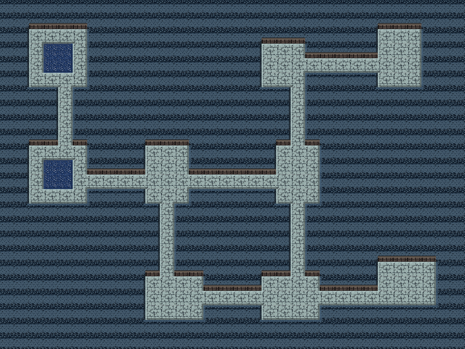

# Donjon EoS — un étage construit intégralement, méthode Chunsoft

Aucun pixel ni aucune carte du jeu n'est repris ici. L'étage est produit de
bout en bout, mais **selon la méthode d'*Explorers of Sky***, en respectant son
format de jeu de tuiles et son autotuilage.



| Dossier | Contenu |
|---|---|
| `tileset/` | `tileset_0.png` à `tileset_4.png`, `tileset.dtef.xml`, `eau_dpla.json` |
| `calques/` | `00_mur`, `01_sol`, `02_eau`, plus `compose.png` |
| `tiled/` | `donjon_eos.tsx` et `etage.tmx` |
| `aseprite/` | `etage.aseprite`, trois calques, douze images, tag `eau` |
| `apercus/` | `etage.gif` |
| `sources_ia/` | les quatre textures de base |

## Le format DTEF, respecté

Un jeu de tuiles de donjon PMD décrit **trois types de terrain** — mur,
secondaire, sol, dans cet ordre — et, pour chacun, la façon dont une tuile se
raccorde à ses huit voisines. Cela fait 256 configurations, que le format
réduit à **47 règles de base** ; les 209 autres s'y ramènent.

La réduction est exacte et tient en une phrase : **un bit diagonal ne compte
que si les deux bits cardinaux qui l'encadrent sont posés**. Un coin nord-ouest
n'existe que si le nord *et* l'ouest sont du même type.

La table des 47 règles n'est pas devinée : elle est extraite de
`skytemple_dtef/rules.py` et enregistrée dans `outils/regles_47.json`. La
planche l'ordonne en 6 × 8, avec l'emplacement vide que le format prévoit — il
est visible dans chaque section.

Les fichiers `tileset_1` à `tileset_4` sont des **variantes**, elles aussi
prévues par le format. Sans elles la masse de mur se répète en bandes très
visibles.

## Les 47 tuiles ne sont pas dessinées à la main

Elles sont **construites** à partir de quatre textures de base produites au
générateur d'image : dalle de sol, dessus de roche, surface d'eau, face de
falaise. Pour chaque règle, le corps est posé, puis :

* chaque côté dont le voisin est d'un autre type reçoit un liseré — clair au
  nord et à l'ouest, sombre au sud et à l'est, la lumière venant d'en haut à
  gauche ;
* chaque coin diagonal manquant alors que ses deux cardinaux sont présents
  reçoit une **encoche rentrante** ;
* un bord sud ouvert reçoit en plus une **face verticale**. C'est ce seul
  détail qui donne aux murs leur relief dans les donjons ; sans lui la carte
  est parfaitement plate.

## L'étage, généré comme dans la série

La grille est découpée en cellules ; certaines reçoivent une salle
rectangulaire, les autres restent pleines. Les cellules voisines sont ensuite
cousues par des couloirs d'une case, en L, avec une liaison supplémentaire
tirée au sort pour éviter qu'un étage ne soit un simple arbre. Des nappes d'eau
sont creusées au cœur de certaines salles.

C'est la structure des donjons de la série : des salles reliées par des
corridors, sur une grille de cellules.

Chaque case calcule ensuite la configuration de ses huit voisines, la réduit à
sa règle de base, et y lit sa tuile.

## L'eau

Animée par **substitution de palette**, au format DPLA. Le fichier
`tileset.dtef.xml` porte le nœud `<Animation palette="10">` avec ses images de
16 couleurs et la durée de chaque couleur, exactement comme la spécification
le demande. `tileset/eau_dpla.json` donne la même table sous forme lisible.

## Régénérer

```bash
python3 outils/generer_donjon.py 7      # 7 est la graine
```

Chaque graine donne un étage différent avec le même jeu de tuiles.

## Limites

* Les couloirs sont en L, sans les boucles ni les salles pièges des étages
  avancés du jeu.
* Le type secondaire n'est ici que de l'eau ; le format en accepte un seul par
  jeu de tuiles, donc une variante lave demande un second jeu.
* La texture de roche a des strates horizontales qui se remarquent encore un
  peu malgré les cinq variantes.

## Crédits

Le format DTEF et la table des 47 règles viennent de
[SkyTemple](https://github.com/SkyTemple/skytemple-dtef) (GPLv3). Les textures,
la construction des tuiles, la génération d'étage et l'animation sont une
création originale de ce dépôt. *Pokémon Mystery Dungeon* appartient à Spike
Chunsoft, The Pokémon Company et Nintendo.
