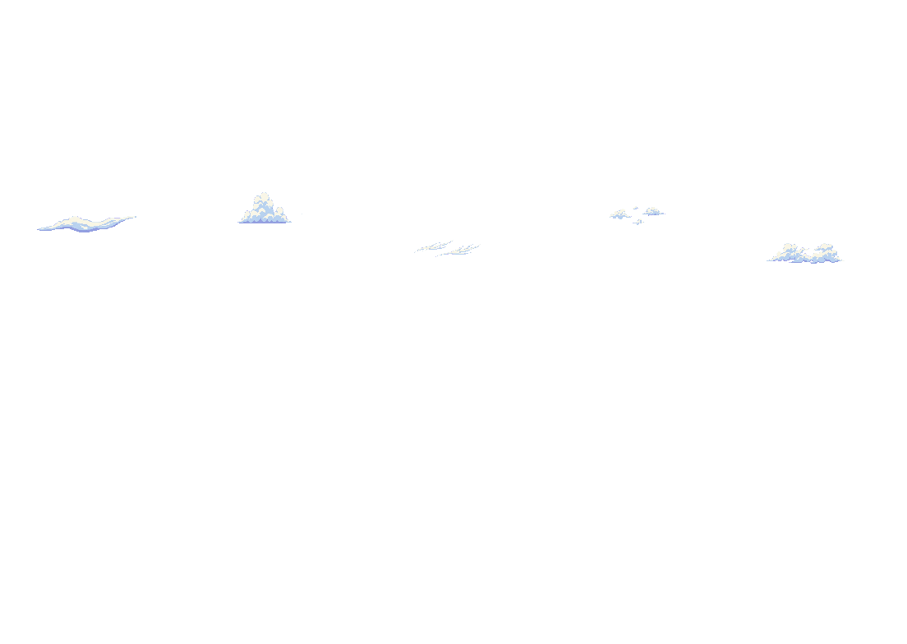

# cliffnordouesttest1 — overlay de nuages uniquement

**Livraison partielle : nuages préparés et ajoutés au Ground racine ; mer NON modifiée.**

## Fichiers à installer ensemble

Le dossier [`a_copier/`](a_copier/) contient exactement trois ressources à fusionner dans votre mod, PMDO fermé et après sauvegarde :

1. [`Data/Ground/cliffnordouesttest1.rsground`](a_copier/Data/Ground/cliffnordouesttest1.rsground) — identique au [Ground racine](../../cliffnordouesttest1.rsground).
2. [`Content/BG/CLIFFNW_NATIVE_CLOUD_OVERLAY.dir`](a_copier/Content/BG/CLIFFNW_NATIVE_CLOUD_OVERLAY.dir) — texture native de l’overlay.
3. [`Data/MapStatus/cliffnw_native_cloud_overlay.json`](a_copier/Data/MapStatus/cliffnw_native_cloud_overlay.json) — statut purement visuel, masqué et sans événement de gameplay.

**Ne pas copier seulement le `.rsground` sans ses deux nouvelles dépendances.** Ne pas remplacer les dossiers entiers : conserver vos banques et scripts existants. Réindexer les MapStatus du mod si nécessaire, puis quitter/rentrer dans le Ground en jeu. Le statut est démarré à l’initialisation du Ground ; sa lecture animée dans la seule vue éditeur n’est pas certifiée.

### Ce qui change

Une seule entrée JSON est ajoutée : `Object.Status.cliffnw_native_cloud_overlay`.

- `OverlayEmitter` natif, **DrawLayer.Top** : dessin au-dessus des calques, pas un `MapBG` caché sous un ciel opaque.
- **Six familles Guilde/Sharpedo validées**, pixels natifs sans redimensionnement, placées dans le bandeau de ciel existant ày208.
- Mouvement horizontal **−4px/s**, wrap1440px, cycle360s.
- Texture1440×784, transparente en dehors des nuages ; répétition verticale native de784px, sans doublon dans l’emprise de cette carte.

Les **quatre calques, toutes les références de tuiles, toutes les listes de frames et cadences existantes, collisions, entités, décorations, fond, musique, caméra et métadonnées restent strictement identiques**. Tous les octets extérieurs à `Status` sont conservés, y compris BOM et fins de ligneCRLF.

### Original conservé

[Original exact au commit aac14ae4](https://github.com/meromoonmeri/guilde-treehouse-pmd/blob/aac14ae4/cliffnordouesttest1.rsground). Son SHA-256 et celui du patch sont dans [`audit.json`](audit.json). Le script de construction refuse d’écraser des modifications indépendantes.

## Mer — blocage explicite

Le `.rsground` ne contient pas les images de ses tuiles. Les banques personnalisées suivantes ne sont pas présentes dans ce checkout ni retrouvées dans les arbres de dépôts examinés :

- **`v2_promontoire_jour_03.tile`**
- `terrain.tile`
- `terrain (2).tile`
- `terrain (3).tile`
- `terrain (4).tile`

Il faut fournir ces fichiers depuis **`Content/Tile/`**, idéalement avec le dossier de textures complet. Un nom de calque/banque ne suffit pas pour identifier la mer, ses limites ou une cadence native. Aucune eau supposée, aucune recoloration ni aucun remplacement de ces textures n’a été appliqué. Les tuiles `Metano_Town_Animation_Tileset` repérées sont une cascade, pas une preuve de mer ; elles restent également inchangées.

## Aperçu de l’effet seul

[PNG transparent complet](png/CLIFFNW_NATIVE_CLOUD_OVERLAY.png) · [Extrait animé8s, une lecture](png/NUAGES_overlay_extrait_8s.webp)

Il ne s’agit **pas d’un rendu complet du Ground** : ses banques manquantes ne sont pas remplacées par des images inventées. L’extrait court ne simule pas une fausse boucle de8s ; le vrai wrap dure360s.

## Validation et limites

- **14contrôles de préservation PASS** : diff structurel, octets hors `Status`, collisions/calques intacts, binaireBG prémultiplié, ressources cohérentes.
- **13contrôles natifs PASS dans le vrai PMDO0.8.12** : chargement du Ground138×98, quatre calques, statut, typeOverlayEmitter, vitesse, coucheTop et définitionMapStatusData. Installation de test jetable, fichiers restaurés après test.
- **Pas de rendu GPU, de lecture animée en jeu ou de chargement des banques absentes validé.** Le chargement natif sans affichage ne prouve pas ces points.

[Tests et méthode](../../source/cliffnordouesttest1_animation_v1/README.md) · [Résultats natifs](../../source/cliffnordouesttest1_animation_v1/runtime_results.tsv) · [Audit détaillé](audit.json).
