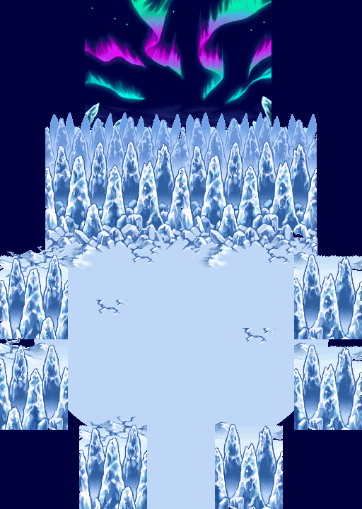

# Layout V1 — aurores natives reconstituées, port RGB8

**[Atelier interactif](review/index.html)** · **[Animation WebP complète](review/scene.webp)** · **[Fond seul](review/background.webp)** · **[Les deux dessins natifs](review/native_pair.png)**



## Périmètre

Cible retenue : **`exports/ice_arena_aurora_v1`, 512 × 720 px**, avec le fond d’aurore de 264 × 216 px en **(120, 0)**. Ce n’est pas la V1 Sky Peak de 960 × 720 px, qui n’avait pas d’aurore.

- **Aucun déplacement, redessin ou redimensionnement du terrain.** Les huit anciens PNG statiques sont copiés à l’identique sous de nouveaux noms ; les cinq calques de terrain/avant-plan restent inchangés dans toutes les phases.
- Les anciens fichiers, animations, Grounds et livraisons V1/V2/V3 sont conservés. Aucun changement à `cliffnordouesttest1.rsground`.
- Remplacement de l’ondulation par colonnes et du scintillement inventé par les **deux dessins natifs et leur commande de fondu d’origine**.
- Pas de génération d’image, de palette cyclique inventée, de translation, de rotation, de déformation ni de wrap de l’aurore.
- Cette livraison ne recertifie pas le terrain V1 comme une carte jouable : c’est une **animation de fond et son port d’assets PMDO**, pas un nouveau Ground avec collisions.

## Ce qui a été retrouvé

Source figée : [`pret/pmd-sky@a3d641227a8e61c887987f17a3d0b7fad6d8f671`](https://github.com/pret/pmd-sky/tree/a3d641227a8e61c887987f17a3d0b7fad6d8f671).

`files/MAP_BG/v38p05a.bma`, `.bpc`, `.bpl` contiennent **deux plans opaques**. Le plan supérieur BPC0 correspond **pixel pour pixel, en RGBA, à `aurorepmdsky.png`**. L’autre plan contient une seconde forme native de l’aurore. Pas de BPA et pas d’animation de palette BPL.

Le script EU `SCRIPT/D52P32A/n09a1207.ssb`, routine 2, contient :

```text
4492  back2_SetEffect(5, 120)
4495  Wait(120)
4497  back2_SetEffect(3, 120)
4500  Wait(120)
4502  Jump(4492)
```

Le moteur relie ces commandes à deux sens de fondu entre BG2 et BG3, **pas à une ondulation géométrique**. Le changement de silhouette et de couleur vient de la superposition progressive des deux vrais dessins.

**240 ticks par boucle**, soit **4 secondes à 60 ticks/s dans ce port PMDO**. Cette durée est une conversion nominale des ticks, pas une mesure d’affichage sur console. L’origine choisie pour la boucle est l’extrémité du fondu entrant : ce n’est pas un horodatage revendiqué de la cinématique.

Le calcul natif utilise des valeurs complémentaires sur 128, puis quantifie séparément les deux coefficients sur 16. Leur somme peut valoir **15 ou 16** : une légère modulation de luminosité appartient à ce calcul et n’a pas été « corrigée » par une normalisation inventée. Il y a **33 couples de coefficients distincts**, pas 33 images à jouer avec une durée uniforme.

## Canonicité : distinction importante

| Élément | Statut |
|---|---|
| Dessins et palettes BPC/BPL | Sources natives figées ; plan supérieur égal à la référence fournie |
| Commandes, sens, durée et coefficients de fondu | Reconstitués depuis le script et le code du moteur |
| PNG des deux plans bruts | RGB8 BPL conservés, aucun changement géométrique |
| Phases destinées à PMDO | **Transposition RGB8** : `floor((BG2 × EVA + BG3 × EVB) / 16)` |
| Rendu de l’écran DS | **Non certifié pixel-perfect** : pas d’émulation RGB555/LCD, pas de capture de jeu |
| Découpage ciel/aurores/étoiles/brume/glace | Masques éditoriaux ; recomposition exacte des phases du port, pas cinq plans natifs retrouvés |
| Rendu GPU PMDO / caméra / parallax / collisions | **Non testé en jeu** |

Le port conserve exactement les couleurs BPL des deux extrémités. Il ne simule pas la conversion des palettes RGB8 vers le framebuffer RGB555 de la DS. **« Mécanisme natif retrouvé et transposé » n’est donc pas une certification de captures officielles à l’octet près.**

Les anciens scintillements d’étoiles ne sont pas conservés : les étoiles suivent désormais les deux dessins et le fondu natifs. Si un ruban recouvre une étoile dans l’autre dessin, cette zone de transition reste dans le calque `Ribbons` ; aucun ciel caché ou nouvel astre n’a été inventé.

## Fichiers et calques

- [`native_layers/`](native_layers/) : les deux vrais plans, `BG2_Upper` et `BG3_Lower`, sans retouche.
- [`frames/BGComposite/`](frames/BGComposite/) : 33 états du fond complet.
- Effets séparés : [`Ribbons`](frames/Ribbons/), [`Stars`](frames/Stars/), [`Sky`](frames/Sky/), [`Haze`](frames/Haze/), [`DistantIce`](frames/DistantIce/).
- Chaque dossier contient **33 PNG individuels**, nommés avec leurs coefficients `aXX_bYY`. Les calques hors `Sky` sont transparents sur le ciel uni ; celui-ci n’est pas collé dans le détourage des rubans.
- [`static/`](static/) : huit copies byte-identiques des calques V1, avec préfixe inédit `IceAuroraNativeV2`.
- [`timeline.json`](timeline.json) : correspondance exacte **tick → état**, coefficients et durées d’aperçu.
- [`preserved_v1_layers.json`](preserved_v1_layers.json) : correspondance des anciens/nouveaux noms et SHA256.
- [`review/scene_upper.png`](review/scene_upper.png) et [`scene_lower.png`](review/scene_lower.png) : les deux extrémités dans le même layout.

Dans le rendu, le fond natif complet remplace les anciennes aurores, étoiles, brume et glace lointaine. Les anciens calques statiques **02/03 sont archivés à l’identique mais ne doivent pas être redessinés par-dessus**, puisque leur contenu est déjà inclus dans les composants natifs. Les calques de terrain **04 à 08** restent au-dessus.

Les masques réutilisent la découpe de glace lointaine V1 et classent les petites composantes natives du ciel comme étoiles. Ce sont des découpes de pixels visibles, sans reconstruction de surfaces cachées. Tous les plans se recomposent exactement en fond complet pour chaque état.

## Import PMDO 0.8.12 — choisir une seule option

Les fichiers sont dans [`pmdo/Content/BG/`](pmdo/Content/BG/) ; leurs noms n’existent dans aucune ancienne livraison.

**Option simple, recommandée :** copier uniquement `IceAuroraNativeV2_BGComposite.dir` dans le `Content/BG/` du mod de travail et utiliser le MapBG décrit dans [`pmdo/placement_recipe.json`](pmdo/placement_recipe.json), option `one_complete_BG`.

**Option calques éditables :** copier et utiliser les cinq autres `.dir`, dans cet ordre : `Sky`, `Ribbons`, `Stars`, `Haze`, `DistantIce`. Tous partagent les mêmes 240 ticks. **Ne pas cumuler cette option avec `BGComposite`.**

Réglages communs :

```text
MapLoc       = (120, 0)
FrameTime    = 1
StartFrame   = 0
EndFrame     = 239, inclus
BGMovement   = (0, 0)
RepeatX/Y    = false
Parallax     = (1, 1)
Alpha        = 255
```

Ordre général : **ciel extérieur statique V1 → option BG choisie → calques V1 04–08**. Désactiver les anciens rubans/étoiles animés V1, et les anciennes brume/glace de fond 02/03 dans cette composition, sans supprimer leurs fichiers.

Chaque `.dir` contient 240 cases de 264 × 216 px, rangées en **15 × 16**, soit un atlas de **3960 × 3456 px**, inférieur à 4096 sur les deux axes. Les cases répétées préservent la cadence, même si seuls 33 états sont distincts. Pas de redimensionnement des pixels. L’option composite utilise une texture d’environ 52 Mio décompressée ; les cinq calques en utilisent cinq, donc cette option est surtout destinée à l’édition.

Le format a été vérifié contre `DirSheet.Load` et `AnimData.GetCurrentFrame` de RogueEssence **`4961b2271bb0cace74f40f6a85e799e8e4848ace`**, sous-module de PMDO 0.8.12. Les six conteneurs, leurs en-têtes et leurs 240 cases ont été relus avec un auditeur Python. **Ce contrôle ne remplace pas un chargement GPU du moteur.**

`placement_recipe.json` est une recette de placement, **pas un `.rsground` à ouvrir**. Aucun fichier de Ground existant n’a été modifié ou remplacé automatiquement. Tester d’abord le BG composite dans une copie du Ground de travail, au zoom natif, avant de généraliser aux cinq composants.

## Contrôles et limites

- **49 contrôles de fichiers/calculs PASS** : hashes Git/SHA256, source exacte, préservation V1, calcul indépendant du fondu, cinq composants, pixels du terrain, WebP sans perte, durée, conteneurs PMDO et toutes leurs cases.
- **15 contrôles d’atelier en DOM simulé PASS** : lecture, pause, scrub, boucle, zoom, placement et cases à cocher. Ce n’est **pas** un test dans un vrai navigateur ni une capture GPU.
- Les WebP peuvent fusionner des images consécutives identiques ; leur durée totale reste **4 000 ms** et leurs pixels/temps sont contrôlés contre les 240 ticks.
- Pas d’exécution ARM, d’émulateur DS, de session GPU PMDO ni de validation de collisions/navigation revendiquée.
- La conservation du layout ne constitue pas une nouvelle approbation artistique de la V1 ou de sa géométrie.

Audits : [`audit.json`](audit.json), [`viewer_checks.json`](viewer_checks.json), [`files.sha256.json`](files.sha256.json).

Reproduction depuis la racine du dépôt :

```bash
.venv/bin/python source/ice_arena_aurora_native_v2/build.py
node source/ice_arena_aurora_native_v2/test_viewer.cjs
.venv/bin/python source/ice_arena_aurora_native_v2/verify.py
```

Les versions des bibliothèques sont inscrites dans [`manifest.json`](manifest.json). Les sources binaires et le code nécessaires à l’audit sont figés localement : pas de ROM à fournir, pas de téléchargement LFS requis.

## Traçabilité et crédits

[Chaîne de preuve technique](../../source/ice_arena_aurora_native_v2/README.md) · [Sources, Git blobs et SHA256](../../source/ice_arena_aurora_native_v2/references/sources.json).

Branche de référence demandée, résolue sans bascule : `arena/01a095e8-guilde-treehouse-pmd` → `d58045243ba2b2089e25ff54020360c4cbbda543`. Livraison sur la branche de session `arena/01a0b45b-guilde-treehouse-pmd`.

Graphismes et données du jeu : Pokémon Mystery Dungeon: Explorers of Sky, Nintendo / Pokémon / Chunsoft et ayants droit. Analyse et noms de fonctions issus du projet `pret/pmd-sky` ; décodeurs SkyTemple. Leur présence ici sert à la traçabilité de cette reconstruction, sans revendication de propriété ni nouvelle licence sur ces données.
