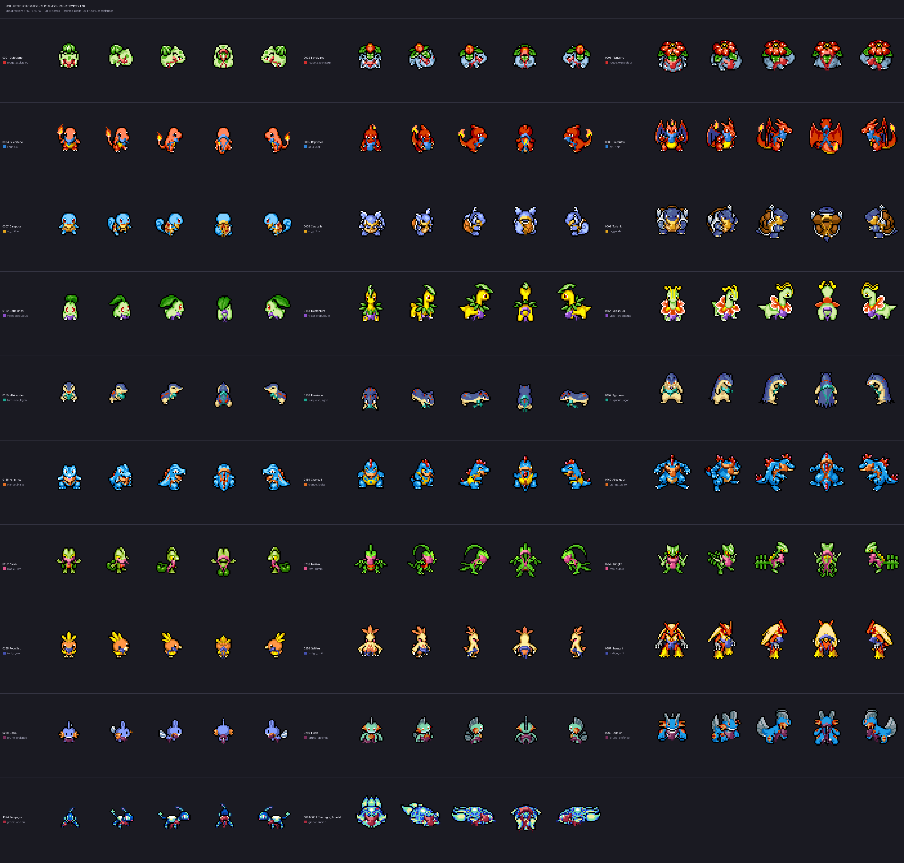

# Foulards d'exploration — 29 Pokémon, format PMDCollab

Pack de foulards en pixel art pour les Pokémon de départ des générations 1 à 3
et leurs évolutions, plus **Terapagos** (formes Normale et Terastal), au format
**PMDCollab / SpriteCollab**. Le foulard suit chaque Pokémon dans **toutes** ses
animations, ses 8 directions et ses 28 162 cases — pas seulement sur une pose de
présentation.

Le cadrage du col est vérifié automatiquement : **96,1 % des 232 vues sont
conformes** aux tolérances géométriques (voir « Auto-audit du cadrage »).



---

## Ce que contient le dossier

| Chemin | Contenu |
|---|---|
| `calques/<id>_<Nom>/` | 29 dossiers, **655 planches de foulard seul** en PNG RGBA transparent, plus un `AnimData.xml` |
| `fusionnes/` | Terapagos déjà composé (sprite + foulard + `Offsets`/`Shadow`), prêt à charger |
| `apercus/` | GIF animés (Idle, Walk, Attack) et la planche de contact |
| `manifeste.json` | palettes, rampes, réglages, liste des animations, comptes de cases |
| `AUDIT_FORMAT.md` | audit complet du format PMDCollab, relevé sur le dépôt cloné |
| `CREDITS.md` | attribution CC BY‑NC des sprites SpriteCollab utilisés en aperçu |
| `outils/` | scripts d'audit, de rendu, de fusion et de calibrage |
| `outils/audit_cadrage.json` | relevé chiffré du cadrage, vue par vue |

## Comment s'en servir

Chaque `calques/0004_Salamèche/Walk-Anim.png` a **exactement les mêmes
dimensions et la même grille** que le `sprite/0004/Walk-Anim.png` de
SpriteCollab. Il suffit de le composer par‑dessus, sans le moindre décalage :

```python
from PIL import Image
base = Image.open("sc/sprite/0004/Walk-Anim.png").convert("RGBA")
haut = Image.open("calques/0004_Salamèche/Walk-Anim.png").convert("RGBA")
Image.alpha_composite(base, haut).save("Walk-Anim.png")
```

Dans un moteur, on garde deux `Sprite` sur la même région de découpe : le
Pokémon, puis le foulard au‑dessus. Le calque étant séparé, on peut le teindre,
le masquer quand le Pokémon n'a pas encore rejoint l'équipe, ou le réutiliser
tel quel sur la version **chromatique** (même géométrie, seule la couleur du
corps change).

Les `Offsets.png` et `Shadow.png` sont **inchangés** : le foulard ne déplace ni
les points de corps ni l'ombre portée. On continue d'utiliser ceux de
SpriteCollab.

Pour obtenir des planches déjà fusionnées, prêtes à charger :

```bash
python3 outils/fusionner.py            # -> fusionnes/, avec Offsets et Shadow copiés
```

## Comment le foulard suit les animations

Dessiner 26 744 cases à la main n'a pas de sens. Le foulard est **rendu** case
par case à partir des données que le format PMD fournit déjà, ce qui garantit
qu'il colle au sprite même dans les animations les plus violentes (`Tumble`,
`HitGround`, `LeapForth`, où le Pokémon se déplace et bascule dans la case).

1. **Où est le cou.** Le marqueur noir d'`Offsets.png` n'est pas le sommet du
   crâne : c'est la position 3D de la tête projetée à l'écran. De face elle
   descend, de dos elle remonte (Salamèche : `y=16` en S, `y=8` en N, sur la
   même image). Ce basculement est mesuré par direction puis retiré, ce qui
   ramène l'ancre sur l'axe du corps tout en conservant les mouvements réels de
   la tête. Une seconde ancre indépendante, la **ligne d'épaules** (milieu des
   deux marqueurs de mains), est mélangée à 45 % : elle suit l'animation image
   par image et tient le col en place même chez les Pokémon à très grosse tête.
   On affine enfin sur la ligne où la silhouette se resserre.
2. **Quelle largeur.** L'écartement des marqueurs de mains donne la carrure ;
   il est raccourci selon la direction (1,00 de face, 0,72 de profil) puis borné
   par la silhouette réelle de la case. Le col est ensuite **plaqué sur le
   masque alpha** du sprite : il épouse le contour au lieu de flotter.
3. **Comment il est orienté.** L'arc du col se creuse vers le bas de face et se
   bombe vers le haut de dos ; le nœud n'est visible que du côté face, les pans
   que du côté dos. Entre les deux, l'interpolation suit le vecteur de direction
   de la ligne (S, SE, E, NE, N, NO, O, SO).
4. **Comment il bouge.** Les deux pans ondulent selon une phase calculée sur
   l'index de l'image dans l'animation, avec une amplitude propre à chaque
   animation : 0,08 pour `Sleep`, 0,30 pour `Idle`, 0,72 pour `Walk`, 1,10 pour
   `Tumble`. Ils s'arrêtent au niveau du sol pour ne pas traîner sous les pieds.

Le trait reste du pixel art propre : rampe de 4 tons (lumière / base / ombre /
contour), lumière posée en haut à gauche, bandeau de 2 à 5 px selon la taille du
sprite, pans de 1 à 3 px qui s'affinent vers la pointe.

Un fichier `outils/reglages.json` porte le calibrage anatomique par espèce
(décalage vertical du col, largeur, échelle). C'est la seule partie réglée à
l'œil ; tout le reste est déduit du format.

## Auto-audit du cadrage

`outils/audit_cadrage.py` mesure le cadrage sans intervention humaine, pour
chaque Pokémon et chacune de ses 8 directions :

| Critère | Ce qu'il mesure | Tolérance |
|---|---|---|
| `releve_epaule` | (ligne d'épaules − col) / taille du corps | −0,02 → 0,26 |
| `largeur_rel` | largeur du col / largeur du corps | 0,28→0,80 de face, 0,18→0,64 en diagonale, 0,10→0,46 de profil |
| `hors_corps` | part du bandeau tombant hors de la silhouette | ≤ 0,16 |
| `sous_pieds` | dépassement des pans sous les pieds | ≤ 1,5 px |
| `ecart_tete` | décentrage du col par rapport à l'axe du corps | ≤ 0,30 |

La première passe a donné **18,5 % de vues conformes** : le col dérivait vers le
ventre, surtout de face et de profil. Trois causes, toutes corrigées :

1. **Le biais de projection du marqueur de tête n'était pas compensé.** Comme ce
   marqueur descend de face et remonte de dos, ancrer le col dessus le faisait
   glisser sur le ventre en vue de face. Il est maintenant ramené sur l'axe du
   corps (`pipeline.biais_direction`), en recentrant **image par image** — sur
   un Idle très mobile comme celui de Kaiminus, dont la tête monte de 24 à 2 px,
   une moyenne globale annulait le signal.
2. **Une seule ancre ne suffit pas.** La ligne d'épaules, milieu des deux
   marqueurs de mains, sert désormais de seconde ancre (45 %). C'est elle qui
   tient le col en place chez les Pokémon à très grosse tête (Kaiminus, Gobou),
   pour lesquels le repère « hauteur dans la silhouette » n'a aucun sens.
3. **De profil, le col était étiré en diagonale.** Le raccourci de projection
   est passé de 0,72 à 0,38, le recentrage sur la silhouette (qui donne le
   milieu du corps, pas celui du cou) est désactivé, et le terme d'inclinaison
   n'est plus proportionnel à l'épaisseur.

Deux défauts secondaires ont suivi : les pans traînaient sous les pieds
(borne dure au sol) et le nœud pouvait flotter à côté du corps en vue de profil
(il est ramené sur la silhouette).

Le décalage vertical résiduel de chaque espèce est ensuite **résolu
automatiquement** : deux passes ramènent le relevé d'épaules médian sur la
cible, et écrivent le `dy` correspondant dans `reglages.json`.

| | avant | après |
|---|---|---|
| Vues conformes | 18,5 % | **96,1 %** |
| Défaut `hauteur` | 170 | 5 |
| Défaut `sous-pieds` | 64 | 0 |
| Défaut `hors-corps` | 45 | 0 |
| Défaut `décentré` | — | 0 |

Les 9 vues restantes sont des écarts d'un demi-pixel sur des morphologies sans
cou marqué (Kaiminus, Galifeu, Flobio de face).

```bash
python3 outils/audit_cadrage.py     # relevé + JSON détaillé
```

## Palettes

Une couleur par lignée : le foulard est l'identité d'un membre d'équipe, il ne
change pas quand il évolue. Les neuf teintes sont distinctes et choisies pour
trancher nettement avec le corps (écart de teinte et de luminance mesurés sur
les couleurs dominantes des trois stades).

| Lignée | Type | Foulard | |
|---|---|---|---|
| Bulbizarre → Florizarre | Plante | `rouge_explorateur` | `#D22E2E` |
| Salamèche → Dracaufeu | Feu | `azur_ciel` | `#2C81D6` |
| Carapuce → Tortank | Eau | `or_guilde` | `#E3A51E` |
| Germignon → Méganium | Plante | `violet_crepuscule` | `#8B4EC8` |
| Héricendre → Typhlosion | Feu | `turquoise_lagon` | `#1DA894` |
| Kaiminus → Aligatueur | Eau | `orange_braise` | `#E06E22` |
| Arcko → Jungko | Plante | `rose_aurore` | `#E1548E` |
| Poussifeu → Braségali | Feu | `indigo_nuit` | `#4451B0` |
| Gobou → Laggron | Eau | `prune_profonde` | `#7A2E5C` |
| Terapagos (Normale + Terastal) | Normal | `grenat_ancien` | `#A82B40` |

Treize rampes sont disponibles dans `outils/foulard.py`. Pour changer une
attribution, modifier `FORCE` dans `outils/lignees.py`, ou mettre `FORCE = None`
pour laisser le scoring automatique (distance de teinte + contraste de
luminance + préférence franchise) décider seul.

## Régénérer

```bash
bash outils/cloner_spritecollab.sh ~/sc_tmp   # clone partiel, ~110 Mo
export SPRITECOLLAB=~/sc_tmp
python3 outils/audit_format.py                # relevé du format -> JSON
python3 outils/generer.py                     # 27 Pokémon, ~17 s
python3 outils/generer.py 0004 0006           # ou seulement certains
python3 outils/audit_cadrage.py               # auto-audit du cadrage
python3 outils/contact.py Walk                # planche de contrôle
python3 outils/fusionner.py 1024              # planches Pokémon+foulard fusionnées
```

Dépendances : `Pillow`, `numpy`.

## Portée et limites

* Couverture : **29 Pokémon** — les 27 starters gen 1-3 en forme de base, plus
  Terapagos en formes Normale et Terastal (sa forme Stellaire n'a pas encore de
  sprites dans SpriteCollab). Les formes alternatives
  (`sprite/0006/0001/`…) ont leurs propres planches et ne sont pas traitées ;
  les versions chromatiques réutilisent le calque tel quel.
* Les animations déclarées `<CopyOf>` n'ont pas de planche, conformément au
  format : le `AnimData.xml` généré reprend la référence à l'identique.
* Le calque est toujours composé **au‑dessus** du sprite. Pour les vues de face,
  les pans passeraient derrière le corps : ils sont volontairement réduits à
  leurs pointes de part et d'autre du cou plutôt que dessinés par‑dessus.

## Licence et crédits

Les foulards de `calques/` sont une création originale : aucun pixel de
SpriteCollab n'y est repris. Les aperçus et le dossier `fusionnes/` contiennent
en revanche des sprites SpriteCollab, publiés sous **CC BY‑NC 4.0** — usage non
commercial, attribution obligatoire. Voir `CREDITS.md` pour la liste des auteurs
par Pokémon. Les sprites originaux appartiennent à Spike Chunsoft /
The Pokémon Company / Nintendo.
