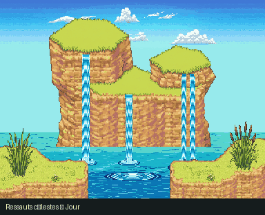

# Ressauts célestes — texture Treasure Town

**Nouveau layout**, 576 × 432 px, en jour et nuit. Deux ressauts naturels asymétriques, bassin ouvert au centre et berges au premier plan.

[Ouvrir la zone](../../apercu_falaise.html) · [GIF jour/nuit](../../previews/cascades_jour_nuit.gif) · [Documentation des calques et du cycling](../README.md)

La roche reprend les strates ocres et les petits détails de **Treasure Town**, pas les grands blocs gris de la version précédente. Terrain, relief du fond et végétation sont des plans distincts, issus de dessins générés séparément. Il n’y a ni bâtiment, ni panneau, ni clôture ajoutés.

Le fond de l’eau est fixe. Le plan de surface utilise sa propre carte d’indices et ses palettes cycliques. Les cascades et l’écume ont leurs calques et palettes séparés lorsqu’ils sont présents. La première image des PNG correspond à la première palette.

- `calques/` : dix emplacements de plans RGBA.
- `animations/` : indices PNG, palettes JSON, atlas pour Tiled.
- `aseprite/` : composition animée complète en RGBA.
- `aseprite_indexe/` : véritables fichiers indexés, avec cels fixes et palettes par frame.
- `tiled/` : composition en plans fixes et objets-tuiles animés.
- `kit.json` et `controle_qualite.json` : données de rendu et contrôles.

Sources : `source/zones_treasure_town/cascades/`. La préparation et l’animation sont réalisées par le pipeline du dépôt, pas par un déplacement d’une capture complète. Aucune collision ni transition PMDO n’est configurée.
