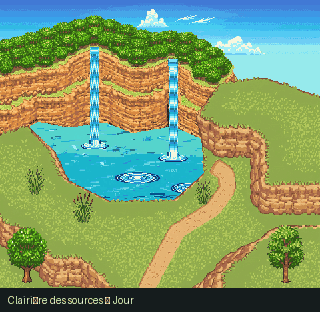

# Étang de la forêt

Version **jour / nuit**, 456 × 624 px, d’après la référence `pondourpmdàrefaire.png` ajoutée par l’utilisateur. Dessin généré, sans structures, puis découpé en six emplacements de calques.

[Ouvrir l’aperçu](../../apercu_falaise.html) · [Preview GIF](../../previews/etang_jour_nuit.gif) · [Documentation commune](../README.md)

Les plans sont dans `calques/`, les images 0 dans `compositions/`, les bases dans `bases/`, les fichiers éditables dans `aseprite/` et `tiled/`. Conserver `animations/` avec les cartes. `kit.json` décrit les opérations et `controle_qualite.json` leurs contrôles.

Les sources retenues se trouvent dans `source/paysages_nouveaux/etang/`. Les bâtiments, panneaux, clôtures et installations ont été retirés ; la végétation et les formations rocheuses naturelles sont conservées. Ce module ne configure pas de collisions ou de transitions PMDO.
