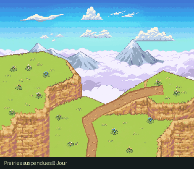

# Prairies suspendues — texture Treasure Town

**Nouveau layout**, 504 × 408 px, en jour et nuit. Terrasse haute à gauche, clairière basse et rampe naturelle vers la terrasse droite.

[Ouvrir la zone](../../apercu_falaise.html) · [GIF jour/nuit](../../previews/plateaux_jour_nuit.gif) · [Documentation des calques et du cycling](../README.md)

La roche reprend les strates ocres et les petits détails de **Treasure Town**, pas les grands blocs gris de la version précédente. Terrain, relief du fond et végétation sont des plans distincts, issus de dessins générés séparément. Il n’y a ni bâtiment, ni panneau, ni clôture ajoutés.

Le fond de l’eau est fixe. Le plan de surface utilise sa propre carte d’indices et ses palettes cycliques. Chaque cascade possède désormais son propre calque et son décalage de palette ; l’écume est indépendante. Les nuages lointains et proches traversent le ciel en wrap à deux vitesses. La première image des PNG correspond à la première palette.

- `calques/` : 11 plans RGBA, dont nuages lointains/proches et chutes séparées.
- `animations/` : indices PNG, palettes JSON, atlas pour Tiled.
- `aseprite/` : composition animée complète en RGBA.
- `aseprite_indexe/` : véritables fichiers indexés, avec cels fixes et palettes par frame.
- `tiled/` : composition en plans fixes et objets-tuiles animés.
- `kit.json` et `controle_qualite.json` : données de rendu et contrôles.

Sources : `source/zones_treasure_town/plateaux/`. La préparation et l’animation sont réalisées par le pipeline du dépôt, pas par un déplacement d’une capture complète. Aucune collision ni transition PMDO n’est configurée.

La dernière passe de dessin utilise les falaises de guilde et du cap comme références pour les sommets, la terre et la roche. Les formes restent celles de ce layout, sans reprise des bâtiments du post Bekipan.
