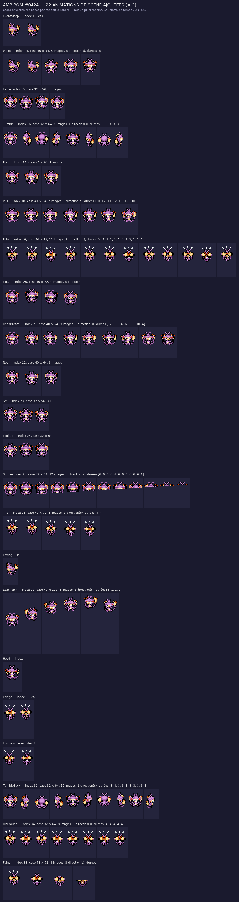

# Ambipom #0424 (Capidextre) — animations de scène ajoutées

Le sprite officiel de Ambipom sur [PMDCollab](https://sprites.pmdcollab.org/#/0424?form=0) a le set de donjon, mais
**aucune des 22 animations de scène** du « set complet » (Eat, Wake, Sit, Sink, Faint…). Ce dossier les
ajoute, sans toucher à ce qui existait.

## Méthode

**Composer, ne pas générer** — la méthode de Falinks, appliquée à un seul personnage.

1. Chaque image d'une animation ajoutée est une **case officielle de Ambipom lui-même** (Idle, Hurt, Hop,
   Charge, Rotate, Sleep…), replacée par rapport à son ancre : décalage de quelques pixels, changement de
   direction, ou troncature par le bas pour l'enfoncement dans le sol. **Aucun pixel n'est repeint** :
   la palette des nouvelles feuilles est incluse dans celle du sprite d'origine (11 couleurs).
2. Le **squelette du temps** — nombre d'images, durées en 1/60 s, déplacements de l'ancre, nombre de lignes,
   numéro de créneau `<Index>` — est relu tel quel sur le sprite officiel **#0155** (Bayleef), qui possède
   le jeu Chunsoft complet. Rien n'est inventé côté cadence.
3. Les animations d'origine sont recopiées **octet pour octet** et déclarées dans le même `AnimData.xml` :
   le dossier s'importe directement dans SkyTemple, sans réassembler quoi que ce soit.

## Ce qui est livré

| Fichier | Contenu |
| --- | --- |
| `AnimData.xml` | Sprite complet : animations d'origine **+** les 22 ajoutées, avec `ShadowSize` 1, cases, durées et créneaux. |
| `<Anim>-Anim.png` | Feuilles : une colonne par image, une ligne par direction (Bas, Bas-droite, Droite, Haut-droite, Haut, Haut-gauche, Gauche, Bas-gauche) ou une seule ligne pour les animations sans direction. |
| `<Anim>-Offsets.png` | Repères : noir = tête, vert = centre, rouge = main gauche, bleu = main droite, repris de la case source. |
| `<Anim>-Shadow.png` | Pixel blanc = ancre ; gabarit d'ombre du Pokémon lui-même autour de l'ancre. |
| `nuit/<Anim>-Anim.png` | Mêmes feuilles avec le filtre nuit des salles (`night()` de `source/rebuild_kit.py`). |
| `ambipom_scenes.aseprite` | Aseprite animé : un calque par direction, les 22 animations bout à bout, une étiquette chacune. |
| `apercu.png` | Planche de contrôle × 2 : toutes les images de chaque animation ajoutée. |
| `apercu_eat.gif`, `apercu_chute.gif` | Lecture animée sur le parquet de la guilde. |
| `apercu.html` | Lecteur hors ligne : animation, direction, zoom, lecture. |
| `kit.json` | Cases, durées, créneaux, cases sources de chaque image, palette. |
| `controle_qualite.json` | Résultat du vérificateur. |
| `credits.txt` | Crédits au format SpriteCollab, lignes d'origine conservées. |

## Les 22 animations ajoutées

| Animation | Créneau | Case | Images | Dir. | Durée | Cases officielles employées |
| --- | --- | --- | --- | --- | --- | --- |
| `EventSleep` | 13 | 40 × 56 | 2 | 8 | 65 ticks | Sleep |
| `Wake` | 14 | 40 × 64 | 5 | 8 | 42 ticks | Idle, Sleep |
| `Eat` | 15 | 32 × 56 | 4 | 1 | 28 ticks | Idle |
| `Tumble` | 16 | 32 × 64 | 8 | 1 | 24 ticks | Rotate |
| `Pose` | 17 | 40 × 64 | 3 | 8 | 22 ticks | Charge, Idle |
| `Pull` | 18 | 40 × 64 | 7 | 1 | 76 ticks | Charge |
| `Pain` | 19 | 40 × 72 | 12 | 8 | 24 ticks | Hurt |
| `Float` | 20 | 40 × 72 | 4 | 8 | 50 ticks | Idle |
| `DeepBreath` | 21 | 40 × 64 | 9 | 1 | 62 ticks | Charge, Idle |
| `Nod` | 22 | 40 × 64 | 3 | 8 | 20 ticks | Idle |
| `Sit` | 23 | 32 × 56 | 3 | 1 | 24 ticks | Idle |
| `LookUp` | 24 | 32 × 64 | 3 | 1 | 18 ticks | Idle |
| `Sink` | 25 | 32 × 64 | 12 | 1 | 72 ticks | Idle |
| `Trip` | 26 | 40 × 72 | 5 | 8 | 22 ticks | Hurt |
| `Laying` | 27 | 32 × 56 | 1 | 8 | 12 ticks | Sleep |
| `LeapForth` | 28 | 40 × 128 | 6 | 1 | 14 ticks | Hop |
| `Head` | 29 | 40 × 64 | 1 | 8 | 4 ticks | Charge |
| `Cringe` | 30 | 32 × 80 | 2 | 1 | 10 ticks | Hurt |
| `LostBalance` | 31 | 32 × 72 | 2 | 1 | 16 ticks | Hurt |
| `TumbleBack` | 32 | 32 × 64 | 10 | 1 | 30 ticks | Rotate |
| `HitGround` | 34 | 32 × 64 | 8 | 1 | 34 ticks | Hurt |
| `Faint` | 33 | 48 × 72 | 4 | 8 | 34 ticks | Hurt |

Animations d'origine conservées telles quelles : `Walk`, `Attack`, `MultiStrike`, `Shoot`, `SpAttack (copie de RearUp)`, `RearUp`, `Sleep`, `Hurt`, `Idle`, `Swing`, `Double`, `Hop`, `Charge`, `Rotate`.

## Contrôle

`source/personnages/verify_animations_scenes.py` rejoue les règles du SpriteBot (cases paires, feuilles
divisibles, 1 ou 8 lignes, durées = colonnes, alpha 0 ou 255, un seul pixel blanc et un seul repère par
couleur et par case, 15 couleurs au plus) **et** les contrôles de méthode : durées et déplacements d'ancre
identiques au squelette #0155, palette incluse dans celle du sprite d'origine, animations d'origine
inchangées. Résultat dans `controle_qualite.json`.

## Licence

Voir `credits.txt` : les crédits d'origine du dépôt SpriteCollab sont conservés, et les animations ajoutées
reprennent la licence la plus restrictive du sprite source. Elles n'ont été **ni soumises ni approuvées**
sur SpriteCollab.
