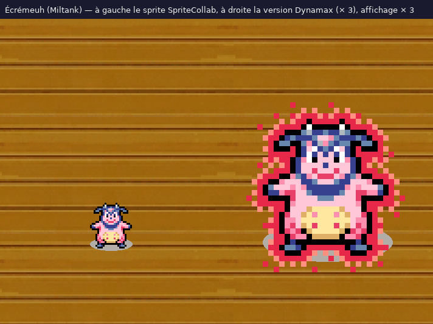

# Écrémeuh (Miltank) #0241 — sprite Dynamax au format SpriteCollab

Version **Dynamax** du sprite SpriteCollab de Écrémeuh (Miltank) : toutes les animations du sprite d'origine
(`source/personnages/reference/0241`) sont reprises, agrandies × 3 au plus proche voisin et entourées d'une aura rouge
animée (anneau plein + trame qui remonte le long du corps). Aucun pixel du Pokémon n'est redessiné ; deux couleurs
sont ajoutées (16 couleurs au total). `ShadowSize` passe à 2 (grande ombre). **Les nuages tournants et la
transformation sont des VFX séparés**, sans personnage, à superposer en jeu : voir
[`personnages/dynamax/vfx/`](../vfx/README.md) et l'entrée `dynamax.vfx` de `kit.json` (taille et décalage).

Construit par `source/personnages/build_dynamax_sprites.py` (méthode et réglages dans
[`personnages/dynamax/README.md`](../README.md)), vérifié par `verify_dynamax_sprites.py`
(`controle_qualite.json`).

## Fichiers

`AnimData.xml`, `<Anim>-Anim.png` / `-Offsets.png` / `-Shadow.png` (8 lignes de directions, ou 1), `nuit/` (filtre
nuit des salles), `ecremeuh.aseprite` (8 calques de directions, une étiquette par animation), `apercu.png` (toutes
les images), `apercu_directions.png`, `apercu_comparaison.png`, `apercu_marche_attente.gif`, `apercu_attaques.gif`,
`apercu.html` (lecteur hors ligne), `kit.json`, `credits.txt`.

## Animations

| Animation | Index | Case | Images | Durée | Repères |
| --- | --- | --- | --- | --- | --- |
| Walk | 0 | 112 × 160 (origine 32 × 40) | 4 | 36 ticks | — |
| Attack | 1 | 208 × 264 (origine 64 × 80) | 15 | 30 ticks | Rush 2, Hit 8, Return 11 |
| Stomp | 2 | 224 × 224 (origine 72 × 64) | 16 | 30 ticks | Hit 7, Return 9 |
| Shoot | 3 | 128 × 200 (origine 40 × 56) | 10 | 28 ticks | Hit 6, Return 9 |
| Appeal | — | — | — | — | copie de Twirl |
| Twirl | 4 | 128 × 160 (origine 40 × 40) | 19 | 30 ticks | Hit 9, Return 16 |
| Sleep | 5 | 104 × 144 (origine 32 × 40) | 2 | 65 ticks | — |
| Hurt | 6 | 160 × 208 (origine 48 × 56) | 2 | 10 ticks | — |
| Idle | 7 | 120 × 176 (origine 32 × 48) | 6 | 67 ticks | — |
| Swing | 8 | 248 × 280 (origine 80 × 80) | 9 | 16 ticks | Hit 5, Return 5 |
| Double | 9 | 176 × 232 (origine 56 × 64) | 16 | 36 ticks | — |
| Hop | 10 | 112 × 296 (origine 32 × 88) | 10 | 24 ticks | Hit 9 |
| Charge | 11 | 120 × 168 (origine 32 × 48) | 10 | 20 ticks | Hit 5, Return 9 |
| Rotate | 12 | 112 × 160 (origine 32 × 40) | 9 | 18 ticks | Hit 8 |

Les durées, index et repères d'images sont ceux du sprite d'origine ; les cases sont agrandies × 3 puis élargies
par pas de 8 pour contenir l'aura et les nuages, l'ancre au repos restant en (largeur / 2, hauteur / 2 + 4).

## Licence

sprite original du jeu (CHUNSOFT), licence non précisée sur SpriteCollab : usage non commercial de fan uniquement. Les crédits du sprite d'origine sont repris dans `credits.txt`. Forme non officielle, ni soumise ni
approuvée sur SpriteCollab.
