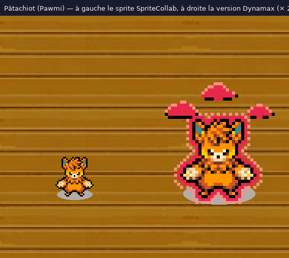

# Pâtachiot (Pawmi) #0923 — sprite Dynamax au format SpriteCollab

Version **Dynamax** du sprite SpriteCollab de Pâtachiot (Pawmi) : toutes les animations du sprite d'origine
(`source/personnages/reference/0923`) sont reprises, agrandies × 2 au plus proche voisin, entourées d'une aura rouge
tramée et de trois nuages rouges qui tournent autour du corps. Aucun pixel du Pokémon n'est redessiné ; trois
couleurs sont ajoutées (14 couleurs au total). `ShadowSize` passe à 2 (grande ombre).

Construit par `source/personnages/build_dynamax_sprites.py` (méthode et réglages dans
[`personnages/dynamax/README.md`](../README.md)), vérifié par `verify_dynamax_sprites.py`
(`controle_qualite.json`).

## Fichiers

`AnimData.xml`, `<Anim>-Anim.png` / `-Offsets.png` / `-Shadow.png` (8 lignes de directions, ou 1), `nuit/` (filtre
nuit des salles), `patachiot.aseprite` (8 calques de directions, une étiquette par animation), `apercu.png` (toutes
les images), `apercu_directions.png`, `apercu_comparaison.png`, `apercu_marche_attente.gif`, `apercu_attaques.gif`,
`apercu.html` (lecteur hors ligne), `kit.json`, `credits.txt`.

## Animations

| Animation | Index | Case | Images | Durée | Repères |
| --- | --- | --- | --- | --- | --- |
| Walk | 0 | 88 × 152 (origine 32 × 48) | 4 | 36 ticks | — |
| Attack | 1 | 176 × 224 (origine 72 × 88) | 10 | 19 ticks | Rush 1, Hit 3, Return 6 |
| QuickStrike | 2 | 280 × 336 (origine 128 × 144) | 10 | 19 ticks | Hit 3, Return 6 |
| Shoot | 3 | 104 × 176 (origine 40 × 56) | 11 | 25 ticks | Hit 2, Return 4 |
| Shock | 4 | 112 × 184 (origine 48 × 64) | 13 | 20 ticks | Hit 6, Return 10 |
| Sleep | 5 | 80 × 136 (origine 24 × 40) | 2 | 65 ticks | — |
| Hurt | 6 | 104 × 176 (origine 48 × 64) | 2 | 10 ticks | — |
| Idle | 7 | 88 × 168 (origine 32 × 56) | 6 | 56 ticks | — |
| Swing | 8 | 168 × 224 (origine 80 × 80) | 9 | 16 ticks | Hit 5, Return 5 |
| Double | 9 | 136 × 200 (origine 56 × 72) | 16 | 36 ticks | — |
| Hop | 10 | 88 × 240 (origine 32 × 96) | 10 | 24 ticks | Hit 9 |
| Charge | 11 | 96 × 152 (origine 32 × 48) | 10 | 20 ticks | Hit 5, Return 9 |
| Rotate | 12 | 88 × 152 (origine 32 × 48) | 9 | 18 ticks | Hit 8 |

Les durées, index et repères d'images sont ceux du sprite d'origine ; les cases sont agrandies × 2 puis élargies
par pas de 8 pour contenir l'aura et les nuages, l'ancre au repos restant en (largeur / 2, hauteur / 2 + 4).

## Licence

PMDCollab_1 (usage libre avec crédit, dans le cadre des règles de PMDCollab). Les crédits du sprite d'origine sont repris dans `credits.txt`. Forme non officielle, ni soumise ni
approuvée sur SpriteCollab.
