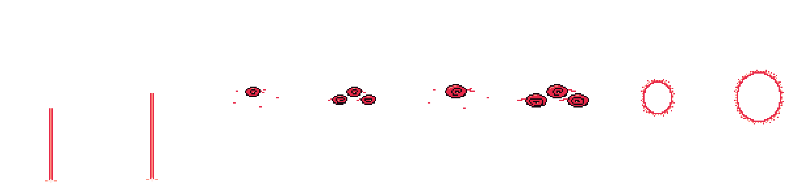

# Sprites Dynamax — dix Pokémon, toutes leurs animations SpriteCollab

Versions **Dynamax** des sprites de donjon, au format SpriteCollab / SkyTemple. Pour chaque Pokémon, **toutes les
animations du sprite d'origine** sont reprises (noms, index, `CopyOf`, durées, `RushFrame` / `HitFrame` /
`ReturnFrame`, déplacements de l'ancre) ; le dessin est agrandi **× 3** pixel par pixel et entouré d'une **aura
rouge animée**. Aucun pixel du Pokémon n'est redessiné. Les **nuages tournants** et l'**animation de
transformation** ne sont pas dans les sprites : ce sont des **VFX génériques, sans personnage ni fond**, dans
[`vfx/`](vfx/README.md), à superposer en jeu sur n'importe quel sprite (deux tailles, M et L).



Le dossier `vfx/` ne contient **que les effets** (feuilles, aperçus et Aseprite sur fond transparent, palette de
5 couleurs) : aucun personnage, aucun fond. Un exemple d'intégration de la séquence sur Hariyama est conservé à
part, comme document : `source/personnages/reference/dynamax/exemple_sequence_hariyama.gif`.

| Dossier | Pokémon | Source | Animations (index) | Couleurs | VFX | Licence |
| --- | --- | --- | --- | --- | --- | --- |
| `0186_tarpaud/` | Tarpaud (Politoed) | SpriteCollab 0186 (CHUNSOFT) | Walk 0, Attack 1, Strike 2 = Attack, Shoot 3, RearUp 4, Sleep 5, Hurt 6, Idle 7, Swing 8, Double 9, Hop 10, Charge 11, Rotate 12 | 17 | M | non précisée |
| `0241_ecremeuh/` | Écrémeuh (Miltank) | SpriteCollab 0241 (CHUNSOFT) | Walk, Attack, Stomp, Shoot, Appeal = Twirl, Twirl, Sleep, Hurt, Idle, Swing, Double, Hop, Charge, Rotate | 16 | M | non précisée |
| `0282_gardevoir/` | Gardevoir | SpriteCollab 0282 (CHUNSOFT) | Walk, Attack, Strike = Attack, Shoot = Charge, SpAttack = Appeal, Appeal, Sleep, Hurt, Idle, Swing, Double, Hop, Charge, Rotate | 12 | M | non précisée |
| `0297_hariyama/` | Hariyama | SpriteCollab 0297 (CHUNSOFT) | Walk, Attack, Strike, Shoot, Twirl = Rotate, Sleep, Hurt, Idle, Swing, Double, Hop, Charge, Rotate | 15 | L | non précisée |
| `0424_capidextre/` | Capidextre (Ambipom) | SpriteCollab 0424 (CHUNSOFT) | Walk, Attack, MultiStrike, Shoot, SpAttack = RearUp, RearUp, Sleep, Hurt, Idle, Swing, Double, Hop, Charge, Rotate | 14 | L | non précisée |
| `0443_griknot/` | Griknot (Gible) | SpriteCollab 0443 (CHUNSOFT) | Walk, Attack, Strike = Attack, Shoot, SpAttack = RearUp, RearUp, Sleep, Hurt, Idle, Swing, Double, Hop, Charge, Rotate | 15 | M | non précisée |
| `0674_pandespiegle/` | Pandespiègle (Pancham) | SpriteCollab 0674 (baronessfaron) | Walk, Attack, Strike, Shoot = Charge, Punch, Sleep, Hurt, Idle, Swing, Double, Hop, Charge, Rotate | 15 | M | CC BY-NC 4.0 |
| `0923_patachiot/` | Pâtachiot (Pawmi) | SpriteCollab 0923 (baronessfaron) | Walk, Attack, QuickStrike, Shoot, Shock, Sleep, Hurt, Idle, Swing, Double, Hop, Charge, Rotate | 14 | L | PMDCollab_1 |
| `0870_falinks/` | Falinks (escouade) | `personnages/falinks/` (ce dépôt) | Walk, Attack, Strike = Attack, Shoot, Sleep, Hurt, Idle, Swing, Double, Hop, Charge, Rotate | 15 | M | CC BY-NC 4.0 |
| `0893_zarude/` | Zarude | `personnages/zarude/` (ce dépôt) | Walk, Attack, Strike = Attack, Shoot, Sing, Sleep, Hurt, Idle, Swing, Double, Hop, Charge, Rotate | 13 | L | CC BY-NC 4.0 |
| `vfx/` | **VFX Dynamax** (génériques) | dessinés ici (`dynamax_fx.py`) | Transformation, NuagesApparition, Nuages, Aura — chacun en M et L (index 13–20) | 5 | — | CC BY-NC 4.0 |

Chaque dossier contient : `AnimData.xml`, `<Anim>-Anim.png` / `-Offsets.png` / `-Shadow.png`, `nuit/` (filtre nuit
des salles), `<slug>.aseprite` (8 calques de directions, une étiquette par animation), `apercu.png` (toutes les
images), `apercu_directions.png`, `apercu_comparaison.png` (origine et Dynamax côte à côte sur le parquet),
`apercu_marche_attente.gif`, `apercu_attaques.gif`, `apercu.html` (lecteur hors ligne), `kit.json`,
`controle_qualite.json`, `credits.txt` et un `README.md` avec le tableau des cases.

## Ce qu'est la transformation

1. **Agrandissement × 3 au plus proche voisin** : chaque pixel du sprite d'origine devient un bloc 3 × 3 (un
   Pokémon dynamaxé fait environ trois fois sa taille : deux à trois cases de donjon de large). Il garde exactement
   sa forme ; seule son échelle change. Ce choix évite tout rééchantillonnage et garde la palette d'origine intacte.
2. **Aura rouge animée** : un anneau plein d'un pixel (à l'échelle du dessin, donc 3 px à l'écran) colle à la
   silhouette, doublé d'un anneau extérieur tramé dont le motif **remonte d'un pixel à chaque image** (quatre
   phases) et de langues d'énergie qui s'en détachent : le halo ondule pendant toutes les animations sans ajouter
   d'image ni de couleur (deux couleurs ajoutées : aura (232, 40, 72) et aura claire (255, 144, 128)).
3. **Repères et ancre** : chaque repère d'Offsets (tête, centre, mains) est replacé à sa position × 3, un pixel
   chacun ; l'ancre (pixel blanc de Shadow) aussi, le gabarit d'ombre de l'origine est agrandi et `ShadowSize`
   passe à 2 (grande ombre). Le déplacement de l'ancre à chaque image est celui de l'origine × 3 : charge de
   l'attaque, cercle de Swing, aller-retour de Double, parabole de Hop restent ceux de SpriteCollab.
4. **Cases** : agrandies × 3 puis élargies par pas de 8 pour contenir l'aura, l'ancre au repos restant en
   (largeur / 2, hauteur / 2 + 4) comme dans tout le dépôt.
5. **Palette** : les sprites qui avaient 15 couleurs en ont donc 17 (Tarpaud, Écrémeuh) : au-delà de la limite
   d'import strict de SkyTemple, sans conséquence pour un usage dans ce kit.
6. **Nuages et transformation = VFX séparés** (`vfx/`) : en jeu la Dynamax est un effet joué **par-dessus** le
   sprite, pas une partie du sprite. Les nuages (`Nuages-M/L`, boucle de 12 images, un tiers de tour par boucle)
   se posent au-dessus de la tête ; la transformation (`Transformation-M/L`, 15 images : rayon, colonne d'énergie
   opaque, éclairs épais qui tournent en s'abattant, flash, onde de choc) se joue à l'ancre du sprite ; l'aura
   générique (`Aura-M/L`) sert aux sprites qui n'ont pas d'aura intégrée. L'entrée `dynamax.vfx` du `kit.json`
   de chaque pack donne la taille (M : corps ≤ 24 px de large à l'échelle 1, sinon L) et le décalage vertical de
   l'anneau de nuages (`ancre_nuages_decalage`, 2 px au-dessus du sommet du sprite au repos).
   L'option `--nuages-integres` du constructeur cuit tout de même les nuages dans les feuilles (ancienne version).

## Emploi dans la guilde

Un sprite Dynamax occupe environ trois cases de donjon de 24 px en largeur et jusqu'à quatre en hauteur (voir les
cases dans chaque `kit.json`). Il se lit à l'échelle 1 du kit : ne pas le réduire. Séquence complète :

1. sprite normal à l'arrêt ; lancer `vfx/Transformation-<taille>` à son ancre, par-dessus ;
2. image 5 (la colonne devient opaque) : masquer le sprite normal ;
3. image 11 (`HitFrame` = 10, le flash) : afficher le sprite Dynamax de ce dossier, même ancre — les deux
   `AnimData` ont les mêmes index et durées, donc la même image courante ;
4. image 14 (`ReturnFrame` = 13) : lancer `vfx/NuagesApparition-<taille>` à l'ancre + `ancre_nuages_decalage`,
   puis la boucle `vfx/Nuages-<taille>` au même endroit tant que le Pokémon reste dynamaxé.

## Reproduire ou adapter

```
python3 source/personnages/build_dynamax_sprites.py                # les dix, ~5 min
python3 source/personnages/build_dynamax_sprites.py gardevoir      # un seul (slug ou numéro)
python3 source/personnages/build_dynamax_sprites.py --echelle 2    # autre facteur
python3 source/personnages/build_dynamax_vfx.py                    # les VFX (vfx/), quelques secondes
python3 source/personnages/verify_dynamax_sprites.py               # « OK » par pack et pour vfx/, controle_qualite.json
```

Pour ajouter un Pokémon : télécharger son sprite complet SpriteCollab dans `source/personnages/reference/<numéro>/`
(voir `source/personnages/METHODE_SPRITES_PMD.md` § 2) et ajouter une ligne à `POKEMON` dans le constructeur.

Le vérificateur rejoue les contrôles du SpriteBot (index, `CopyOf`, tailles de feuilles, 1 ou 8 lignes, colonnes
= durées, alpha binaire, un blanc par case, un pixel par repère, compte des couleurs) et vérifie que chaque pixel
de l'origine se retrouve agrandi à sa place sans recoloration, que l'ancre et les repères sont ceux de l'origine
× 3, que les durées, index et `CopyOf` sont identiques, que la palette = palette d'origine + aura, et que l'entrée
`dynamax.vfx` désigne des VFX existants avec le bon décalage. Pour `vfx/` : feuilles à une ligne, cases multiples
de 8, ancre unique, alpha binaire, palette = les 5 couleurs des effets et rien d'autre (donc ni personnage ni
fond), aperçus transparents, aucun fichier étranger, `HitFrame` < `ReturnFrame`.

## Licences

Les sprites CHUNSOFT (0186, 0241, 0282, 0297, 0424, 0443) sont les sprites originaux des jeux, hébergés par
SpriteCollab sans licence précisée : usage de fan non commercial uniquement. Pandespiègle et Falinks/Zarude sont
en CC BY-NC 4.0, Pâtachiot en PMDCollab_1 ; leurs crédits sont repris dans chaque `credits.txt`. Les formes
Dynamax ne sont pas des formes officielles acceptées par SpriteCollab : ces sprites n'y ont été ni soumis ni
approuvés. Les VFX de `vfx/` sont dessinés pour ce dépôt (CC BY-NC 4.0, comme Falinks et Zarude).
