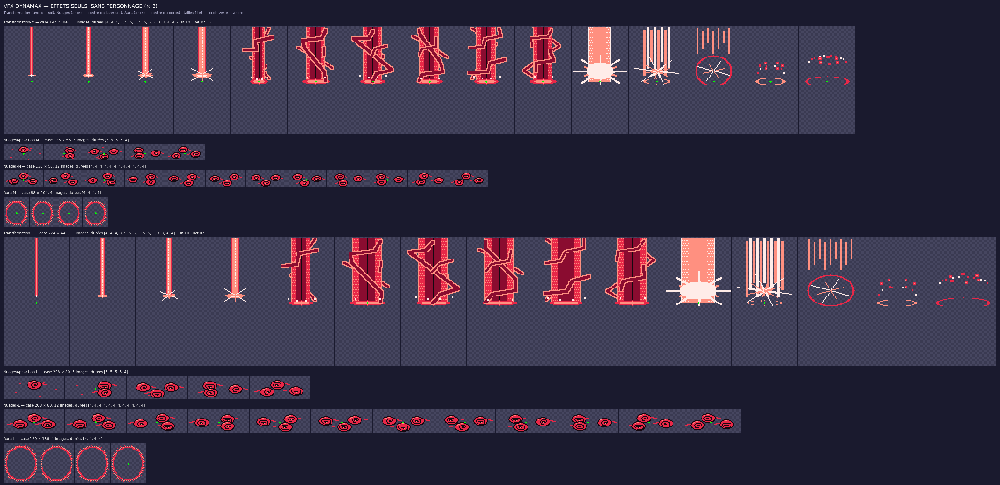

# VFX Dynamax — effets seuls, à superposer sur n'importe quel sprite

Effets visuels de la Dynamax **sans personnage ni fond**, dessinés en pixel art à l'échelle 1 et agrandis × 3
comme les sprites Dynamax du dépôt. Deux tailles : **M** (corps ≤ 24 px de large à l'échelle 1 : —)
et **L** (au-delà : Hariyama, Pâtachiot (Pawmi)). L'entrée `dynamax.vfx` du `kit.json` de chaque pack Dynamax donne la taille et le
décalage à appliquer ; pour un autre sprite, mesurer la largeur du corps au repos.

| Effet | Case | Images | Durée | Ancre | Boucle |
| --- | --- | --- | --- | --- | --- |
| Transformation-M | 192 × 368 | 15 | 62 ticks | sol | non |
| NuagesApparition-M | 136 × 56 | 5 | 24 ticks | centre de l’anneau | non |
| Nuages-M | 136 × 56 | 12 | 48 ticks | centre de l’anneau | oui |
| Aura-M | 88 × 104 | 4 | 16 ticks | centre du corps | oui |
| Transformation-L | 224 × 440 | 15 | 62 ticks | sol | non |
| NuagesApparition-L | 208 × 80 | 5 | 24 ticks | centre de l’anneau | non |
| Nuages-L | 208 × 80 | 12 | 48 ticks | centre de l’anneau | oui |
| Aura-L | 120 × 136 | 4 | 16 ticks | centre du corps | oui |

## Séquence en jeu

1. Le Pokémon (sprite normal) est à l'arrêt. Lancer **Transformation** avec l'ancre sur son sol (pixel blanc de
   sa feuille Shadow), dessinée par-dessus le sprite. Images 1–4 : un rayon fin descend du ciel et frappe le sommet
   du Pokémon (hauteur calibrée pour un corps de taille M ou L). Images 5–10 : la **colonne d'énergie opaque**
   s'abat (bord clair, bandes rouges où coulent des étincelles, cœur cramoisi), enroulée d'**éclairs épais et
   opaques** cramoisi bordé de rose qui tournent en descendant ; **masquer le sprite normal à l'image 5**.
2. Image 11 (`HitFrame` = 10) : **flash** — la colonne devient blanche, grand éclat en étoile : **afficher le sprite
   Dynamax** (× 3) à cet instant. Images 12–13 : la colonne se dissout en lames de lumière qui montent.
3. Images 14–15 (`ReturnFrame` = 13) : onde de choc au sol, étincelles, volutes qui montent. Lancer à cet instant
   **NuagesApparition** (5 images, 24 ticks : 1, 2 puis 3 nuages qui tournent déjà) avec l'ancre au centre de
   l'anneau : décalage `ancre_nuages_decalage` du `kit.json` (2 px au-dessus du sommet du sprite Dynamax au repos,
   à l'échelle). Enchaîner la boucle **Nuages** (12 images, 48 ticks, un tiers de tour par boucle : la boucle est
   invisible, et la dernière image de l'apparition précède l'image 1 de la boucle). L'anneau est aplati : la moitié
   arrière passe derrière la tête si le moteur trie par profondeur ; sinon le dessiner par-dessus, il reste lisible.
4. **Aura** : les sprites Dynamax du dépôt ont déjà l'aura animée dans leurs feuilles. Cet effet générique (ellipse
   d'énergie, 4 images) sert à donner l'aura à un sprite qui ne l'a pas (ancre au centre du corps).

Palette des effets : 5 couleurs — sombre (20, 8, 16), cramoisi (138, 12, 48), rouge (232, 40, 72), claire
(255, 144, 128), blanc (255, 236, 232) ; tout est opaque (aucune transparence partielle). Feuilles à une ligne (un
VFX n'a pas d'orientation), `AnimData.xml` façon SpriteCollab (index 13+),
`*-Offsets.png` (centre vert = ancre) et `*-Shadow.png` (pixel blanc = ancre) pour les lecteurs du dépôt,
`dynamax_vfx.aseprite` (une étiquette par effet), `apercu.png`, `apercu_effets.gif` (effets seuls sur damier),
`apercu_demonstration.gif` (Hariyama : petit sprite, transformation, sprite Dynamax, apparition puis boucle des nuages).

Design : brouillons du générateur d'images `source/personnages/reference/dynamax/concept_*.png` (volutes à cœur
clair, colonne à cœur sombre enroulée d'éclairs, flash en étoile, formation des nuages) ; tout est redessiné à la
main sur la grille dans `source/personnages/dynamax_fx.py` et `build_dynamax_vfx.py`. Reconstruire :
`python3 source/personnages/build_dynamax_vfx.py`.
