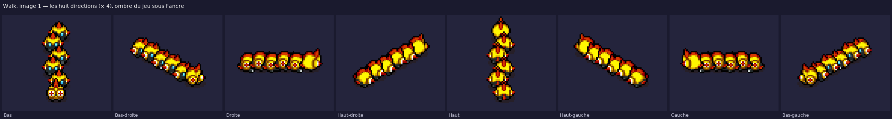

# Falinks #0870 — sprite d'escouade au format SpriteCollab



Sprite de donjon de **Falinks au complet** (forme 0000 : le brass et ses cinq troopers), dans le format
des dépôts PMDCollab / SkyTemple, avec le **set donjon complet** : Idle, Walk, Sleep, Hurt, Attack, Charge,
Shoot, Strike, Swing, Double, Rotate, Hop.

## Ce qui est livré

| Fichier | Contenu |
| --- | --- |
| `AnimData.xml` | Déclaration SpriteCollab : `ShadowSize`, et pour chaque animation nom, index officiel, case, `RushFrame` / `HitFrame` / `ReturnFrame`, durées en 1/60 s. `Strike` est un `CopyOf` d'`Attack`. |
| `<Anim>-Anim.png` | Feuille d'images : une colonne par image, une ligne par direction (Bas, Bas-droite, Droite, Haut-droite, Haut, Haut-gauche, Gauche, Bas-gauche ; `Sleep` n'a qu'une ligne). RGBA, alpha 0 ou 255. |
| `<Anim>-Offsets.png` | Repères du jeu : noir = tête, vert = centre, rouge = main gauche, bleu = main droite (repris du brass, couleurs additionnées quand ils se superposent). |
| `<Anim>-Shadow.png` | Pixel blanc = ancre du sprite ; vert / rouge / bleu = gabarit d'ombre petite / normale / grande. |
| `nuit/<Anim>-Anim.png` | Mêmes feuilles avec le filtre nuit des salles de la guilde (`night()` de `source/rebuild_kit.py`). Offsets et Shadow sont inchangés. |
| `ombres_unites/<Anim>-Ombres.png` | **Une ombre sous chaque unité** (calque hors format SpriteCollab, même grille que `-Anim.png`, alpha 100) : à dessiner sous le sprite à la place de l'ombre unique du jeu. Le format du jeu ne connaît qu'une ombre par sprite, d'où ce calque séparé ; `-Shadow.png` garde l'ombre unique réglementaire. |
| `falinks.aseprite` | Fichier Aseprite animé : 8 calques (une direction chacun), toutes les animations bout à bout avec leurs durées, une étiquette par animation. |
| `apercu.png` | Planche de contrôle × 2 : toutes les images de chaque animation (directions Bas et Droite pour Walk / Attack). |
| `apercu_directions.png` | Walk image 1 dans les huit directions, × 4. |
| `apercu_marche_attente.gif`, `apercu_attaque.gif` | Lecture animée sur le parquet de la guilde (Walk / Idle, puis Attack / Hurt, quatre directions). |
| `apercu.html` | Lecteur hors ligne : choix de l'animation, zoom, ombre, repères, grille de 24 px. |
| `kit.json` | Plan de formation, cases, durées, index, notes de composition, palette. |
| `controle_qualite.json` | Résultat du vérificateur. |
| `credits.txt` | Crédits au format SpriteCollab. |

### Cases et cadences

| Animation | Index | Case | Images | Durée | Composition |
| --- | --- | --- | --- | --- | --- |
| Walk | 0 | 72 × 64 | 6 | 28 ticks | pas en vague, une image de retard par rang |
| Attack | 1 | 112 × 112 | 10 | 19 ticks | charge à l'unisson, Rush 1 · Hit 3 · Return 6 |
| Strike | 2 | — | — | — | copie d'Attack |
| Shoot | 3 | 72 × 80 | 13 | 29 ticks | cadence du trooper (élan, tir, recul) ; le brass fixe la cible, Hit 3 · Return 7 |
| Sleep | 5 | 64 × 40 | 2 | 65 ticks | bivouac sur deux rangs de trois, brass au centre du premier rang |
| Hurt | 6 | 72 × 72 | 2 | 10 ticks | toute l'escouade encaisse, étincelles d'impact sur le brass seulement |
| Idle | 7 | 72 × 80 | 13 | 60 ticks | garde-à-vous 40 ticks puis petit bond du brass repris de rang en rang |
| Swing | 8 | 112 × 112 | 9 | 16 ticks | à l'unisson, Hit 5 · Return 5 |
| Double | 9 | 88 × 72 | 16 | 36 ticks | à l'unisson (dédoublement latéral) |
| Hop | 10 | 72 × 112 | 10 | 24 ticks | à l'unisson, Hit 9 |
| Charge | 11 | 72 × 64 | 10 | 20 ticks | à l'unisson (tremblement), Hit 5 · Return 9 |
| Rotate | 12 | 72 × 64 | 9 | 18 ticks | à l'unisson (tour complet), Hit 8 |

L'ancre au repos est en (largeur / 2, hauteur / 2 + 4) comme dans tout le dépôt ; les cases sont paires et
multiples de 8. `ShadowSize` vaut 2 : l'escouade occupe deux cases de large, comme les grands Pokémon.

## Méthode : composition, pas génération

PMDCollab publie les deux unités séparément — le **Brass** (`0870/0002`, ◥θ┴θ◤) et le **Trooper**
(`0870/0003`, baronessfaron) — mais pas la formation. Les copies de référence sont dans
`source/personnages/reference/0870/`. Le constructeur `source/personnages/build_falinks_sprite.py` :

1. **lit chaque unité par rapport à son ancre** (pixel blanc de la feuille Shadow) et conserve le
   déplacement propre à chaque image — la glissade de l'attaque, la secousse de Charge, la parabole du Hop ;
2. **pose les six unités en file indienne**, brass en tête, orientée selon la direction (pas de 8 px vers le
   haut, le bas ou le côté, 7 × 4 px en diagonale, léger décalage alterné de face et de dos pour que les casques
   ne se masquent pas), et les dessine du plus lointain au plus proche ;
3. **cadence les unités séparément** quand l'animation d'origine le permet : marche en vague, bond d'attente
   repris de rang en rang, Shoot du brass réparti sur la cadence du trooper ; les attaques restent à l'unisson ;
4. **réassemble** les feuilles Anim / Offsets / Shadow, `AnimData.xml`, l'Aseprite, les variantes nuit et les aperçus.

Une seule retouche de couleur : les unités d'origine peignent la **semelle du pied levé en blanc pur**, ce
qui clignote sur six unités en file ; elle est ramenée au gris du pied (`#4a5252`, déjà dans la palette).
Tout le reste est repris tel quel : les 13 couleurs sont celles des unités d'origine. C'est le travail d'un spriter
qui assemble une formation à partir des membres existants, scripté pour rester reproductible et vérifiable.

Le vérificateur `source/personnages/verify_falinks_sprite.py` rejoue les contrôles du SpriteBot (index imposés,
`CopyOf`, tailles de feuilles, 1 ou 8 lignes, durées, alpha binaire, un seul pixel blanc et un seul jeu de
repères par case, 15 couleurs au plus) et ceux de la composition (palette d'origine seule, ancre au repos,
marge d'un pixel dans chaque case, silhouettes nuit = jour, Aseprite cohérent avec les feuilles).

## Limites

- **Sprite large.** Walk fait 72 × 64 px et Attack 112 × 112 px : l'escouade déborde d'une case de 24 px, comme
  Onix ou Steelix. Prévoir cette emprise pour les collisions et l'ordre d'affichage.
- **Une ombre par unité** n'existe pas dans le format du jeu (un seul pixel blanc, une seule ombre par sprite) :
  `-Shadow.png` garde l'ombre unique ; le calque `ombres_unites/` sert aux moteurs qui dessinent l'ombre eux-mêmes.
- **Pas de forme 0000 sur SpriteCollab.** Le dépôt n'accepte que les formes officielles ; cette composition ne
  peut pas y être soumise telle quelle et n'y a été ni proposée ni approuvée.
- **Licence.** Le brass est sous PMDCollab_1, le trooper sous CC BY-NC 4.0 ; l'escouade hérite de la plus
  restrictive : crédit aux deux auteurs, **pas d'usage commercial**.

## Reproduire

```bash
python source/personnages/build_falinks_sprite.py
python source/personnages/verify_falinks_sprite.py
```

Pour resserrer ou élargir la formation, modifier `STEP_VERTICAL`, `STEP_HORIZONTAL`, `STEP_DIAGONAL` et
`STAGGER` en tête du constructeur ; pour changer la cadence de la marche ou de l'attente, `WALK_PHASE_PER_RANK`
et `IDLE_WAVE_DELAY`.
