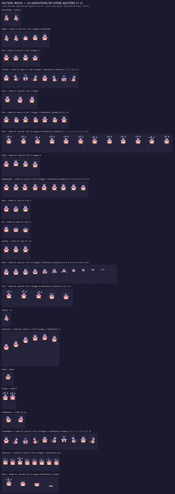

# Miltank #0241 (Écrémeuh) — animations de scène ajoutées

Le sprite officiel de Miltank sur [PMDCollab](https://sprites.pmdcollab.org/#/0241?form=0) a le set de donjon, mais
**aucune des 22 animations de scène** du « set complet » (Eat, Wake, Sit, Sink, Faint…). Ce dossier les
ajoute, sans toucher à ce qui existait.

## Méthode

**Composer, ne pas générer** — la méthode de Falinks, poussée d'un cran : les mouvements sont
maintenant **physiologiques**, pas de simples translations.

### 1. Des cases officielles, jamais un pixel repeint

Chaque image part d'une **case officielle de Miltank lui-même** (Idle, Hurt, Hop, Charge, Rotate,
Sleep…). La palette des nouvelles feuilles est incluse dans celle du sprite d'origine
(14 couleurs) — le vérificateur le refuse sinon.

### 2. Le mouvement est relevé sur la bibliothèque SpriteCollab

Un « manger » ne se fabrique pas en descendant tout le sprite de 2 px. Relevé ligne par ligne sur
l'`Eat` officiel de **Bayleef #0155** :

| | haut de la silhouette | bas (appuis au sol) | pixels |
| --- | --- | --- | --- |
| repos | ligne 2 | ligne 19 | 188 |
| bouchée | ligne 5 (**−3**) | ligne 19 (**inchangé**) | 162 (**−14 %**) |

Les pattes **ne bougent pas** et la silhouette **perd des pixels** : le corps s'écrase, la tête
plonge vers la nourriture. Une translation garderait 188 pixels et ferait décoller les pieds.

Ce comportement est reproduit par une déformation autour d'une **charnière basse** : la partie
haute est rééchantillonnée (des lignes de pixels existantes sont retirées ou répétées), la partie
basse reste intacte. Trois gestes en découlent — écrasement (`squash`), étirement (`stretch`),
inclinaison (`lean`) — qui servent à Eat, Nod, Sit, LookUp, DeepBreath, Pose, Pull, Trip,
LostBalance, Head, Cringe, HitGround et Faint.

### 3. L'amplitude suit la physionomie du Pokémon

Un Dedenne de 20 px ne plonge pas de la même hauteur qu'un Hariyama de 40 px. Les amplitudes sont
donc calculées sur la hauteur réelle de la silhouette au repos de **Miltank** (25 px) :

| Geste | Amplitude |
| --- | --- |
| plongée du repas | 3 px |
| respiration, hochement | 2 px |
| affaissement assis | 6 px |
| étirement vers le haut | 2 px |
| inclinaison latérale | 2 px |

### 4. Le temps vient du squelette

Nombre d'images, durées en 1/60 s, déplacements de l'ancre, nombre de lignes et numéro de créneau
`<Index>` sont relus tels quels sur **#0155** (Bayleef), qui possède le jeu Chunsoft complet.
Rien n'est inventé côté cadence.

### 5. Le sprite reste entier

Les animations d'origine sont recopiées **octet pour octet** et déclarées dans le même
`AnimData.xml` : le dossier s'importe directement dans SkyTemple.

## Ce qui est livré

| Fichier | Contenu |
| --- | --- |
| `AnimData.xml` | Sprite complet : animations d'origine **+** les 22 ajoutées, avec `ShadowSize` 1, cases, durées et créneaux. |
| `<Anim>-Anim.png` | Feuilles : une colonne par image, une ligne par direction (Bas, Bas-droite, Droite, Haut-droite, Haut, Haut-gauche, Gauche, Bas-gauche) ou une seule ligne pour les animations sans direction. |
| `<Anim>-Offsets.png` | Repères : noir = tête, vert = centre, rouge = main gauche, bleu = main droite, repris de la case source. |
| `<Anim>-Shadow.png` | Pixel blanc = ancre ; gabarit d'ombre du Pokémon lui-même autour de l'ancre. |
| `nuit/<Anim>-Anim.png` | Mêmes feuilles avec le filtre nuit des salles (`night()` de `source/rebuild_kit.py`). |
| `miltank_scenes.aseprite` | Aseprite animé : un calque par direction, les 22 animations bout à bout, une étiquette chacune. |
| `apercu.png` | Planche de contrôle × 2 : toutes les images de chaque animation ajoutée. |
| `apercu_eat.gif`, `apercu_chute.gif` | Lecture animée sur le parquet de la guilde. |
| `apercu.html` | Lecteur hors ligne : animation, direction, zoom, lecture. |
| `kit.json` | Cases, durées, créneaux, cases sources de chaque image, palette. |
| `controle_qualite.json` | Résultat du vérificateur. |
| `credits.txt` | Crédits au format SpriteCollab, lignes d'origine conservées. |

## Les 22 animations ajoutées

| Animation | Créneau | Case | Images | Dir. | Durée | Cases officielles employées |
| --- | --- | --- | --- | --- | --- | --- |
| `EventSleep` | 13 | 32 × 48 | 2 | 8 | 65 ticks | Sleep |
| `Wake` | 14 | 32 × 56 | 5 | 8 | 42 ticks | Idle, Sleep |
| `Eat` | 15 | 32 × 48 | 4 | 1 | 28 ticks | Idle |
| `Tumble` | 16 | 32 × 56 | 8 | 1 | 24 ticks | Rotate |
| `Pose` | 17 | 40 × 56 | 3 | 8 | 22 ticks | Charge, Idle |
| `Pull` | 18 | 24 × 48 | 7 | 1 | 76 ticks | Charge |
| `Pain` | 19 | 48 × 64 | 12 | 8 | 24 ticks | Hurt |
| `Float` | 20 | 32 × 64 | 4 | 8 | 50 ticks | Idle |
| `DeepBreath` | 21 | 32 × 48 | 9 | 1 | 62 ticks | Charge, Idle |
| `Nod` | 22 | 32 × 56 | 3 | 8 | 20 ticks | Idle |
| `Sit` | 23 | 32 × 48 | 3 | 1 | 24 ticks | Idle |
| `LookUp` | 24 | 32 × 56 | 3 | 1 | 18 ticks | Idle |
| `Sink` | 25 | 32 × 64 | 12 | 1 | 72 ticks | Idle |
| `Trip` | 26 | 48 × 64 | 5 | 8 | 22 ticks | Hurt |
| `Laying` | 27 | 32 × 48 | 1 | 8 | 12 ticks | Sleep |
| `LeapForth` | 28 | 32 × 120 | 6 | 1 | 14 ticks | Hop |
| `Head` | 29 | 40 × 56 | 1 | 8 | 4 ticks | Charge |
| `Cringe` | 30 | 24 × 72 | 2 | 1 | 10 ticks | Hurt |
| `LostBalance` | 31 | 32 × 64 | 2 | 1 | 16 ticks | Hurt |
| `TumbleBack` | 32 | 32 × 56 | 10 | 1 | 30 ticks | Rotate |
| `HitGround` | 34 | 24 × 56 | 8 | 1 | 34 ticks | Hurt |
| `Faint` | 33 | 48 × 56 | 4 | 8 | 34 ticks | Hurt |

Animations d'origine conservées telles quelles : `Walk`, `Attack`, `Stomp`, `Shoot`, `Appeal (copie de Twirl)`, `Twirl`, `Sleep`, `Hurt`, `Idle`, `Swing`, `Double`, `Hop`, `Charge`, `Rotate`.

## Contrôle

`source/personnages/verify_animations_scenes.py` rejoue les règles du SpriteBot (cases paires, feuilles
divisibles, 1 ou 8 lignes, durées = colonnes, alpha 0 ou 255, un seul pixel blanc et un seul repère par
couleur et par case, 15 couleurs au plus) **et** les contrôles de méthode : durées et déplacements d'ancre
identiques au squelette #0155, palette incluse dans celle du sprite d'origine, animations d'origine
inchangées, **et la signature physiologique** : sur Eat, Nod, Sit et LookUp, il mesure le déplacement du
haut, du bas et le nombre de pixels, puis exige qu'ils aillent dans le même sens que sur le squelette
officiel — un contrôle qu'une simple translation échouerait. Résultat dans `controle_qualite.json`.

## Licence

Voir `credits.txt` : les crédits d'origine du dépôt SpriteCollab sont conservés, et les animations ajoutées
reprennent la licence la plus restrictive du sprite source. Elles n'ont été **ni soumises ni approuvées**
sur SpriteCollab.
