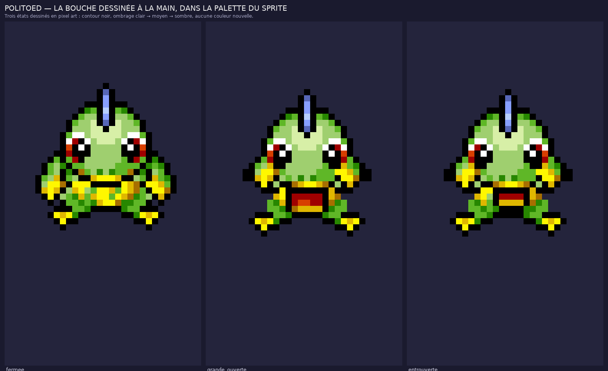

# Politoed #0186 — un `Eat` **dessiné**, à la manière de Chunsoft



Tous les autres lots de ce dépôt **déplacent** des pixels existants. Celui-ci franchit le pas :
des pixels sont **peints à la main**, comme le fait un artiste de SpriteCollab. La règle n'est
plus « ne rien repeindre », mais « repeindre en respectant exactement la grammaire du sprite ».

## Ce que font les artistes — relevé sur l'`Eat` de Pichu #0172

Comparaison caractère par caractère du visage de Pichu, au repos et pendant la bouchée :

```
repos                      bouchée
...acadbbbbbadca....       ..ahabbbbbbbaaaa....
...aeebbcgcbbeea....       ..aadbbbbbbbbca.....
...agebbgggbbega....       ..aebbbbbhabbca.....
....accbgegbcca.....       ..agaafbbadbbda.....
....aafcccccfaa.....       ...abbafbbeeca......
...acbcaaaaacbca....       ...acaccccegafa.....
```

L'artiste **redessine la tête entière**. Quatre règles s'en dégagent, et ce sont elles qu'on applique :

1. **La palette ne s'élargit jamais** — pas une couleur nouvelle ; on repeint avec les teintes déjà là.
2. **Tout trait est cerné de noir** `(0,0,0)` — la signature visuelle de la série.
3. **L'ombrage est ordonné** — clair → moyen → sombre, jamais de saut de valeur.
4. **Le changement est local et légèrement asymétrique** — pas de symétrie mécanique.

## Ce qui est dessiné

Politoed a une **grande bouche fermée** : le trait noir de `y=16, x=9..13` dans sa case Idle,
souligné de la lèvre jaune. C'est son trait le plus caractéristique — un Politoed qui mange
l'ouvre en grand. Trois états sont dessinés en pixel art dans le code source, sous forme de
grilles de caractères lisibles et modifiables :

| État | Description |
| --- | --- |
| `fermee` | l'original, non retouché (sert de témoin au vérificateur) |
| `entrouverte` | la lèvre s'écarte d'un pixel, le fond de gorge apparaît |
| `grande_ouverte` | la mâchoire descend, gorge profonde et **langue** au fond |

Le cycle est `fermée → grande ouverte → fermée → entrouverte` : l'artiste ne répète jamais deux
fois la même image, il varie l'amplitude pour que le cycle respire. Les mains montent en même
temps, avec le mécanisme déjà éprouvé.

## Ce qui est livré

| Fichier | Contenu |
| --- | --- |
| `AnimData.xml` | `Eat` au créneau 15, case 32 × 56, cadence officielle [6, 8, 6, 8]. |
| `Eat-Anim.png` | Feuille : 4 images × 8 directions. |
| `Eat-Offsets.png`, `Eat-Shadow.png` | Repères et ancre, repris de la case source. |
| `nuit/Eat-Anim.png` | Filtre nuit des salles de la guilde. |
| `politoed_eat.aseprite` | Aseprite animé, un calque par direction. |
| `apercu_bouches.png` | Les trois bouches en grand, côte à côte. |
| `apercu_eat.gif` | Lecture animée sur le parquet de la guilde. |
| `kit.json`, `controle_qualite.json`, `credits.txt` | Plan, contrôle, crédits. |

## Contrôle

`source/personnages/verify_eat_politoed.py` — le vérificateur le plus sévère du dépôt, parce que
c'est le seul lot où des pixels sont inventés. Outre les règles du SpriteBot, il vérifie la
grammaire graphique :

- **palette fermée** : aucune couleur qui ne soit déjà dans le sprite officiel (14 employées sur 15) ;
- **cerne noir** : dans la zone dessinée, aucun pixel de gorge à vif sur la peau ;
- **ombrage ordonné** : la lèvre claire ne touche jamais la sombre sans intermédiaire ;
- **changement local** : le bas du corps est intact au pixel près sous la zone redessinée ;
- **la bouche s'ouvre vraiment** : plus de pixels de gorge que sur l'image de repos ;
- **le repos est l'original** : l'image 0 est la case Idle officielle, non retouchée.

Ce dernier contrôle a d'ailleurs attrapé une vraie faute pendant l'écriture : une première
version laissait la gorge toucher la peau verte sans cerne.

## Licence

Sprite d'origine : CHUNSOFT (voir `credits.txt`). Technique relevée sur les `Eat` de Pichu #0172
et Riolu #0447. Cadence : Bayleef #0155. Ces images dessinées n'ont été **ni soumises ni
approuvées** sur SpriteCollab.
