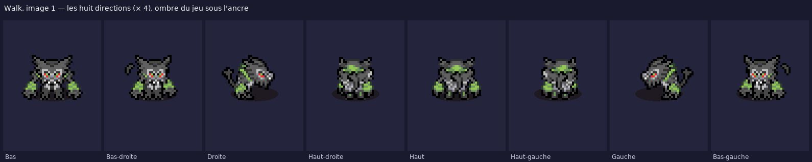
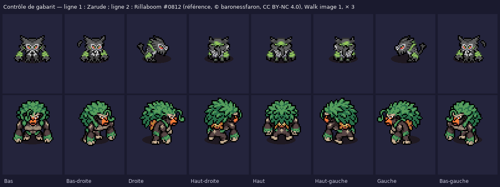

# Zarude #0893 — sprite PMD au format SpriteCollab



Sprite de donjon de **Zarude**, construit à partir de la **planche de marche fournie** (4 directions × 4 images,
Game Character Hub, `source/personnages/reference/zarude/`), livré dans le format des dépôts PMDCollab / SkyTemple
avec le **set donjon complet** : Idle, Walk, Sleep, Hurt, Attack, Charge, Shoot, Strike, Sing, Swing, Double, Rotate, Hop.

Zarude n'existe pas sur SpriteCollab. La planche donne le dessin (Bas, Gauche/Droite, Haut, 11 couleurs) ;
le **squelette d'animation vient de Rillaboom #0812** (forme 0, baronessfaron, CC BY-NC 4.0) : mêmes animations,
mêmes cases, mêmes durées, mêmes `RushFrame` / `HitFrame` / `ReturnFrame`, même déplacement de l'ancre à chaque
image, même sens de rotation pour Swing et Rotate. Aucun pixel de Rillaboom n'est repris.



## Ce qui est livré

| Fichier | Contenu |
| --- | --- |
| `AnimData.xml` | Déclaration SpriteCollab : `ShadowSize` 1, et pour chaque animation nom, index officiel, case, `RushFrame` / `HitFrame` / `ReturnFrame`, durées en 1/60 s. `Strike` est un `CopyOf` d'`Attack`. |
| `<Anim>-Anim.png` | Feuille d'images : une colonne par image, une ligne par direction (Bas, Bas-droite, Droite, Haut-droite, Haut, Haut-gauche, Gauche, Bas-gauche ; `Sleep` n'a qu'une ligne). RGBA, alpha 0 ou 255. |
| `<Anim>-Offsets.png` | Repères du jeu : noir = tête, vert = centre, rouge = main gauche, bleu = main droite (couleurs additionnées quand ils se superposent). |
| `<Anim>-Shadow.png` | Pixel blanc = ancre du sprite ; vert / rouge / bleu = gabarit d'ombre petite / normale / grande (celui des sprites officiels). |
| `nuit/<Anim>-Anim.png` | Mêmes feuilles avec le filtre nuit des salles de la guilde (`night()` de `source/rebuild_kit.py`). Offsets et Shadow sont inchangés. |
| `zarude.aseprite` | Fichier Aseprite animé : 8 calques (une direction chacun), les 12 animations bout à bout avec leurs durées (103 images), une étiquette par animation. |
| `apercu.png` | Planche de contrôle × 2 : toutes les images de chaque animation (directions Bas et Droite pour Walk / Attack / Sing). |
| `apercu_directions.png` | Walk image 1 dans les huit directions, × 4. |
| `apercu_reference.png` | Zarude au-dessus de Rillaboom, même case, même ancre : contrôle du gabarit. |
| `apercu_marche_attente.gif`, `apercu_attaque_hurlement.gif` | Lecture animée sur le parquet de la guilde (Walk / Idle, puis Attack / Sing, quatre directions). |
| `apercu.html` | Lecteur hors ligne : choix de l'animation, zoom, ombre, repères, grille de 24 px, variante nuit. |
| `kit.json` | Cases, durées, index, notes de composition, palette, orientations dessinées et miroirs. |
| `controle_qualite.json` | Résultat du vérificateur. |
| `credits.txt` | Crédits au format SpriteCollab (planche d'origine, référence Rillaboom, licence CC BY-NC 4.0). |

### Cases et cadences

| Animation | Index | Case | Images | Durée | Pose |
| --- | --- | --- | --- | --- | --- |
| Walk | 0 | 48 × 64 | 4 | 44 ticks | les quatre images de la planche (repos / pas A / repos / pas B) ; de profil le repos est le pas A, les pas le pas B ; le corps descend d'un pixel sur les pas |
| Attack | 1 | 72 × 88 | 13 | 26 ticks | bras levés au-dessus de la tête, frappe au sol accroupi avec griffures à l'impact, retour · Rush 2 · Hit 3 · Return 6 |
| Strike | 2 | — | — | — | copie d'Attack |
| Shoot | 3 | 48 × 64 | 11 | 26 ticks | rebond, puis accroupi bras poussés vers l'avant · Hit 1 · Return 3 |
| Sing | 4 | 48 × 64 | 16 | 48 ticks | hurlement : bras à demi levés, six coups de poing sur le poitrail, tête levée bras au ciel avec ondes · Hit 5 · Return 10 |
| Sleep | 5 | 40 × 40 | 2 | 65 ticks | couché en boule, masque vers la gauche, respiration |
| Hurt | 6 | 56 × 72 | 2 | 10 ticks | bras écartés (rejetés en arrière de profil), tête baissée, étincelles, recul de la référence |
| Idle | 7 | 40 × 64 | 1 | 32 ticks | pose de repos |
| Swing | 8 | 88 × 96 | 9 | 16 ticks | tour complet en décrivant un cercle (l'image i regarde la direction d − i) · Hit 5 · Return 5 |
| Double | 9 | 72 × 88 | 16 | 36 ticks | accroupi, aller-retour latéral de l'ancre |
| Hop | 10 | 48 × 104 | 10 | 24 ticks | accroupi, saut jusqu'à 23 px, réception accroupie · Hit 9 |
| Charge | 11 | 48 × 64 | 10 | 20 ticks | repos, tremblement d'un pixel · Hit 5 · Return 9 |
| Rotate | 12 | 48 × 64 | 9 | 18 ticks | tour complet sur place · Hit 8 |

Deux cases diffèrent de Rillaboom, agrandies d'un pas de 8 : **Hurt** 56 × 72 (48 × 72 chez lui : les bras
écartés de Zarude sont plus longs que son corps) et **Swing** 88 × 96 (80 × 96 : queue et bras dans le cercle).
L'ancre au repos est en (largeur / 2, hauteur / 2 + 4) comme dans tout le dépôt. `ShadowSize` vaut 1 : Zarude fait
22 px de haut, la taille d'un Pokémon moyen (Rillaboom, 35 px, a l'ombre 2).

## Méthode : découper la planche, recopier un squelette

Le constructeur `source/personnages/build_zarude_sprite.py`, ses pièces `zarude_pieces.py` et le script de découpe
`zarude_pieces_from_sheet.py` :

1. **La planche fournie est la source de vérité.** Elle est dessinée au double (256 × 256, `Description :
   Made with Game Character Hub`) : ramenée à 1:1 (128 × 128, cases 32 × 32, ancre en (16, 27)). Six teintes quasi
   doublons (53/53/53, 63/65/63, 94/97/94, 78/105/74, 200/200/200, 232/232/248) sont ramenées à leur voisine :
   **11 couleurs**. La vue « gauche » est retournée pour donner la Droite, comme dans les sprites officiels
   (dir 6 = miroir de dir 2). Chaque case est découpée en **pièces pixel-exactes** (tête, poitrail, deux bras, deux
   jambes, queue, dos) par tables de plages `R(y, x0, x1)` ; la découpe est vérifiée sans pixel oublié ni doublon.
2. **Walk = la planche.** Le vérificateur du constructeur (`cmp` dans la méthode) confirme que les images Bas,
   Droite et Haut de Walk reproduisent les cases de la planche au pixel près (à part le pixel de descente du corps
   sur les pas, et un pixel de recouvrement bras/torse au pas B de profil).
3. **Diagonales dessinées** dans la palette : tête et poitrail de trois quarts (oreille éloignée plus fine, traits
   du masque décalés d'un pixel), dos de trois quarts (lianes décalées, sliver du masque), bras et jambes de la
   planche rapprochés de l'axe de 3 px avec le bras éloigné passé derrière le corps.
4. **Bras des animations dessinés** dans le trait de la planche (contour noir, avant-bras 3-4 px, cuff de lianes,
   main griffue) : levé, tendu sur le côté, plié au poitrail, poussé vers l'avant ; deux points nommés chacun
   (épaule, poing) pour les repères mains. **Sommeil** et **effets** (griffures, ondes, étincelles) dessinés aussi.
5. **Le squelette vient de Rillaboom** : `AnimData.xml` de la référence (`source/personnages/reference/0812/`, copie
   intacte) et, pour chaque case, le déplacement du pixel blanc de sa feuille Shadow, relu tel quel. C'est ce qui
   donne la charge de l'attaque, la secousse de Charge, le cercle de Swing, l'aller-retour de Double et la parabole
   de Hop. Si une pose déborde de la case de la référence, la case est agrandie par pas de 8 (`Builder.fit`).
6. **Réassemblage** avec le pipeline commun aux sprites du kit (`sheet`, `write_aseprite`, aperçus, filtre nuit).

Le vérificateur `source/personnages/verify_zarude_sprite.py` rejoue les contrôles du SpriteBot (index imposés,
`CopyOf`, tailles de feuilles, 1 ou 8 lignes, durées, alpha binaire, un seul pixel blanc et un seul jeu de repères
par case, 15 couleurs au plus) et ajoute : squelette identique à Rillaboom (durées, Rush/Hit/Return, cases agrandies
seulement par pas de 8, déplacement d'ancre et gabarit d'ombre à chaque image), miroirs exacts des directions
gauches, Swing / Rotate tournant d'une direction par image, Idle et Charge égaux à la pose de repos de Walk,
palette ⊂ pièces, marge d'un pixel, repères dans le dessin, silhouettes nuit = jour, Aseprite ↔ feuilles,
`kit.json`, `credits.txt` et aperçus présents.

```
python3 source/personnages/zarude_pieces_from_sheet.py   # seulement si une découpe ou une pièce dessinée change
python3 source/personnages/build_zarude_sprite.py        # ~8 s, déterministe
python3 source/personnages/verify_zarude_sprite.py       # « OK — 13 animations, 810 cases contrôlées, 11 couleurs, ShadowSize 1, squelette Rillaboom respecté »
```

## Limites

- **Les diagonales et les bras d'animation sont des ajouts** : ils suivent le trait de la planche mais n'ont pas
  été relus par son auteur. Tout se retouche dans `zarude_pieces_from_sheet.py` (tables de découpe et bitmaps
  ASCII) puis rebuild.
- **Idle à une image**, comme Rillaboom : pas de respiration au repos.
- **Auteur de la planche non renseigné** dans `credits.txt` : à compléter si vous le connaissez. Licence retenue
  pour le pack : CC BY-NC 4.0, comme la référence, sous réserve des droits sur la planche.
- **Pas sur SpriteCollab.** Le dépôt n'accepte que des sprites relus par sa communauté ; celui-ci n'y a été ni
  soumis ni approuvé.
