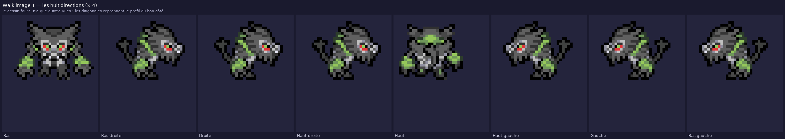

# Zarude — dessin fourni, mis au format SpriteCollab

Le dessin transmis (`IMG_4840.png`, repris dans `source/personnages/reference/zarude_fourni.png`) est une
planche **256 × 256 : 4 orientations × 4 images**, cases de 64 × 64. Ce dossier le met au format des dépôts
PMDCollab / SkyTemple **sans en repeindre le style**, avec le set de donjon complet.

Il existe deux Zarude dans ce dépôt, volontairement séparés :

| Dossier | Dessin | Animation |
| --- | --- | --- |
| `personnages/zarude/` | dessiné pièce par pièce dans le dépôt (bitmaps ASCII, cinq orientations) | squelette Rillaboom #0812 |
| `personnages/zarude_fourni/` (ici) | **dessin fourni par l'utilisateur**, non modifié | squelette Rillaboom #0812 |

## Méthode

1. **Lecture de la planche.** Les quatre lignes sont : de face, profil gauche, son miroir exact
   (profil droit) et de dos. Les quatre colonnes forment un cycle de marche — les images 0 et 2 sont
   deux appuis distincts, 1 et 3 les mêmes abaissés de 2 px. Chaque case est recadrée sur son contenu
   et reçoit une **ancre au sol** (milieu de la dernière ligne opaque), qui remplace le pixel blanc
   absent de la planche d'origine.
2. **Palette ramenée à 15 couleurs** — le SpriteBot en refuse davantage. Le dessin en avait 17 ; les plus
   rares sont rabattues sur leur voisine la plus proche, sans effet visible :
- `#4e694a` → `#5e615e` (16 pixels)
- `#ffffff` → `#e8e8f8` (32 pixels)
3. **Huit directions.** Le dessin n'en donne que quatre. Les diagonales reprennent le profil du bon côté,
   comme le font les sprites officiels à quatre vues. **C'est la limite connue de ce lot** : il faudrait
   quatre vues diagonales dessinées pour la lever.
4. **Squelette d'animation.** Cadences, cases, déplacements d'ancre, créneaux `<Index>` et
   `Rush`/`Hit`/`Return` sont relus tels quels sur **Rillaboom #0812** (même carrure). Chaque image choisit
   une des quatre poses fournies selon un plan explicite (`kit.json` → `animations.<nom>.poses`) ; c'est
   l'ancre du squelette qui porte l'élan de l'attaque, la parabole du bond, la secousse et le cercle de Swing.

## Ce qui est livré

| Fichier | Contenu |
| --- | --- |
| `AnimData.xml` | `ShadowSize` 2, les 12 animations + `Strike` en `CopyOf` d'`Attack`. |
| `<Anim>-Anim.png` | Feuilles : une colonne par image, une ligne par direction. |
| `<Anim>-Offsets.png` | Repères : noir = tête, vert = centre, rouge/bleu = mains. |
| `<Anim>-Shadow.png` | Pixel blanc = ancre ; gabarit d'ombre du squelette. |
| `nuit/<Anim>-Anim.png` | Filtre nuit des salles de la guilde. |
| `zarude_fourni.aseprite` | Aseprite animé : 8 calques (directions), une étiquette par animation. |
| `apercu.png`, `apercu_directions.png` | Planches de contrôle. |
| `apercu_marche_attente.gif`, `apercu_attaque.gif` | Lecture animée sur le parquet de la guilde. |
| `apercu.html` | Lecteur hors ligne. |
| `kit.json`, `controle_qualite.json`, `credits.txt` | Plan, contrôle, crédits. |

## Animations

| Animation | Créneau | Case | Images | Dir. | Durée |
| --- | --- | --- | --- | --- | --- |
| `Idle` | 7 | 72 × 88 | 1 | 8 | 32 ticks |
| `Walk` | 0 | 72 × 88 | 4 | 8 | 44 ticks |
| `Sleep` | 5 | 72 × 88 | 2 | 1 | 65 ticks |
| `Hurt` | 6 | 72 × 96 | 2 | 8 | 10 ticks |
| `Attack` | 1 | 72 × 96 | 13 | 8 | 26 ticks |
| `Shoot` | 3 | 72 × 96 | 11 | 8 | 26 ticks |
| `Sing` | 4 | 72 × 88 | 16 | 8 | 48 ticks |
| `Swing` | 8 | 88 × 96 | 9 | 8 | 16 ticks |
| `Double` | 9 | 96 × 88 | 16 | 8 | 36 ticks |
| `Hop` | 10 | 72 × 104 | 10 | 8 | 24 ticks |
| `Charge` | 11 | 72 × 88 | 10 | 8 | 20 ticks |
| `Rotate` | 12 | 72 × 88 | 9 | 8 | 18 ticks |

`Strike` est un `CopyOf` d'`Attack`, comme sur la référence.

## Contrôle

`source/personnages/verify_zarude_fourni.py` rejoue les règles du SpriteBot **et** vérifie que chaque
silhouette est, au pixel près, l'une des seize poses fournies (éventuellement retournée), que la palette
ne contient aucune couleur hors du dessin, et que durées, cases et déplacements d'ancre sont ceux de
Rillaboom #0812. Résultat dans `controle_qualite.json` (15 couleurs).

## Licence

Dessin : utilisateur. Squelette d'animation : Rillaboom #0812 par baronessfaron, CC BY-NC 4.0. Zarude #0893
n'existe pas sur SpriteCollab ; ce sprite n'y a été **ni soumis ni approuvé**. Voir `credits.txt`.
