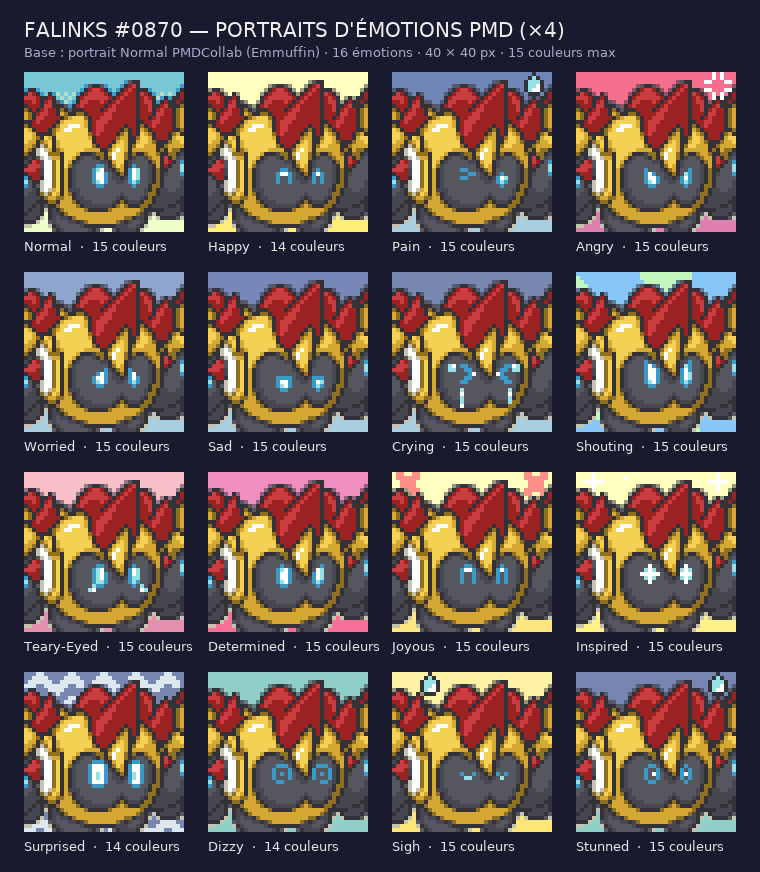

# Falinks #0870 — portraits d'émotions au format PMDCollab



## Ce qui est livré

| Fichier | Contenu |
| --- | --- |
| `planche_spritebot.png` | **200 × 320 px**, le gabarit SpriteBot : 5 colonnes × 8 rangées de 40 px. Rangées 1–4 : les 16 émotions dans l'ordre officiel ; rangées 5–8 : les mêmes retournées (`^`). Les 4 cases *Special* sont transparentes. |
| `planche_spritebot_160.png` | Les 16 émotions seules, 200 × 160 px, sans la moitié retournée. |
| `emotions/<Emotion>.png` | 16 portraits individuels **40 × 40**, RGBA opaque, **≤ 15 couleurs** chacun. |
| `emotions/<Emotion>^.png` | Versions retournées, miroir horizontal exact. |
| `apercu.png` | Planche de lecture × 4 avec le nombre de couleurs. |
| `kit.json` | Ordre du gabarit, palette de base, boîtes des yeux, description pixel de chaque émotion. |
| `controle_qualite.json` | Résultat du vérificateur. |
| `credits.txt` | Crédits au format SpriteCollab. |

Ordre du gabarit (`sprite_config.json` de SpriteCollab) :

```
Normal    Happy     Pain       Angry     Worried
Sad       Crying    Shouting   Teary-Eyed Determined
Joyous    Inspired  Surprised  Dizzy     Special0
Special1  Sigh      Stunned    Special2  Special3
```

## Méthode : retouche pixel, pas génération

Le portrait **Normal** publié sur PMDCollab (auteur **Emmuffin**, licence PMDCollab_2) est la base, conservée à l'identique dans `source/portraits/reference/`. Chaque émotion en dérive par retouche pixel scriptée — exactement ce que fait un spriter qui décline un portrait :

1. **Fond** : couleurs Chunsoft de l'émotion, relevées sur les portraits officiels de Pikachu (jaune Happy/Joyous/Inspired, rose Angry, bleu Sad/Pain/Worried, rayons Shouting, zigzags Surprised, uni Dizzy…). Seuls les pixels de fond changent ; l'anticrénelage ciel/cimier est reteinté avec le nouveau fond.
2. **Yeux du brass** : les deux lumières bleues (18 pixels) sont effacées puis redessinées dans une boîte de 5 × 8 px par œil, dans la palette existante (bleu, cyan, blanc). Rien d'autre du visage n'est touché.
3. **Troupiers** : quand le brass ferme les yeux (Happy, Joyous, Sigh, Crying), les fentes visibles des deux troupiers sur les bords se ferment aussi — toute l'escouade réagit.
4. **Effets** : goutte sur le cimier (Pain, Stunned, Sigh), larmes (Crying, Teary-Eyed), marque de colère (Angry), croix saumon et étincelles sur le fond (Joyous, Inspired).

Le générateur d'images n'a pas été utilisé : à 40 × 40 px et 15 couleurs, il produit des formes floues qu'il faudrait repixelliser entièrement, et il ne sait pas conserver la base pixel pour pixel. Les décors de la guilde suivent une autre méthode ; ici, la précision prime.

Le vérificateur contrôle que : chaque PNG fait 40 × 40 en RGBA opaque avec ≤ 15 couleurs ; `Normal` est identique à la base ; au moins 80 % du personnage est conservé (mesuré : 95–97 %) ; les retouches restent dans les zones prévues (yeux, bord haut, fentes des troupiers) ; les `^` sont des miroirs exacts ; la planche recompose les PNG et laisse les cases *Special* vides.

## Licence et crédits

Le portrait de base est sous **PMDCollab_2** : usage, copie, redistribution et modification autorisés avec crédit à l'artiste d'origine, **hors usage commercial**. Les 15 émotions dérivées héritent de cette condition. Elles ne sont ni soumises ni approuvées sur le serveur PMDCollab ; pour une soumission, passer par le canal `#submissions` avec la planche 200 × 320 et créditer Emmuffin.

## Reproduire

```bash
python source/portraits/build_portraits_falinks.py
python source/portraits/verify_portraits_falinks.py
```

Pour ajuster une émotion, modifier son motif dans `EYES` / `EFFECTS` du constructeur (légende : `A` bleu, `E` cyan, `B` blanc, `.` pixel conservé), puis relancer les deux scripts.
