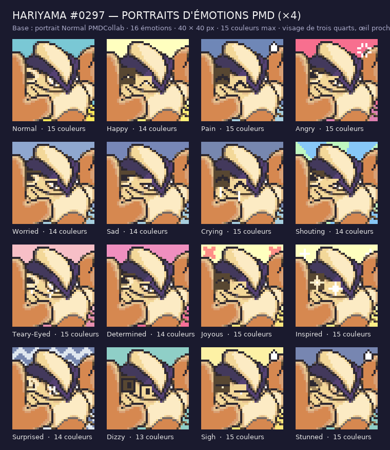

# Hariyama #0297 (Hariyama) — portraits d'émotions

Le dépôt [PMDCollab](https://sprites.pmdcollab.org/#/0297?form=0) ne publie que **1** portrait(s) pour ce Pokémon
(Normal). Ce dossier complète la planche : **16 émotions** au
format PMDCollab, plus leurs versions retournées « ^ », et la planche SpriteBot 200 × 320.

## Méthode

Le portrait **Normal** officiel sert de base et **n'est jamais redessiné**. Une émotion, c'est trois
retouches contrôlées :

1. **Le fond** est repeint aux couleurs Chunsoft de l'émotion (dégradé ciel/sol, rayons pour Shouting,
   zigzag pour Surprised). Le fond est détecté par propagation depuis le bord, en n'autorisant que les
   couleurs présentes sur le cadre et **absentes du carré central** occupé par le personnage : la
   propagation s'arrête exactement sur la silhouette, anticrénelage compris.
   [Voir les repères](apercu_reperes.png) — magenta : le fond détecté ; cyan : les boîtes des yeux.
2. **Les yeux** sont transformés par des opérations sur leurs propres pixels (fermer en arche, plisser,
   rabattre la paupière, incliner, écarquiller, éteindre la lumière, spirale, étoile), en n'employant que
   les couleurs déjà présentes dans l'œil et la peau qui l'entoure. Boîte(s) relevée(s) sur cette base :
   16, 18 (6 × 6), 7, 14 (7 × 8).
3. **Les effets** (goutte de sueur, larmes, marque de colère, croix, étincelles) sont posés dans la palette
   Chunsoft déjà utilisée par le kit, sur le fond ou par-dessus selon l'émotion.

Aucun pixel n'est peint par un générateur d'images. Chaque portrait tient dans **15 couleurs** ; quand le
dégradé de fond ferait passer la planche à 16, on retombe sur un aplat, comme plusieurs portraits officiels.

Particularité de ce portrait : visage de trois quarts, œil proche à droite du bandeau.

## Ce qui est livré

| Fichier | Contenu |
| --- | --- |
| `emotions/<Emotion>.png` | Portrait 40 × 40, RGBA opaque, ≤ 15 couleurs. |
| `emotions/<Emotion>^.png` | Version retournée : miroir horizontal exact. |
| `planche_spritebot.png` | Planche 200 × 320 : ordre officiel, moitié basse = versions « ^ », cases `Special` vides. |
| `planche_spritebot_160.png` | Les 16 émotions sans la moitié retournée. |
| `apercu.png` | Planche de lecture × 4, avec le compte de couleurs. |
| `apercu_reperes.png` | Base × 8 avec le fond détecté et les boîtes des yeux. |
| `kit.json` | Boîtes des yeux, opérations, fond et effets de chaque émotion, palettes. |
| `controle_qualite.json` | Résultat du vérificateur. |
| `credits.txt` | Crédits au format SpriteCollab, lignes d'origine conservées. |

## Les émotions

| Émotion | Couleurs | Origine | Effets |
| --- | --- | --- | --- |
| `Normal` | 15 | officiel PMDCollab | — |
| `Happy` | 14 | yeux : arch | — |
| `Pain` | 15 | yeux : squeeze | goutte de sueur |
| `Angry` | 15 | yeux : slant | marque de colère |
| `Worried` | 14 | yeux : lid | — |
| `Sad` | 14 | yeux : lid | — |
| `Crying` | 15 | yeux : squeeze | larmes |
| `Shouting` | 14 | yeux : slant | — |
| `Teary-Eyed` | 15 | yeux : wet | larmes |
| `Determined` | 14 | yeux : slant | — |
| `Joyous` | 15 | yeux : arch | croix de joie sur le fond |
| `Inspired` | 15 | yeux : star | étincelles sur le fond |
| `Surprised` | 14 | yeux : shrink | — |
| `Dizzy` | 13 | yeux : spiral | — |
| `Sigh` | 15 | yeux : line | soupir : goutte |
| `Stunned` | 15 | yeux : blank | hébétude : goutte |

## Contrôle

`source/portraits/verify_portraits_manquants.py` vérifie le format (40 × 40, opacité, 15 couleurs, planche
200 × 320, miroirs exacts, cases `Special` vides) **et** la méthode : les émotions officielles sont reprises
à l'identique, `Normal` est la base intacte, et hors du fond une émotion ne modifie que les boîtes des yeux
et les zones d'effet déclarées — le reste du personnage garde sa palette d'origine.

## Licence

Voir `credits.txt` : crédits d'origine du dépôt SpriteCollab conservés. Les émotions ajoutées n'ont été
**ni soumises ni approuvées** sur SpriteCollab.
