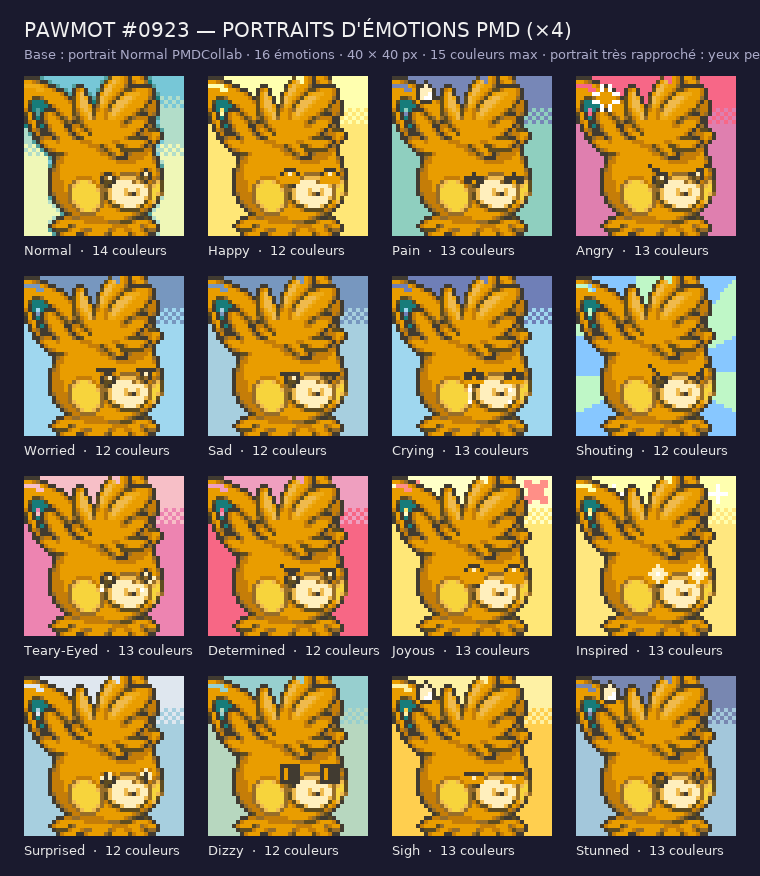

# Pawmot #0923 (Pawmot) — portraits d'émotions

Le dépôt [PMDCollab](https://sprites.pmdcollab.org/#/0923?form=0) ne publie que **1** portrait(s) pour ce Pokémon
(Normal). Ce dossier complète la planche : **16 émotions** au
format PMDCollab, plus leurs versions retournées « ^ », et la planche SpriteBot 200 × 320.

## Méthode

Le portrait **Normal** officiel sert de base et **n'est jamais redessiné**. Une émotion, c'est trois
retouches contrôlées :

1. **Le fond est canonique.** Les fonds de portrait PMDCollab ne sont ni libres ni dégradés : ce sont
   des **paires de couleurs fixes par émotion**, identiques d'un Pokémon à l'autre, disposées toujours
   de la même façon — ciel plein en haut jusqu'à la ligne 8, sol plein en bas, et entre les deux
   une bande de 4 lignes en **damier**. Les deux teintes de chaque émotion ont été relevées sur les
   huit jeux de référence du dépôt (ligne 0 pour le ciel, coins bas pour le sol, valeur majoritaire).
   `Shouting` fait exception : c'est le seul fond radial officiel, des rayons depuis le visage.

   Le décor d'origine est repéré par ses **couleurs canoniques connues** (la base est un portrait
   `Normal`, donc son décor est `#77c7d7` / `#e7f7b7`), complétées par les teintes qui bordent l'image
   sans jamais apparaître au centre — les deux critères réunis, car pris séparément ils ne trouvaient
   que 6 à 30 % du fond. [Voir les repères](apercu_reperes.png) — magenta : le fond détecté ; cyan :
   les boîtes des yeux.
2. **Les yeux** sont transformés par des opérations sur leurs propres pixels (fermer en arche, plisser,
   rabattre la paupière, incliner, écarquiller, éteindre la lumière, spirale, étoile), en n'employant que
   les couleurs déjà présentes dans l'œil et la peau qui l'entoure. Boîte(s) relevée(s) sur cette base :
   28, 22 (5 × 5), 18, 22 (5 × 5).
3. **Les effets** (goutte de sueur, larmes, marque de colère, croix, étincelles) sont posés dans la palette
   Chunsoft déjà utilisée par le kit, sur le fond ou par-dessus selon l'émotion.

Aucun pixel n'est peint par un générateur d'images. Chaque portrait tient dans **15 couleurs** ; quand la
paire de fond ferait passer la planche à 16, on retombe sur un aplat, comme plusieurs portraits officiels.

Particularité de ce portrait : portrait très rapproché : yeux petits, au-dessus du museau clair.

## Ce qui est livré

| Fichier | Contenu |
| --- | --- |
| `emotions/<Emotion>.png` | Portrait 40 × 40, RGBA opaque, ≤ 15 couleurs. |
| `emotions/<Emotion>^.png` | Version retournée : miroir horizontal exact. |
| `planche_spritebot.png` | Planche 200 × 320 : ordre officiel, moitié basse = versions « ^ », cases `Special` vides. |
| `planche_spritebot_160.png` | Les 16 émotions sans la moitié retournée. |
| `apercu.png` | Planche de lecture × 4, avec le compte de couleurs. |
| `apercu_reperes.png` | Base × 8 avec le fond détecté et les boîtes des yeux. |
| `kit.json` | Boîtes des yeux, opérations, fond et effets de chaque émotion, palettes. |
| `controle_qualite.json` | Résultat du vérificateur. |
| `credits.txt` | Crédits au format SpriteCollab, lignes d'origine conservées. |

## Les émotions

| Émotion | Couleurs | Origine | Effets |
| --- | --- | --- | --- |
| `Normal` | 14 | officiel PMDCollab | — |
| `Happy` | 12 | yeux : arch | — |
| `Pain` | 13 | yeux : squeeze | goutte de sueur |
| `Angry` | 13 | yeux : slant | marque de colère |
| `Worried` | 12 | yeux : lid | — |
| `Sad` | 12 | yeux : lid | — |
| `Crying` | 13 | yeux : squeeze | larmes |
| `Shouting` | 12 | yeux : slant | — |
| `Teary-Eyed` | 13 | yeux : wet | larmes |
| `Determined` | 12 | yeux : slant | — |
| `Joyous` | 13 | yeux : arch | croix de joie sur le fond |
| `Inspired` | 13 | yeux : star | étincelles sur le fond |
| `Surprised` | 12 | yeux : shrink | — |
| `Dizzy` | 11 | yeux : spiral | — |
| `Sigh` | 13 | yeux : line | soupir : goutte |
| `Stunned` | 13 | yeux : blank | hébétude : goutte |

## Contrôle

`source/portraits/verify_portraits_manquants.py` vérifie le format (40 × 40, opacité, 15 couleurs, planche
200 × 320, miroirs exacts, cases `Special` vides) **et** la méthode : les émotions officielles sont reprises
à l'identique, `Normal` est la base intacte, et hors du fond une émotion ne modifie que les boîtes des yeux
et les zones d'effet déclarées — le reste du personnage garde sa palette d'origine. **La canonicité du fond
est contrôlée** : teinte majoritaire du ciel et du sol égale à la valeur officielle de l'émotion, ciel en
bandes horizontales unies (donc pas de dégradé), et bande de transition contenant bien les deux teintes.

## Licence

Voir `credits.txt` : crédits d'origine du dépôt SpriteCollab conservés. Les émotions ajoutées n'ont été
**ni soumises ni approuvées** sur SpriteCollab.
