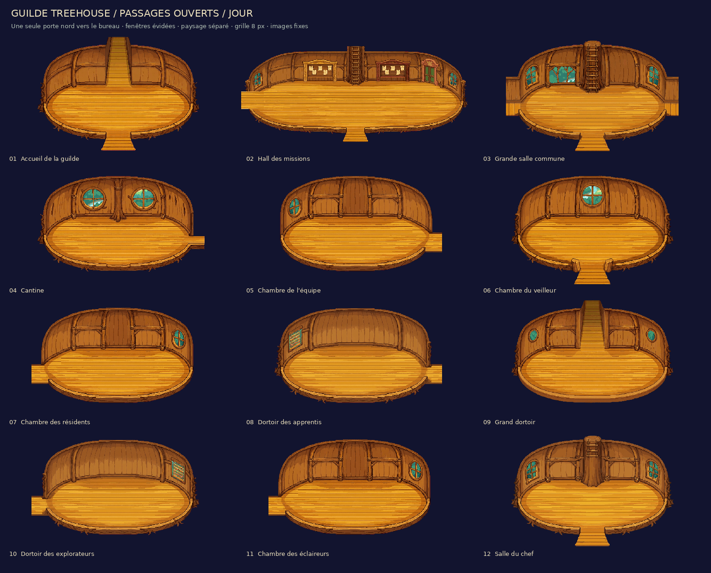
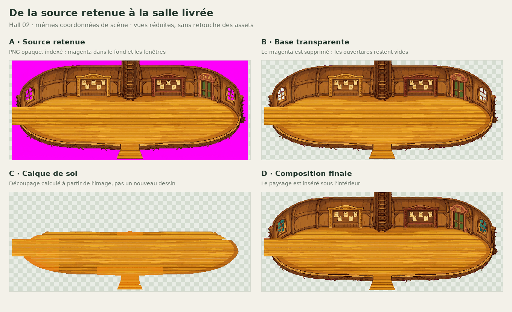
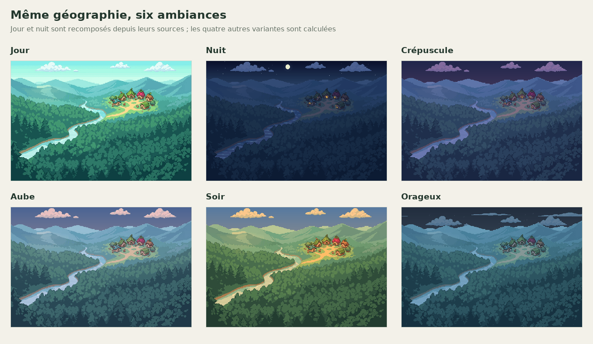
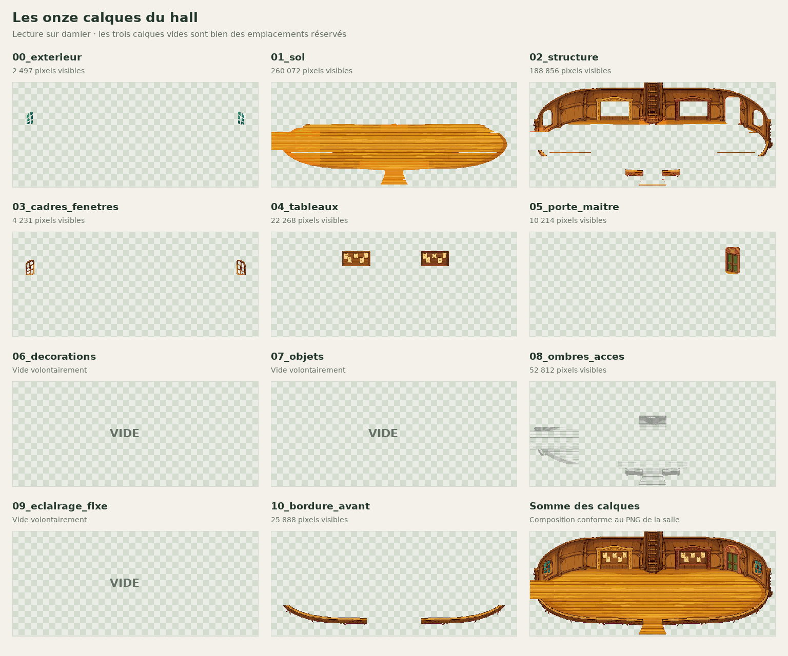
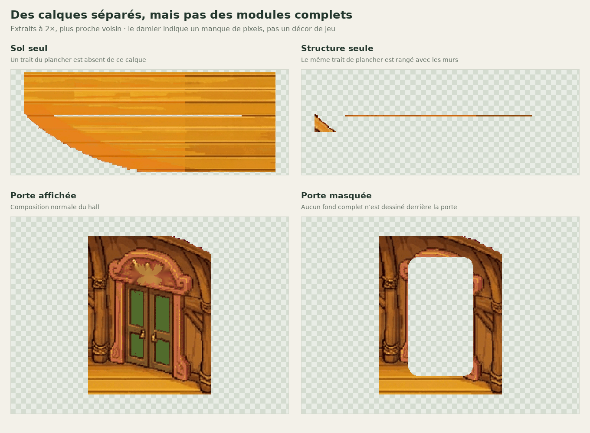
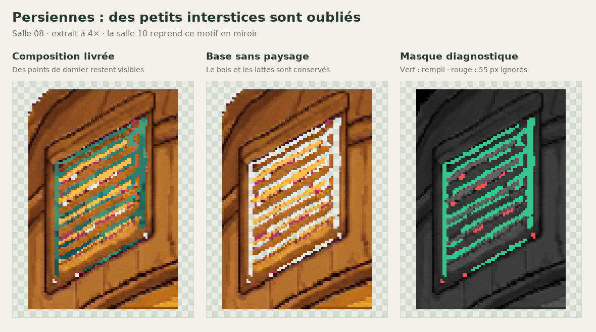
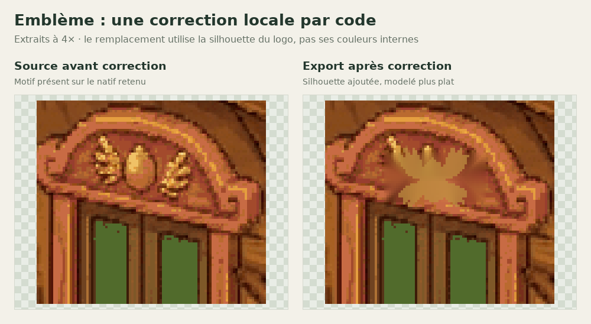

# Intérieurs de la guilde : méthode et qualité

Rapport du **5 septembre 2026** · Dépôt `meromoonmeri/guilde-treehouse-pmd` · Révision étudiée : `6c4ac5a`.

## 01 · Conclusion en bref {#synthese}

**La méthode est hybride : retouches au générateur d’images, puis détourage, séparation en calques et export par des scripts Python.** Le dépôt ne montre pas une création de onze calques indépendants dans le générateur ou dans Aseprite. Il contient surtout des images aplaties, à partir desquelles les calques de livraison sont reconstruits.

Mon avis : **une base visuelle cohérente et une chaîne d’export bien contrôlée, mais une modularité encore partielle**. Le kit convient mieux à des salles fixes qu’à un décor dont on déplace librement les murs, portes et fenêtres.

- **Retrouvé :** 12 salles, 24 compositions jour/nuit, 264 PNG de calques et 24 fichiers Aseprite.
- **Compris et vérifié :** le traitement des images, la fabrication des calques, les paysages interchangeables et les exports.
- **Non retrouvé :** les prompts originaux, le nom et la version du générateur, ses paramètres et le journal des essais. Je ne peux donc pas prétendre reproduire exactement sa phase générative.
- **À reprendre en priorité :** quelques masques, le classement de certains pixels entre sol et structure et les fonds cachés nécessaires à une vraie édition modulaire.

**Aucune image de jeu n’a été modifiée pour cet audit. Aucune nouvelle image n’a été générée par IA.** Les illustrations du rapport sont des montages, extraits et visualisations de masques des fichiers existants.



*Planche fournie avec le kit. Les pièces sont volontairement vides ; l’absence de mobilier n’est pas un défaut de cette livraison.*

## 02 · Images et fichiers récupérés {#inventaire}

La récupération a été faite **dans le dépôt fourni**, sans téléchargement d’un pack extérieur ni duplication de toutes les images dans un nouveau ZIP.

| Ensemble | Quantité vérifiée | Emplacement et rôle |
| --- | ---: | --- |
| Images natives retenues | 9 PNG | `source/natives/` : points de départ aplatis |
| Salles composées | 24 PNG | `salles/*/salle_jour.png` et `salle_nuit.png` |
| Bases sans paysage | 24 PNG | `salles/*/base_*_transparente.png` |
| Bases de contrôle magenta | 24 PNG | `salles/*/base_*_magenta.png` |
| Calques exportés | 264 PNG | `calques/<salle>/<jour-ou-nuit>/` : 11 par variante |
| Documents Aseprite | 24 | `salles/` : une image fixe et 11 calques chacun |
| Cartes Tiled | 24 | `tiled/` : grille de 8 × 8 px |
| Paysages | 6 panoramas + 72 vues masquées | `exterieur/` et `fenetres_exterieur/` ; 12 masques supplémentaires |
| Banque de décoration séparée | 135 sprites individuels | `sprites/individuels/`, atlas jour/nuit et métadonnées |

Le **hall 02 mesure 1280 × 544 px**. Les onze autres salles mesurent **648 × 432 px**. La grille de 8 px est une grille de travail et d’export, pas la taille des pixels du dessin.

| Salle | Natif utilisé | Accès actuels | Groupes de fenêtres |
| --- | --- | --- | ---: |
| 01 · Accueil | `01.png` | Nord, sud | 0 |
| 02 · Hall des missions | `02.png` | Ouest, sud, échelle nord, porte nord vers 12 | 2 |
| 03 · Grande salle commune | `03.png` | Ouest, est, sud, échelle nord | 3 |
| 04 · Cantine | `04.png` | Est | 2 |
| 05 · Chambre de l’équipe | `05.png` | Est | 1 |
| 06 · Chambre du veilleur | `06.png` | Sud | 1 |
| 07 · Chambre des résidents | `05.png`, miroir | Ouest | 1 |
| 08 · Dortoir des apprentis | `08.png` | Est | 1 |
| 09 · Grand dortoir | `09.png` | Nord | 2 |
| 10 · Dortoir des explorateurs | `08.png`, miroir | Ouest | 1 |
| 11 · Chambre des éclaireurs | `05.png`, miroir | Ouest | 1 |
| 12 · Salle du chef | `12.png` | Sud | 2 |

Pour examiner les fichiers individuellement, [l’aperçu existant](../../apercu_pmd.html) permet de changer de salle, d’ambiance et de masquer les calques. Les chemins exacts des compositions, bases et Aseprite sont dans [kit.json](../../kit.json).

La banque de sprites contient **107 éléments de végétation et 28 autres éléments** : mobilier, couchages, lampes, textiles, ornements et portes. Elle n’est pas posée dans les salles actuelles. Son extraction initiale n’est pas reconstruite par les scripts fournis ; les placements historiques sont à revalider avant réutilisation.

## 03 · Sa méthode de travail, reconstituée {#methode}

### A. Partir d’un kit et de consignes visuelles

Le README indique que les retouches ont été faites avec un générateur **à partir des images du kit**, et que des images de jeu ont servi à comprendre les passages, sans être collées dans les décors. C’est une **provenance déclarée**, pas une session de génération que je peux revoir. [R1]

Les contraintes conservées sont précises : pièces vides, passages ouverts avec continuité du sol, pas de portes aux sorties ordinaires, une seule porte fermée au nord du hall, fenêtres sans paysage intégré et tronc/échelle du hall prolongés hors cadre. [R2]

### B. Conserver neuf images aplaties

Les neuf PNG de `source/natives/` sont **opaques, indexés et utilisent 255 ou 256 couleurs**, avec du magenta autour de la salle et dans les fenêtres. Ce sont les sources de reconstruction disponibles, mais rien ne garantit qu’il s’agisse des sorties brutes du générateur avant toute préparation.

Les salles 07, 10 et 11 sont dérivées par miroir. Le script n’appelle aucun service de génération d’images : cette étape a eu lieu **en amont du code fourni**. [R3]

### C. Détourer et corriger localement

`key()` détecte le magenta par des seuils de couleur et élargit légèrement la détection près des contours. Il transforme ces pixels en transparence.

Dans le hall, le script repère la porte verte, efface une partie de son ancien emblème avec **l’inpainting classique OpenCV/Telea**, puis applique la silhouette de `embleme_4_ailes.png`. Cet inpainting n’est pas un appel au générateur d’images. [R3]

### D. Fabriquer les calques après coup

Le découpage combine plusieurs techniques :

- détection des trous transparents, regroupement et dilatation pour les fenêtres ;
- rectangles prédéfinis pour le contenu des tableaux du hall ;
- segmentation **GrabCut**, guidée par une ellipse centrale, pour le sol ;
- ajustements géométriques pour les passages et la bordure avant ;
- affectation du reste des pixels à la structure.

Le script **répartit donc les pixels d’un dessin existant**. Il ne redessine pas le plancher derrière une porte ou derrière un mur. [R4]



### E. Dériver ombres et variante de nuit

Les ombres d’accès sont extraites de pixels foncés dans des zones prédéfinies. Les autres calques sont éclaircis en compensation pour préserver l’apparence de la composition.

La nuit est calculée par une transformation des couleurs des calques intérieurs, hors ombre conservée :

```text
R nuit = arrondi(0,36 × R jour + 9)
V nuit = arrondi(0,34 × V jour + 10)
B nuit = arrondi(0,43 × B jour + 19)
```

**Il n’y a pas une nouvelle génération indépendante pour chaque salle de nuit.** C’est un bon moyen d’éviter que les fenêtres ou la géométrie changent entre deux ambiances. En revanche, ce n’est pas un recalcul de l’éclairage de la pièce. [R5]

### F. Réinsérer le paysage, exporter et contrôler

Les paysages jour et nuit sont recomposés depuis **neuf couches de référence chacun**. Aube, soir, crépuscule et orage sont produits par code : corrections colorimétriques, ciel, soleil, brouillard ou pluie fixe. Ils ne sont pas quatre nouvelles scènes générées indépendamment. [R6]

Un panorama continu est redimensionné et placé derrière les fenêtres, puis limité à leur masque. L’export écrit les PNG, construit directement les fichiers Aseprite et découpe les images en cellules de 8 px pour Tiled. L’aperçu HTML embarque ses images et peut fonctionner hors ligne. [R7]



## 04 · Ce que contiennent réellement les layers {#calques}

Ordre de composition, du fond vers le premier plan :

| Calque | Présent dans… | Nature réelle |
| --- | --- | --- |
| `00_exterieur` | 11 salles | Paysage déjà masqué aux ouvertures |
| `01_sol` | 12 salles | Plancher segmenté et continuités des passages |
| `02_structure` | 12 salles | Murs, tronc, architecture et pixels restants |
| `03_cadres_fenetres` | 11 salles | Cadres et croisillons détourés |
| `04_tableaux` | Hall uniquement | Contenu des deux tableaux ; cadres dans la structure |
| `05_porte_maitre` | Hall uniquement | Découpe de la porte et d’une partie de son entourage |
| `06_decorations` | Aucune | Emplacement volontairement vide |
| `07_objets` | Aucune | Emplacement volontairement vide |
| `08_ombres_acces` | 12 salles | Plan noir à opacité variable, dérivé de la luminance |
| `09_eclairage_fixe` | Aucune | Emplacement volontairement vide |
| `10_bordure_avant` | 12 salles | Partie basse sélectionnée de l’architecture |

Ainsi, **264 fichiers de calques ne signifient pas 264 objets autonomes**. Par palette, l’accueil a 4 calques non vides, le hall en a 8 et les autres salles en ont 6.



## 05 · Points forts et limites visuelles {#qualite}

### Ce qui fonctionne bien

À l’examen des images, l’identité de la guilde est cohérente : **bois ambré, contours organiques, pièces arrondies, troncs et échelles**. Les grandes surfaces libres permettent d’ajouter du mobilier sans refaire toute la scène. Les passages sont lisibles et l’exception de la porte du maître est bien concentrée dans le hall.

La séparation intérieur/paysage est utile, tout comme l’absence de déplacement géométrique entre jour et nuit. Les exports correspondent entre eux, et le kit propose un moyen pratique de vérifier chaque couche.

Le rendu reste très texturé, avec de nombreuses petites variations dans le bois. **Mon appréciation est celle d’une illustration pixelisée détaillée**, pas la certification d’un pixel art dessiné manuellement ni d’une correspondance exacte avec le rendu de Pokémon Donjon Mystère. Les PNG indexés et la grille de 8 px ne suffisent pas à établir cela. Une validation en jeu avec un sprite de personnage à l’échelle cible reste nécessaire.

### 1. Séparation technique ≠ modularité complète

Dans le hall, un trait horizontal du plancher, à partir de **x = 105, y = 364**, est classé dans `02_structure` plutôt que dans `01_sol`. Ce fragment représente 432 pixels. Tout se raccorde quand les couches sont superposées, mais une retouche du sol seul peut laisser des trous ou des traits de l’ancienne texture.

De même, masquer la porte révèle une zone transparente, pas un fond de mur ou de couloir terminé. Le kit ne fournit pas les états nécessaires à son ouverture animée. Ce n’est pas un échec de la composition fixe : c’est une **limite d’édition** importante.



### 2. De petits trous de fenêtres échappent au paysage

La détection conserve seulement les trous fermés d’au moins **12 pixels**. Dans les salles **08 et 10**, **55 pixels par salle, répartis en 9 petites zones**, restent transparents sans être couverts par le panorama. Ils peuvent laisser apparaître le fond d’affichage au lieu du paysage.

Le contrôle complémentaire trouve également **1 pixel dans le hall et 10 dans la salle 12** hors du masque de paysage, à inspecter pour décider s’il faut les remplir ou les rattacher aux ouvertures. Le vérificateur existant valide son masque, mais ne recherche pas tous ces petits trous exclus.

Autour des persiennes 08/10, un filtre de contrôle signale aussi **78 pixels de teinte rose par salle** ; le gros plan montre des franges suspectes. Ce sont des **résidus probables du détourage à confirmer/nettoyer manuellement**, pas un diagnostic automatique fondé uniquement sur leur couleur.



### 3. L’éclairage n’est pas entièrement éditable

Le calque d’ombre d’accès suit aussi des détails foncés du bois : il résulte d’un calcul sur les couleurs, pas d’une identification complète des ombres physiques. **Les grandes variations de lumière restent inscrites dans les textures.** Enlever `08_ombres_acces` ne donne donc pas une salle parfaitement neutre à rééclairer.

La recoloration nocturne est stable et économique, mais elle ne crée pas de nouvelles ombres ni d’éclairage local venant de lanternes. Le calque d’éclairage complémentaire est vide, conformément à la consigne de cette version.

### 4. Certaines salles sont des variantes, pas des dessins distincts

Les bases de jour des salles 07 et 11 sont des miroirs **pixel pour pixel** de la 05 ; la 10 est le miroir de la 08. Les compositions finales **07 et 11 sont identiques, de jour comme de nuit**.

C’est une réutilisation efficace, mais il faudra les différencier par le mobilier, les objets ou des retouches si chaque chambre doit avoir sa propre identité. Les miroirs nocturnes de 05 et 08 présentent de minuscules écarts locaux liés au traitement des calques : il ne faut pas en déduire de nouvelles peintures indépendantes.

### 5. L’emblème mérite une finition dédiée

La correction de l’emblème est bien localisée. Toutefois, le code reprend son masque de silhouette avec une couleur uniforme mélangée au support ; **le résultat apparaît plus plat que le motif du natif**. Si ce symbole est important pour la guilde, je le retravaillerais au pixel plutôt que de régénérer la porte entière.



### 6. L’export Tiled n’est pas un tileset de construction

Il reconstitue les images en les découpant en 8 × 8 px. Il ne fournit pas une bibliothèque optimisée de murs, coins et planchers répétables pour bâtir librement de nouvelles salles. **Collisions, transitions, déclencheurs et gestion du passage du personnage derrière les éléments restent à intégrer au moteur.** L’absence d’animation est explicitement prévue dans le kit, pas découverte comme une panne.

## 06 · Contrôles réellement exécutés {#verifications}

Les tests ont été lancés sur **des copies isolées du commit**, pour ne pas réécrire les originaux.

| Contrôle | Résultat de cet audit | Portée |
| --- | --- | --- |
| `verify_pmd.py` sur les fichiers livrés | Réussi | 12 salles, 24 variantes, recompositions PNG/Aseprite/Tiled identiques, bases et masques contrôlés |
| `verify_browser.py` rejoué | **144 comparaisons réussies ; écart maximal 0** | 12 salles × 2 palettes intérieures × 6 paysages, dans le Chromium de cet audit |
| Aperçu mobile et hors ligne | Réussi | Largeur de 390 px sans débordement, iframe `allow-scripts`, image fixe et aucune erreur JS |
| Alpha des bases jour/nuit | Identique pour les 12 salles | Pas de déplacement des contours et ouvertures entre palettes |
| Reconstruction complète depuis les sources fournies | Réussie | Paysages, kit, aperçu et contrôle de fichiers reconstruits |
| Comparaison des 72 PNG de `salles/` après reconstruction | **Tous identiques aux fichiers livrés** | Compositions, bases transparentes et bases magenta |
| Comparaison des calques reconstruits | **260 sur 264 identiques** | Dans la salle 12, 10 pixels changent d’affectation entre sol et structure, dans les deux palettes |

La petite différence de segmentation de la salle 12 affecte aussi ses deux Aseprite et ses deux cartes Tiled, **sans changer les PNG composés**. Les deux planches d’ensemble diffèrent également à la reconstruction. Je considère donc la reproduction visuelle des salles comme validée, mais **pas l’identité bit à bit de tous les fichiers de travail**.

La cause exacte de ces écarts n’a pas été isolée. Les dépendances ne sont pas figées dans `requirements.txt` et les masques sont recalculés automatiquement : ce sont des points à stabiliser pour une production reproductible.

**Limite du test :** les Aseprite et Tiled ont été relus et recomposés par Python, pas ouverts dans leurs applications respectives. Le navigateur a été testé avec Chromium 149 et Playwright ; son exécutable de lancement a été adapté à l’environnement, sans changer les assertions du vérificateur.

Les résultats détaillés sont conservés dans [verifications.json](verifications.json) et les mesures complémentaires dans [mesures.json](mesures.json). Un test réussi de recomposition ne valide ni la qualité artistique ni la qualité sémantique du découpage.

## 07 · Comment je reprendrais ce travail {#suite}

Je garderais **la direction artistique et les sources acceptées**, plutôt que de repartir sur douze générations indépendantes. Le bon rôle du générateur serait d’assister des retouches ciblées, pas de garantir à lui seul des calques propres.

### Priorité 1 — Sécuriser une salle témoin

- Prendre le hall 02 pour éprouver les calques, et la salle 08 pour les fenêtres difficiles.
- Corriger les petits trous, les franges et les pixels de sol rangés avec les murs.
- Créer de vrais fonds cachés là où un élément doit être retiré ou animé.
- Valider les masques manuellement, puis **les enregistrer**, au lieu de les recalculer à chaque export.

### Priorité 2 — Encadrer l’usage du générateur

Pour chaque retouche : une image de référence approuvée, une zone autorisée, un objectif précis et des contraintes verrouillées — dimensions, perspective, matières, ouvertures, absence de mobilier intégré si la salle doit rester vide.

**Un prompt ne suffit pas à garantir la conservation des pixels.** Après génération, je réappliquerais le masque de retouche et conserverais l’original hors de cette zone, puis vérifierais l’absence de changement non souhaité. Je conserverais aussi le prompt, les références, l’outil et sa version, les paramètres disponibles, la sortie brute et la variante retenue.

Ce protocole est **ma recommandation**, pas un prompt d’origine retrouvé dans le dépôt.

### Priorité 3 — Passer du décor fixe au kit de production

- Reprendre les éléments de la banque séparée en vérifiant leurs contours, pivots et placements sur les salles corrigées.
- Distinguer, quand le besoin le justifie, couleur du matériau, ombres de contact et éclairages ajoutés.
- Différencier les chambres réutilisées par des éléments propres à leurs occupants.
- Tester avec un sprite joueur à l’échelle réelle : lisibilité du sol, passages, collisions et premier plan.
- Figer les dépendances et ajouter des tests de petits trous, de masques stables et de retouches hors zone.

**La prochaine étape utile serait donc une passe de finition sur une salle témoin, pas une régénération globale de la guilde.** Aucune de ces corrections n’a été appliquée pendant l’audit.

## 08 · Sources et limites de traçabilité {#sources}

Le dépôt permet d’étudier précisément **l’après-génération**, mais pas de reconstituer toute l’histoire créative.

- Les neuf chemins `guides/NN_guide.png` cités dans les règles sont absents du dépôt étudié.
- Le premier ZIP est nommé, avec une empreinte SHA-256 dans `source/base_kit.json`, mais l’archive n’est pas fournie ici. Son intégrité n’a donc pas pu être revérifiée.
- Les sources de paysage sont présentes ; les archives originales de la terrasse et les captures de jeu mentionnées par le README ne le sont pas.
- Aucun prompt ni paramètre de génération identifiable n’a été retrouvé dans les fichiers texte ou les métadonnées des natifs. Le nombre d’essais, leur ordre, le modèle et la part de retouche manuelle en amont restent inconnus.
- Le commit audité constitue l’état livré ; il ne fournit pas un journal des itérations artistiques.

### Références internes

| Repère | Source | Ce qu’elle permet d’établir |
| --- | --- | --- |
| R1 | [README.md](../../README.md), notamment ligne 74 | Déclaration de retouches au générateur et origine annoncée des références |
| R2 | [source/regles_acces.json](../../source/regles_acces.json) et [kit.json](../../kit.json) | Consignes, passages, dimensions et inventaire |
| R3 | [source/rebuild_kit.py](../../source/rebuild_kit.py), lignes 11–12, 20–23 et 49–67 | Réutilisation des natifs, miroir, détourage et emblème |
| R4 | Même script, lignes 68–107 | Fenêtres, tableaux, segmentation du sol et affectation des autres pixels |
| R5 | Même script, lignes 108–149 | Décomposition des ombres, recoloration nocturne et composition |
| R6 | [source/rebuild_landscapes.py](../../source/rebuild_landscapes.py), lignes 7–43 | Sources du panorama et création procédurale des quatre ambiances supplémentaires |
| R7 | [source/rebuild_kit.py](../../source/rebuild_kit.py), lignes 27–36 et 134–160 ; [source/build_preview.py](../../source/build_preview.py) | Aseprite écrit par code, paysage masqué, export Tiled et aperçu autonome |
| R8 | [source/verify_pmd.py](../../source/verify_pmd.py) et [source/verify_browser.py](../../source/verify_browser.py) | Contrôles rejoués et limites de leur couverture |
| R9 | [mesures.json](mesures.json), [verifications.json](verifications.json) et les figures de ce rapport | Comptages, doublons, trous hors masque et observations de cet audit |

Pour refaire les mesures complémentaires, après installation des dépendances de `source/requirements.txt` :

```bash
python rapports/audit_interieurs_guilde/relever_mesures.py
```

Ce relevé est en lecture seule. À l’inverse, les scripts de reconstruction du kit réécrivent les exports : les lancer dans une copie de travail si l’on veut préserver une livraison approuvée.
