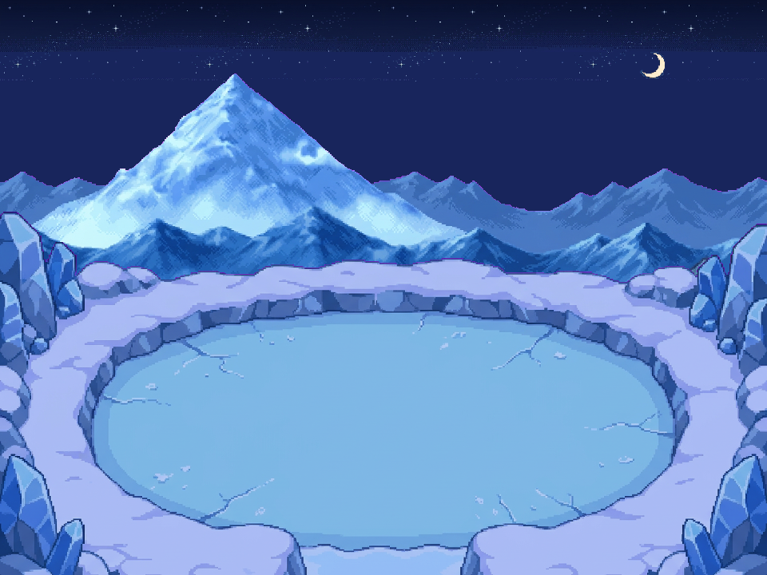

# Arène du Croissant — glace et panorama Sky Peak

**[Composition PNG](ARENE_SKYPEAK_V1_composition_nuit.png)** · **[Calques activables](index.html)** · **[Projet OpenRaster](ARENE_SKYPEAK_V1_editable.ora)** · **[Kit PNG / ORA](ARENE_SKYPEAK_V1_pack.zip)**

Nouvelle arène ovale de glace, ouverte au sud, avec un panorama de montagnes enneigées au loin inspiré de **Sky Peak**, un ciel **bleu-noir étoilé** et le **croissant de lune natif du dépôt**. Pas de grotte, d’aurore ou de nouveaux nuages ajoutés à cette demande. Les lots précédents sont conservés.

## Huit calques alignés — 960 × 720 px

| Plan | PNG |
|---|---|
| Ciel bleu-noir | [01_ciel](calques/ARENE_SKYPEAK_V1_01_ciel_bleu_noir.png) |
| Étoiles natives | [02_etoiles](calques/ARENE_SKYPEAK_V1_02_etoiles_natives.png) |
| Lune canonique | [03_lune](calques/ARENE_SKYPEAK_V1_03_lune_canonique.png) |
| Panorama montagneux lointain | [04_montagnes](calques/ARENE_SKYPEAK_V1_04_montagnes_lointaines.png) |
| Sol complet et accès sud | [05_sol](calques/ARENE_SKYPEAK_V1_05_sol_complet_et_acces_sud.png) |
| Reliefs et bordure arrière | [06_reliefs](calques/ARENE_SKYPEAK_V1_06_reliefs_arriere.png) |
| Immersion au premier plan gauche | [07_gauche](calques/ARENE_SKYPEAK_V1_07_immersion_gauche.png) |
| Immersion au premier plan droit | [08_droite](calques/ARENE_SKYPEAK_V1_08_immersion_droite.png) |

[Planche des calques](PLANCHE_CALQUES.png) · [Terrain seul](ARENE_SKYPEAK_V1_terrain_seul.png) · [Sprite de lune seul, taille native](sprites/ARENE_SKYPEAK_V1_croissant_natif.png).

Tous les grands PNG se placent à `(0,0)`, sans changement d’échelle. Le sprite séparé de lune mesure **33 × 36 px** : il est aussi disponible déjà posé dans son calque plein format, à `(800,64)`.

## Origine et méthode

### Lune et étoiles : pas de redessin

Source : `source/cote_dix_zones/reference_autre_agent/source__falaise__astres_nuit_native.png`, conservée depuis le commit de référence **c16efe12**, famille Guilde/Sharpedo utilisée dans les livraisons précédentes.

Le croissant est extrait comme la plus grande composante alpha connectée du rectangle `(312,24)-(368,80)`. **516 pixels visibles, RGB et alpha inchangés**, pas de recoloration ni d’agrandissement. C’est bien le croissant présent dans la feuille native du dépôt, pas une nouvelle lune peinte par le générateur. Les étoiles reprennent la recette `climate.stars` existante, sans nouvelle génération.

### Ciel bleu-noir demandé

Le ciel vient de la même source nocturne validée, mais **n’est pas le fichier entier inchangé** : ses **65 premières lignes sombres sont conservées** ; la partie inférieure est prolongée avec la couleur RGB existante la plus fréquente de la ligne 64. Cela écarte la zone turquoise claire pour le bleu-noir demandé. Répéter le bruit de toute une ligne provoquait des stries verticales : cette variante a été écartée avant livraison. Aucune nouvelle palette de ciel inventée.

### Arène et montagnes : nouvelles générations référencées

- Arène : références canoniques `pmdskyicearena.png` et `iceroadpmdsky.png`.
- Montagnes : références Sky Peak `source/sky_peak_v1/232233_reference.png` et `sommet_reference.png`.
- Génération indépendante sur magenta pour chaque plan ; détourage, normalisation proportionnelle en nearest-neighbor, assemblage devant le ciel existant.
- Arène : **1264 × 848 → 960 × 644**, position `(0,140)`, bas volontairement recadré pour raccorder le premier plan au bord sud. Atténuation des nouveaux pixels par facteurs RGB `(0,72 ; 0,80 ; 0,96)` pour l’éclairage lunaire. C’est un choix colorimétrique de cette création, pas le filtre Abyss ou une palette native certifiée.
- Montagnes : **1456 × 720 → 960 × 475**, position `(0,45)`. Pas d’étirement anisotrope. Les crêtes restent derrière l’arène.
- Un troisième brut fournit le sol de glace caché sous les reliefs. Les pixels visibles du terrain restent ceux de la génération principale après traitement ; la recomposition des quatre plans terrain est exacte.

**Les nouveaux dessins de glace et de montagnes sont guidés par les références, pas des copies pixel-exactes de tuiles natives.** Le sol caché est généré ; les faces cachées des falaises ne sont pas reconstituées pour des déplacements arbitraires.

## Utilisation et contrôles

- `PNG to Tileset` : grille **8 px**, 120 × 90 cellules, marge et espacement zéro, pas de lissage.
- Utiliser les calques ou le terrain seul, pas la planche de présentation.
- Le PNG de lune recadré n’est pas un atlas 8 px ; utiliser son calque plein format pour un import sur grille.
- ORA : huit plans indépendants, recomposition exacte. Ouvrable dans Krita ou GIMP.
- Scène **statique**. Aucune animation prétendue ou cycle inventé ici.
- Contrôle d’un corridor de 16 px du sud vers le centre sur le masque du sol ; cela ne remplace pas des collisions ni un test de déplacement en jeu.

**29 contrôles de fichiers PASS**, notamment sources, transparence, absence de magenta, lune native, ciel, étoiles, placements, recomposition PNG/ORA et accès sud. **Pas de Ground, warp, collisions ou validation PMDO/GPU.** Proposition visuelle à examiner.

[Manifest, dimensions et empreintes](manifest.json) · [Méthode et reconstruction](../../source/arene_glace_sky_peak_v1/README.md) · [Résultats](../../source/arene_glace_sky_peak_v1/verification.json).
