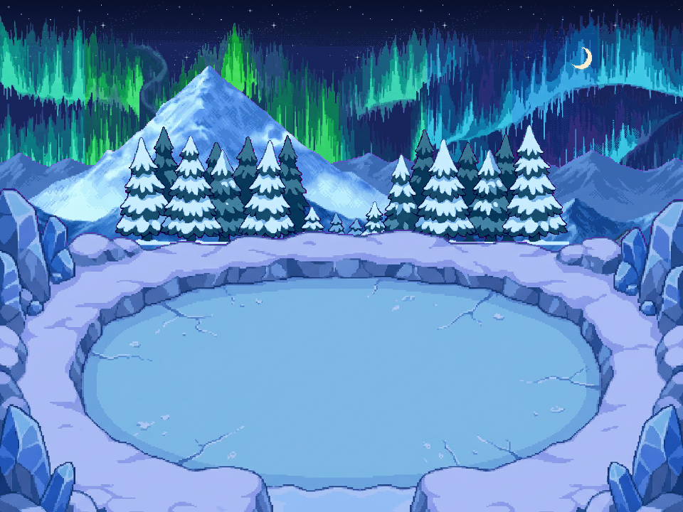

# Arène du Croissant — aurore sur les deux côtés du ciel

**[Composition PNG](ARENE_SKYPEAK_V2_composition_nuit.png)** · **[WebP animé](ARENE_SKYPEAK_V2_composition_animee.webp)** · **[Avant / après PNG](PLANCHE_AVANT_APRES.png)** · **[Atelier interactif](index.html)** · **[Projet ORA](ARENE_SKYPEAK_V2_editable.ora)**

Cette version complète l’arène V1 : **l’aurore occupe les espaces de ciel à gauche ET à droite**, jusqu’aux bords du cadre. Ce n’est plus un petit ruban limité au centre. Des **sapins enneigés** sont ajoutés entre la chaîne de montagnes lointaine et l’arène.

L’arène ovale, l’accès sud, les bordures de glace immersives, le panorama Sky Peak, le ciel bleu-noir, les étoiles et la lune native sont conservés. **Les huit plans V1 sont copiés octet pour octet**, sans régénération du terrain ou de la lune.

## Dix calques alignés — 960 × 720

| Ordre | Plan | Fichier |
|---|---|---|
| 1 | Ciel bleu-noir V1 | [PNG](calques/ARENE_SKYPEAK_V2_01_ciel_bleu_noir.png) |
| 2 | Étoiles natives | [PNG](calques/ARENE_SKYPEAK_V2_02_etoiles_natives.png) |
| 3 | **Nouvelle aurore panoramique**, phase 00 | [PNG transparent](calques/ARENE_SKYPEAK_V2_02b_aurore_panoramique.png) |
| 4 | Lune canonique inchangée | [PNG](calques/ARENE_SKYPEAK_V2_03_lune_canonique.png) |
| 5 | Chaîne de montagnes enneigées | [PNG](calques/ARENE_SKYPEAK_V2_04_montagnes_lointaines.png) |
| 6 | **Sapins enneigés**, nouveau plan intermédiaire | [PNG](calques/ARENE_SKYPEAK_V2_04b_sapins_enneiges.png) |
| 7 | Sol complet, arène et accès sud | [PNG](calques/ARENE_SKYPEAK_V2_05_sol_complet_et_acces_sud.png) |
| 8 | Reliefs arrière | [PNG](calques/ARENE_SKYPEAK_V2_06_reliefs_arriere.png) |
| 9 | Immersion gauche | [PNG](calques/ARENE_SKYPEAK_V2_07_immersion_gauche.png) |
| 10 | Immersion droite | [PNG](calques/ARENE_SKYPEAK_V2_08_immersion_droite.png) |

Tous les plans se posent en **`(0,0)`**, sans resampling au placement. Le projet ORA contient ces dix plans, aurore phase 0. La lune native 33 × 36 reste à `(800,64)` ; ses pixels opaques demeurent inchangés dans les 32 compositions.

## Aurore étendue, pas ciel recoloré

Le générateur a reçu le dessin d’aurore précédent, la scène V1 et `aurorepmdsky.png` pour produire **un nouveau panorama d’effet seul sur magenta**. La consigne demandait des ailes continues coupées par les deux côtés de l’image, sans fond de ciel, montagnes, lune ou étoiles incorporés.

- Sortie réelle : **1808 × 592**, normalisation uniforme nearest **1056 × 346**.
- Pose en **`(-48,-8)`** avant recadrage sur 960 × 720 : le dessin dépasse latéralement le cadre, donc pas de marge vide ni de fondu forcé aux deux bords.
- Pas de miroir, pas de répétition du petit ruban et pas d’étirement anisotrope pour combler le vide.
- Détourage magenta, alpha de luminance, trous internes transparents. L’effet ne repeint pas le ciel sous-jacent.
- Lune compositée **devant l’aurore**, montagnes devant les deux : l’astre reste net et lisible.

La couverture a été vérifiée **après occlusion par les montagnes, sapins et terrain** sur les 32 phases : au moins **18 373 pixels visibles à gauche** et **21 728 à droite**, dans les bandes latérales de 120 × 300 px. Les deux colonnes extrêmes gardent chacune plus de 100 pixels d’aurore ; toutes les colonnes du calque contiennent l’effet. Cela vérifie l’absence du vide latéral, pas une approbation artistique.

## Animation douce sur son propre calque

**32 PNG × 125 ms = 4 secondes**, boucle exacte.

- Couleurs mobiles : 32 couleurs de matière × 8 groupes de phase, soit 256 indices fixes et 32 palettes interpolées. Vert / cyan / bleu-violet, saturation et valeur HSV stables à l’arrondi près.
- Légère ondulation **verticale ±2 px maximum**. Pas de scroll ni de wrap de l’aurore ; le ciel, la lune, le terrain et les sapins restent fixes.
- Un dessin maître animé, **pas 32 dessins générés indépendamment**.
- L’étape 32 reconstruite est égale à l’étape 0 ; le raccord final n’ajoute aucun saut.

**[Les 32 PNG transparents de l’onde](aurore/README.md)** · **[Les 32 PNG de composition](frames_composition/README.md)**

- [WebP transparent, onde seule](aurore/ARENE_SKYPEAK_V2_onde_transparente.webp).
- [WebP ciel + étoiles + aurore + lune](ARENE_SKYPEAK_V2_ciel_aurore_lune.webp).
- [WebP composition complète](ARENE_SKYPEAK_V2_composition_animee.webp).

Les PNG individuels sont présents dans le dossier, pas uniquement dans une archive. Les trois WebP sont en boucle, sans perte sur les pixels visibles. Aucun nouveau nuage n’a été ajouté à cette arène ; les familles validées des autres lots restent intactes.

## Sapins et sources

Le nouveau plan de sapins est guidé par la référence neigeuse du dépôt `source/references_54d3731/snow.png` et la composition de l’arène. Recadrage au contenu, réduction proportionnelle nearest en **640 × 170**, placement **`(160,175)`** derrière les reliefs, sans déplacement des montagnes.

Les sapins et l’aurore sont des **dessins générés référencés PMD**, pas des textures natives extraites. Les matériaux de glace et le panorama V1 gardent eux aussi leur statut de dessins référencés. La lune et les étoiles, en revanche, proviennent bien des ressources natives du dépôt.

Le ciel conservé est précisément celui de l’arène V1 : 65 premières lignes sombres du ciel validé Guilde/Sharpedo, puis prolongement d’une couleur existante. Ce n’est pas le grand ciel turquoise entier, ni un nouveau ciel du générateur.

## Import et limites

- Plans 960 × 720, grille PNG to Tileset **8 px**, 120 × 90 cellules, marge et espacement zéro. Préfixe unique `ARENE_SKYPEAK_V2_*`.
- Garder tous les grands plans alignés en `(0,0)`. La phase PNG remplace le plan d’aurore, elle ne s’ajoute pas à la phase précédente.
- ORA : dix calques **statiques** à la phase 0. Les 32 PNG et WebP fournissent l’animation.
- Sol caché de V1 généré ; faces cachées des reliefs non reconstituées. Aucun nouveau terrain ou chemin reconstruit dans cette version.
- Pas de Ground, collisions, warp, rendu GPU ou validation PMDO ajoutés. Proposition visuelle à examiner.

**23 contrôles V2 PASS**, y compris pixels conservés, couverture latérale sur les 32 phases, palettes, amplitude, alpha, PNG, trois WebP et recomposition ORA. Les **29 contrôles V1 passent également**.

[Manifest et empreintes](manifest.json) · [Rapport V2](../../source/arene_glace_sky_peak_v2/verification.json) · [Méthode et scripts](../../source/arene_glace_sky_peak_v2/README.md) · [Arène V1 conservée](../arene_glace_sky_peak_v1/README.md).
