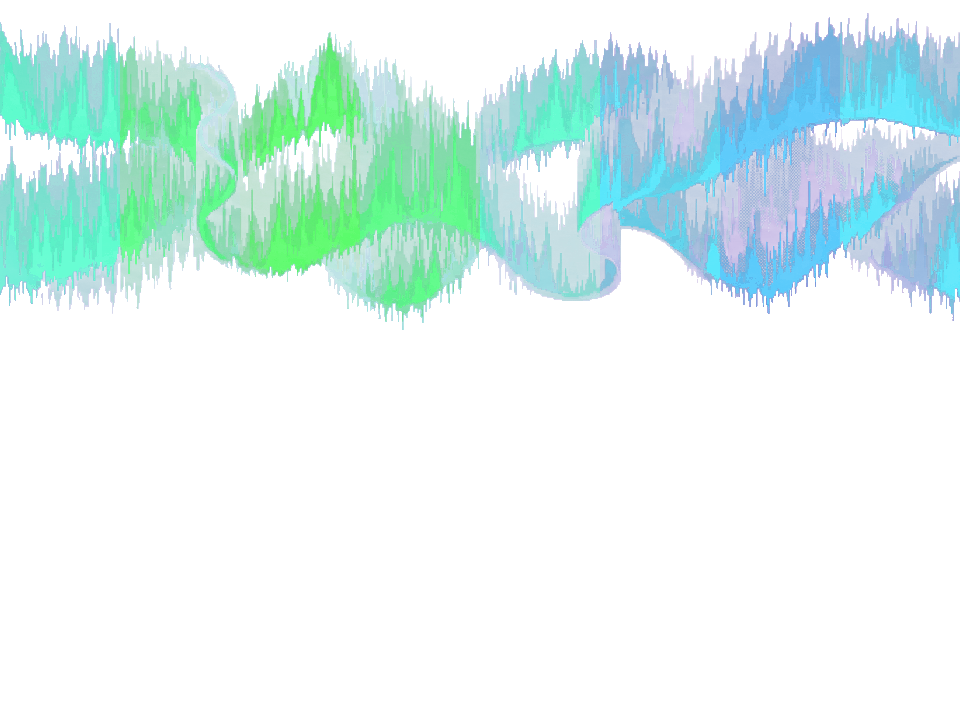

# Onde panoramique seule — 32 PNG

32 ×125ms =4s. Tous les PNG sont960×720, alignés en(0,0). Aucun wrap de l’aurore.

[Notice complète](../README.md) · [Atelier](../index.html)

| Phase | PNG | Phase | PNG |
|---|---|---|---|
| 00 | [PNG](ARENE_SKYPEAK_V2_onde_00.png) | 16 | [PNG](ARENE_SKYPEAK_V2_onde_16.png) |
| 01 | [PNG](ARENE_SKYPEAK_V2_onde_01.png) | 17 | [PNG](ARENE_SKYPEAK_V2_onde_17.png) |
| 02 | [PNG](ARENE_SKYPEAK_V2_onde_02.png) | 18 | [PNG](ARENE_SKYPEAK_V2_onde_18.png) |
| 03 | [PNG](ARENE_SKYPEAK_V2_onde_03.png) | 19 | [PNG](ARENE_SKYPEAK_V2_onde_19.png) |
| 04 | [PNG](ARENE_SKYPEAK_V2_onde_04.png) | 20 | [PNG](ARENE_SKYPEAK_V2_onde_20.png) |
| 05 | [PNG](ARENE_SKYPEAK_V2_onde_05.png) | 21 | [PNG](ARENE_SKYPEAK_V2_onde_21.png) |
| 06 | [PNG](ARENE_SKYPEAK_V2_onde_06.png) | 22 | [PNG](ARENE_SKYPEAK_V2_onde_22.png) |
| 07 | [PNG](ARENE_SKYPEAK_V2_onde_07.png) | 23 | [PNG](ARENE_SKYPEAK_V2_onde_23.png) |
| 08 | [PNG](ARENE_SKYPEAK_V2_onde_08.png) | 24 | [PNG](ARENE_SKYPEAK_V2_onde_24.png) |
| 09 | [PNG](ARENE_SKYPEAK_V2_onde_09.png) | 25 | [PNG](ARENE_SKYPEAK_V2_onde_25.png) |
| 10 | [PNG](ARENE_SKYPEAK_V2_onde_10.png) | 26 | [PNG](ARENE_SKYPEAK_V2_onde_26.png) |
| 11 | [PNG](ARENE_SKYPEAK_V2_onde_11.png) | 27 | [PNG](ARENE_SKYPEAK_V2_onde_27.png) |
| 12 | [PNG](ARENE_SKYPEAK_V2_onde_12.png) | 28 | [PNG](ARENE_SKYPEAK_V2_onde_28.png) |
| 13 | [PNG](ARENE_SKYPEAK_V2_onde_13.png) | 29 | [PNG](ARENE_SKYPEAK_V2_onde_29.png) |
| 14 | [PNG](ARENE_SKYPEAK_V2_onde_14.png) | 30 | [PNG](ARENE_SKYPEAK_V2_onde_30.png) |
| 15 | [PNG](ARENE_SKYPEAK_V2_onde_15.png) | 31 | [PNG](ARENE_SKYPEAK_V2_onde_31.png) |

[Indices](ARENE_SKYPEAK_V2_indices.png) · [Alpha avant ondulation](ARENE_SKYPEAK_V2_alpha.png) · [32palettes et déplacements](ARENE_SKYPEAK_V2_palettes.json).

Dessin généré guidé par PMD, pas un cycle officiel extrait. Les32frames viennent d’un seul dessin maître.
