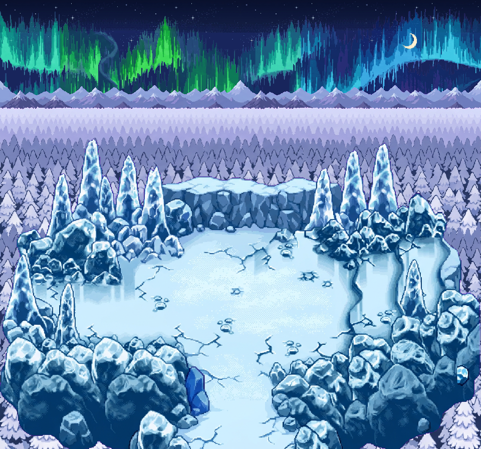

# Quatre poses PNG de composition

Le WebP contient les32phases. Quatre poses sont exportées individuellement pour éviter de dupliquer32fois le même grand terrain ; les32PNG de l’aurore restent accessibles dans V2.

- [Phase00 / 0s](ARENE_SKYPEAK_V3_scene_00.png)
- [Phase08 / 1s](ARENE_SKYPEAK_V3_scene_08.png)
- [Phase16 / 2s](ARENE_SKYPEAK_V3_scene_16.png)
- [Phase24 / 3s](ARENE_SKYPEAK_V3_scene_24.png)
