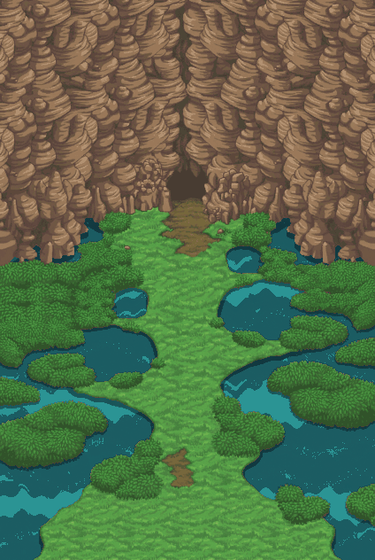

# Entrée Vapeur — sud → nord, V1 (rendu généré)

**Aperçu : [`apercu_entree_vapeur_sud_nord_v1.html`](../../apercu_entree_vapeur_sud_nord_v1.html)**. Il permet d'afficher chaque calque, de lire l'eau animée, d'afficher la grille de 8 px, les collisions et le cadre du viewport ×1, et d'exporter la vue en PNG.

## Livrables

| Fichier | Contenu |
|---|---|
| `ESN1_calques_png_8px.zip` | 8 calques PNG, 12 phases d'eau, carte d'indices et palettes, ORA, manifeste. Pour « PNG to Tileset », importer en **8 px**. |
| `ESN1_projet_pmdo_0812.zip` | Projet `entree_vapeur_sud_nord` : Ground `esn1_entree_vapeur_jour`, 9 banques `.tile`, `index.idx` complet, `Mod.xml`, script, installateur de fusion. |
| `ESN1_entree_vapeur_calques.ora` | Document éditable (Krita, GIMP, etc.), eau en phase 0. |
| `review/` | Scène 1× et ×2, WebP animé, collisions et marqueurs, viewports 320×240 simulés. |

## Calques (424 × 632, de bas en haut)

`00` eau animée (`animation/eau/ESN1_00_eau_f00…f11.png`) · `01` ombres des berges (translucides) · `02` sol complet généré · `03` herbe · `04` chemin de terre · `05` buissons · `06` falaises · `07` piliers de l'entrée · `08` bouche de la grotte. Dans le Ground, un calque `09` vide (`Layer=4`, Top) est ajouté pour l'avant-plan.

Pour l'eau dans PNG to Tileset, importer les 12 phases et les animer à **10 ticks par phase** (166,67 ms), soit une boucle de 2 s.

## Méthode

Méthode « rendu généré » (`source/layouts_magenta_v1/WORKFLOW.md`), **pas d'assemblage de morceaux de maps** :

1. Référence de style et de composition donnée au générateur : `Steam_Cave_entrance_TDS.png`. Aucun de ses pixels n'est copié.
2. Trois générations, conservées dans `bruts/` : le décor complet avec l'eau en magenta ; le sol complet, obtenu à partir du décor en retirant buissons, falaises et grotte ; la matière de l'eau.
3. Normalisation uniforme ×0,5 (848×1264 → 424×632). Chaque bloc 2×2 est moyenné sur les seuls pixels de sa classe, pour ne pas mélanger le magenta. Palette commune de 96 couleurs, sans tramage.
4. Segmentation : le magenta plein donne l'eau, le magenta sombre donne les ombres de berge. Les buissons sont séparés de l'herbe par la luminance moyenne locale (histogramme bimodal mesuré, seuil 110). La roche est la composante reliée au bord nord. La piste olive et la bouche sombre sont délimitées dans des zones repérées, et les piliers forment un sous-ensemble de la roche.
5. Eau : 6 teintes générées, 72 indices fixes (6 niveaux × 12 bandes) et 12 palettes. Seule la palette change, et un front de reflets descend vers le sud.

## Contrôles effectués (10 tests, `source/entree_sud_nord_generee_v1/test_build.py`)

- Hashes des bruts. Facteur identique en X et Y. Dimensions divisibles par 8. Noms `ESN1_` uniques.
- Aucun pixel magenta restant, alpha binaire hors ombres, et aucun trou dans la scène.
- Palette cycling : même alpha et mêmes indices à chaque phase, 12 palettes distinctes, transitions homogènes, y compris 11 → 0.
- Recomposition exacte des calques par rapport à l'ORA et à la scène.
- Aller-retour de format : le `.rsground` et les `.tile` relus redonnent chaque calque, avec 0 écart sur les pixels opaques et les phases d'eau 0, 5 et 11 comparées. Collisions et marqueurs conformes, `index.idx` complet.
- Chemin libre de 16 × 16 px entre l'arrivée au sud et le seuil au nord, sur la grille.

## Limites

- Terrain et eau **générés** à partir de références PMD : ce ne sont **pas des pixels natifs certifiés**. Le mouvement de l'eau est une création, pas un cycle officiel récupéré.
- Ce sont des partitions d'une composition unique. Le sol caché est généré, mais les faces cachées des falaises et des buissons ne sont pas reconstruites pour déplacer librement ces éléments.
- Collisions de base déduites des calques (une case est bloquée si plus de 25 % de ses pixels ne sont pas praticables). **Aucun warp** : `donjon_seuil` reste à raccorder. La direction des marqueurs (4 = haut) est à vérifier dans l'éditeur.
- **Pas de test PMDO** : ni chargement dans le moteur, ni rendu GPU, ni gameplay. Pas de variante de nuit dans cette V1. Art non encore approuvé.

Reconstruction : `.venv/bin/python source/entree_sud_nord_generee_v1/build.py`, puis `package.py`, qui relance les tests avant de créer les ZIP et l'aperçu.
