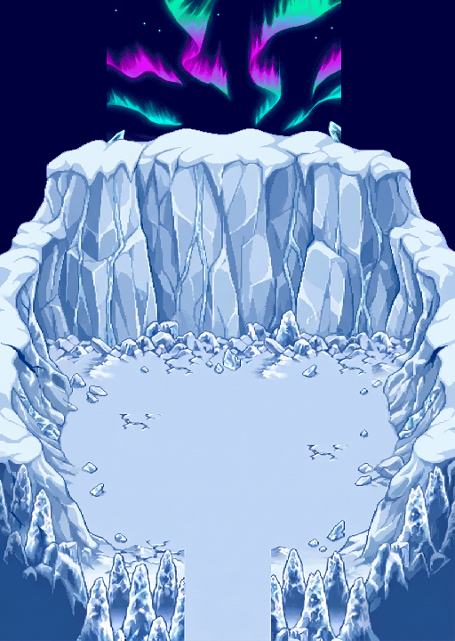

# Falaise continue — proposition générée, ciel et aurores conservés

**[Animation WebP](composition.webp)** · **[Atelier des calques](index.html)** · **[Avant / après](review/before_after.png)** · **[Fichier ORA à sept calques](IceAuroraCoherentV3_layers.ora)**



## Correction demandée

Le terrain est repassé au générateur pour supprimer l’impression de falaises assemblées par greffes : grandes faces de glace reliées, couronne de neige continue, épaules rejoignant les parois latérales. La composition générale reste celle de la V1 : **mur nord, arène centrale, arrivée au sud**, dans un canevas **512 × 720 px**.

**Le terrain et les falaises forment un seul calque.** Le ciel, les aurores, les étoiles, la brume et la glace de fond sont repris de la version précédente, sans les faire redessiner au générateur. Celui-ci a reçu la composition précédente comme référence de contexte ; la composition finale utilise les vrais fichiers existants, pas une approximation générée du ciel.

Les anciennes versions, les anciens terrains et le Ground utilisateur sont conservés sans modification. Cette version est une **nouvelle proposition à valider**, pas une approbation artistique supposée.

## Ce qui est généré / ce qui est conservé

| Élément | Origine et traitement |
|---|---|
| Nouveau terrain, sol, reliefs et ombres | **Générés**, deux passes ; détourage puis ajustement au canevas |
| Géométrie du terrain | Nouvelle géométrie dessinée ; organisation générale V1, pas conservation exacte de ses contours |
| Ciel extérieur | Copie byte-identique de V2 native |
| Aurores et autres composants du fond | PNG existants réutilisés sans changement de pixels, de placement ni de cadence |
| Animation | Même boucle de 240 ticks / 4 s nominales, mêmes 33 états du port RGB8 précédent |
| `.dir` animé du fond | Copie byte-identique, avec nouveau nom pour éviter l’écrasement |
| Collisions / jouabilité / rendu GPU PMDO | Non validés |

**Ce terrain généré n’est pas une reconstruction en tuiles natives.** Sa palette ou son apparence PMD ne suffisent pas à le certifier. Il s’agit d’une correction visuelle proposée ; la validation native en jeu et, si nécessaire, une reconstruction avec de vrais modules restent des étapes distinctes.

Le générateur a rendu **864 × 1232 px**, malgré la demande de format final. Le traitement conserve les bruts, enlève le magenta, retire le haut vide jusqu’à `y=87`, puis ajuste **uniquement le dessin généré** à **512 × 576 px**, en nearest-neighbor, placé à **(0,144)**. Cet ajustement modifie le rapport d’aspect du terrain généré. **Aucun pixel natif du ciel ou des aurores n’a été redimensionné**, recoloré ou déplacé.

Le fond garde la limite explicitée dans V2 : **port RGB8 du mécanisme retrouvé**, pas capture pixel-perfect d’un écran DS RGB555.

## Calques à utiliser

Dossier [`layers/`](layers/) :

1. `IceAuroraCoherentV3_SkyBase.png` — ciel extérieur, 512 × 720.
2. `IceAuroraCoherentV3_Sky_phase0.png` — ciel du fond, 264 × 216.
3. `IceAuroraCoherentV3_Ribbons_phase0.png` — aurores seules sur transparence.
4. `IceAuroraCoherentV3_Stars_phase0.png` — étoiles séparées.
5. `IceAuroraCoherentV3_Haze_phase0.png` — brume.
6. `IceAuroraCoherentV3_DistantIce_phase0.png` — glace lointaine.
7. **[`IceAuroraCoherentV3_Terrain.png`](layers/IceAuroraCoherentV3_Terrain.png)** — terrain généré unifié, transparent au-dessus, 512 × 720.

Ordre : ciel extérieur → cinq composants du fond en **(120,0)** → terrain en **(0,0)**. L’ORA conserve ces sept calques et leurs positions. Les PNG `phase0` sont les images initiales, pas l’animation entière.

Les **33 PNG de chaque composant animé** restent accessibles dans le [dossier V2 inchangé](../../exports/ice_arena_aurora_native_v2/frames/). La correspondance tick/état est reprise dans [`timeline.json`](timeline.json). L’atelier embarque ces mêmes PNG et permet de masquer séparément le terrain, les aurores et les autres plans.

Le calque terrain regroupe le sol et les falaises pour préserver leur continuité. Il ne contient pas de surfaces cachées reconstituées pour déplacer ensuite les falaises indépendamment du sol.

## Sources et bruts

- [`bruts/terrain_generated.png`](bruts/terrain_generated.png) : première passe, conservée mais non retenue comme terrain final.
- [`bruts/terrain_generated_refined.png`](bruts/terrain_generated_refined.png) : seconde passe, mur du fond redessiné en faces continues.
- [`bruts/terrain_keyed_original_size.png`](bruts/terrain_keyed_original_size.png) : détourage avant ajustement de format.
- [Références et résumé des instructions de génération](../../source/ice_arena_aurora_coherent_v3/generation.json).
- [`manifest.json`](manifest.json) : transformations exactes, SHA256 des bruts et des ressources natives réutilisées.

La référence du fond est le commit **`f10176369e707128d97a4590d5c8a78895433fe5`**. Les dépendances sont vérifiées contre son inventaire SHA256 de V2 ; elles ne sont pas régénérées par le build de ce nouveau terrain.

## Assets BG PMDO — proposition, pas Ground jouable

[`pmdo/Content/BG/`](pmdo/Content/BG/) contient trois nouveaux noms :

- `IceAuroraCoherentV3_SkyBase.dir` — statique ;
- `IceAuroraCoherentV3_BGComposite.dir` — le même fond animé que V2 ;
- `IceAuroraCoherentV3_Terrain.dir` — le nouveau terrain statique, sur transparence.

[`pmdo/placement_recipe.json`](pmdo/placement_recipe.json) donne cet ordre de dessin, sans mouvement ni répétition. Les trois ressources peuvent servir à examiner la composition derrière les entités d’un Ground de test. **Ne pas les ajouter par-dessus l’ancien terrain : choisir l’une des compositions.** Aucun script d’installation n’altère un Ground existant.

Ces conteneurs sont contrôlés comme fichiers ; **aucune validation native GPU PMDO n’a été exécutée sur ce nouveau terrain**. La recette n’est pas un `.rsground`, et les parois dessinées ne créent pas de collisions. L’aspect de l’entrée sud ne certifie pas sa navigation en jeu.

## Vérifications

- **21 contrôles de fichiers/pixels PASS** : détourage, ciel inchangé, conservation des pixels natifs exposés dans les 33 états, terrain figé, cadence inchangée, recomposition des sept calques, en-têtes/contenu statiques `.dir`, identité du `.dir` animé et WebP sans perte.
- **15 contrôles d’interface en DOM simulé PASS** : calques, lecture/pause, scrub, boucle, placement et zoom. Pas un test dans un vrai navigateur ou une capture GPU.
- Les pixels occultés par le nouveau relief ne sont pas modifiés dans les sources ; ils sont simplement cachés par le calque terrain.

[`audit.json`](audit.json) · [`viewer_checks.json`](viewer_checks.json).

Reproduction :

```bash
.venv/bin/python source/ice_arena_aurora_coherent_v3/build.py
node source/ice_arena_aurora_coherent_v3/test_viewer.cjs
```

Aucun ancien résultat de test moteur n’est réutilisé pour certifier ce terrain. **Validation artistique, reconstruction native éventuelle, collisions et essai en jeu restent séparés.**
