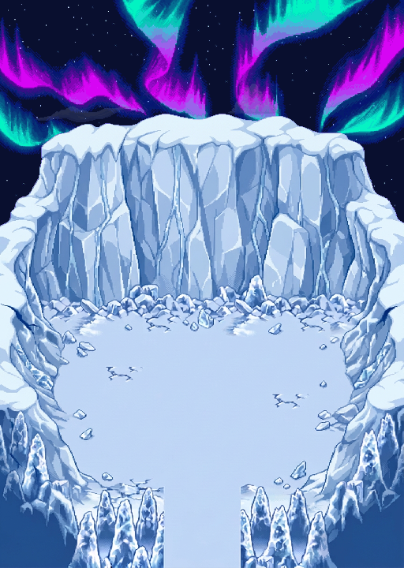

# Ciel nordique — aurores panoramiques, étoiles et nuages lointains

**[Atelier animé](index.html)** · **[Boucle WebP étoiles + aurores](composition_loop.webp)** · **[Extrait avec nuages mobiles](composition_clouds_excerpt.webp)** · **[PNG complet](composition.png)** · **[Calques ORA](NorthernSkyV4_layers.ora)**



## Ce qui change

- **Aurores sur toute la largeur de 512 px**, et non plus dans une fenêtre centrale de 264 px.
- **190 étoiles** à positions fixes, avec des scintillements décalés.
- **Nuages lointains Guilde/Sharpedo**, nocturnes et discrets, en dérive continue dans l’atelier.
- Ciel bleu nuit profond, sans bande rectangulaire ni motif de ciel étiré.
- **Terrain V3 conservé byte pour byte**, avec son calque indépendant. Aucune nouvelle retouche des falaises, du sol ou de l’entrée sud.

Les anciennes versions et le Ground utilisateur ne sont pas modifiés.

## Aurores : mêmes références, nouvelle extension générée

Le générateur a reçu les **deux poses d’aurore d’origine** comme références : mêmes rideaux cyan/turquoise et violet/magenta, mêmes grandes familles de formes, étendues aux deux bords du panorama.

Il a produit **une planche contenant deux poses**, pas 64 images officielles du jeu. Le brut est conservé dans [`bruts/aurora_two_keyframes.png`](bruts/aurora_two_keyframes.png). Les deux panneaux, après exclusion du séparateur ajouté par le modèle, sont ajustés en nearest-neighbor à **512 × 240 px**. Seules ces images générées sont redimensionnées ; **pas le terrain, les motifs d’étoiles ou les nuages natifs**.

Une palette commune de 64 couleurs est calculée sur les deux poses générées, sans nouveau dithering, pour limiter le bruit de couleurs. Le fond noir est retiré par conversion du dessin lumineux en RGB/alpha. Ces traitements ne certifient pas les pixels comme natifs.

**Ce n’est donc pas une reproduction pixel pour pixel des anciennes aurores, ni un nouveau cycle canonique retrouvé.** C’est leur extension générée demandée, explicitement distincte du port natif V2 conservé dans le dépôt.

## Logique des frames

Les **64 frames PNG** sont calculées à partir des deux poses A et B, avec :

```text
poids_B(f) = (1 - cos(2π × f / 64)) / 2
poids_A(f) = 1 - poids_B(f)
```

- Frame 0 : pose A.
- Frame 32 : pose B.
- Retour progressif vers A ; l’échantillon 64 est identique à 0, sans exporter un doublon d’arrêt.
- **6 ticks par frame**, soit **6,4 secondes** à 60 ticks/s.
- Les extrémités sont ralenties : pas de changement de pose brutal.
- Aucun défilement horizontal, wrap, déplacement de caméra, flot optique ou déformation par colonnes de l’aurore.
- Il s’agit d’un **fondu entre deux dessins apparentés**, pas d’une simulation physique ni d’une séquence capturée dans le jeu. Le rythme est nouvellement composé ; ce n’est pas la cadence native 120 + 120 ticks de V2.

[`timeline.json`](timeline.json) indique chaque PNG, sa durée et ses poids A/B. [`review/aurora_cycle.png`](review/aurora_cycle.png) montre huit étapes de la boucle.

## Étoiles et nuages

Les petites formes d’étoiles viennent de `source__falaise__astres_nuit_native.png`, dans la référence Guilde/Sharpedo approuvée. Elles ne sont ni tournées, ni agrandies, ni recolorées. **Leur placement et leur animation d’opacité sont nouveaux** : motifs séparés d’au moins 8 px, crête d’alpha normalisée puis modulée entre 58 % et 100 %, avec phases et fréquences décalées. Les RGB des motifs restent ceux de la source. Il ne s’agit pas d’un scintillement officiel retrouvé.

Les six familles de nuages et leur traitement nocturne proviennent de **`source/ciels_valides.py`**, référence **`c16efe12d74361df5ba8625abb68260f5f8fc6dd`**. Les blocs restent entiers, sans resampling. Leur opacité est réduite à 30 % et ils sont placés plus bas pour donner une impression de distance. La formule nocturne est celle des fonds Guilde/Sharpedo, **pas un filtre Abyss sur le terrain**.

Le ciel uni utilise la couleur sombre `(9,15,47)` prélevée en `(0,0)` dans cette même référence nocturne. Aucun gradient bruité n’est étiré sur le panorama.

### Deux durées différentes, pas de faux raccord

- Aurores et étoiles : **6,4 s**.
- Nuages : bande de **1440 px**, mouvement **−2 px/s**, soit **720 s** pour un tour.
- Retour simultané de tous les effets : **1440 s**, soit 24 minutes.

L’**atelier** garde les nuages en mouvement continu : ils ne repartent pas à zéro lorsque l’aurore recommence.

Le **WebP bouclé de 6,4 s** montre le cycle complet étoiles/aurores avec les nuages fixes. L’**extrait de 8 s** montre également la dérive réelle des nuages, **en une seule lecture**, sans prétendre boucler à cette durée.

## Calques et PNG

[`layers/`](layers/) contient :

1. `NorthernSkyV4_Sky.png` — ciel sombre, 512 × 720 ;
2. `NorthernSkyV4_Stars_phase0.png` — étoiles seules ;
3. `NorthernSkyV4_Aurora_phase0.png` — aurore seule sur transparence ;
4. `NorthernSkyV4_Clouds_phase0.png` — nuages visibles au départ ;
5. **`NorthernSkyV4_Terrain.png` — copie exacte du terrain V3** ;
6. `NorthernSkyV4_CloudStrip.png` — bande complète de nuages, 1440 × 288.

Les cinq plans visibles sont aussi dans l’**ORA**. Ordre : ciel → étoiles → aurores → nuages → terrain. Les nuages peuvent ainsi voiler légèrement les lumières, tout en restant derrière la falaise.

- [`keyframes/`](keyframes/) : les deux poses générées préparées.
- [`aurora_frames/`](aurora_frames/) : les 64 PNG de l’aurore.
- [`star_frames/`](star_frames/) : les 64 PNG des étoiles.
- [`star_placements.json`](star_placements.json) : rectangles source et positions des 190 motifs.

L’atelier charge les PNG par chemins relatifs : garder le dossier complet ou utiliser l’aperçu servi, et non le seul fichier HTML isolé.

## PMDO 0.8.12 — assets et recette, sans modification de Ground

Cinq nouveaux assets dans [`pmdo/Content/BG/`](pmdo/Content/BG/) : `NorthernSkyV4_Sky`, `Stars`, `Aurora`, `CloudStrip`, `Terrain`.

[`pmdo/placement_recipe.json`](pmdo/placement_recipe.json) donne leur ordre et leurs paramètres :

- Origine `(0,0)` pour les cinq calques.
- Étoiles/aurores : `FrameTime=6`, frames `0..63`.
- Nuages : `BGMovement=(-2,0)`, `RepeatX=true`.
- Tout le reste immobile, sans répétition.

Les atlas animés font au maximum **4096 px de large**. Les alpha des conteneurs `.dir` sont prémultipliés ; leurs cases sont relues et comparées aux PNG prémultipliés.

**Ce sont des assets BG et une recette de composition, pas un `.rsground` jouable.** Aucun import automatique ne remplace un terrain ou une animation existante. Pas de collision, caméra ou rendu GPU PMDO certifié ; tester une copie dans l’éditeur avant une installation plus large.

## Contrôles et provenance

- **23 contrôles de fichiers/pixels/calculs PASS** : terrain inchangé, couverture latérale, fermeture et raccord du cycle, motifs d’étoiles, continuité du wrap nuageux, recomposition ORA, durées et conteneurs PMDO.
- **15 contrôles d’interface en DOM simulé PASS** : lecture, pause, scrub, deuxième pose, boucle des aurores sans remise à zéro des nuages, calques et zoom. Ce n’est pas un vrai navigateur ni un test GPU.
- Les contrôles ne constituent pas une validation artistique ni une preuve que les poses générées sont des frames officielles.

[`audit.json`](audit.json) · [`viewer_checks.json`](viewer_checks.json) · [`manifest.json`](manifest.json) · [Références et trace de génération](../../source/ice_arena_northern_sky_v4/generation.json).

Le terrain vient de **`6184e2b578f5d60f479f49b406ea6ad189a3466b`** ; les poses natives de référence de **`f10176369e707128d97a4590d5c8a78895433fe5`**. Les données originales restent conservées. La nouvelle proposition attend l’avis de l’utilisateur.

Reproduction :

```bash
.venv/bin/python source/ice_arena_northern_sky_v4/build.py
node source/ice_arena_northern_sky_v4/test_viewer.cjs
.venv/bin/python source/ice_arena_northern_sky_v4/verify.py
```

Graphismes de référence PMD : ayants droit Nintendo / Pokémon / Chunsoft. Génération panoramique, placements, scintillement et intercalaires : nouvelle adaptation, sans revendication de canonicité native.
