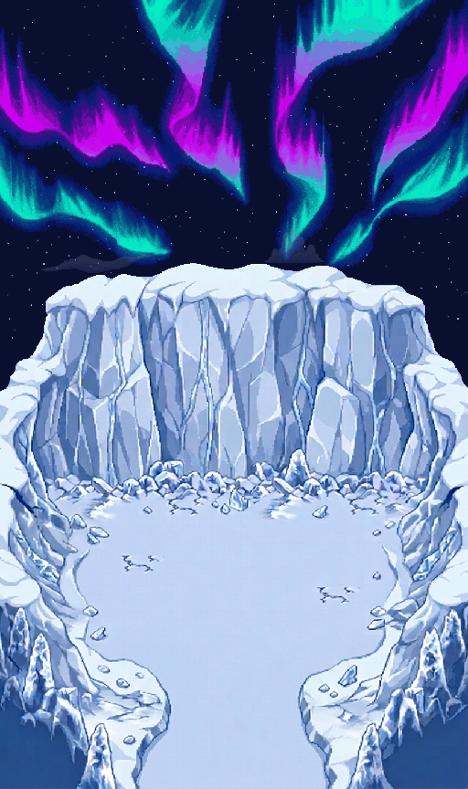

# Ciel nordique V5 — ondulation et entrée raccordée

Nouvelle proposition du **21 septembre 2026**, suite à la demande de plus de hauteur de ciel, de véritables intermédiaires d’ondulation et d’une entrée moins « crop ». V1–V4, l’export natif V2 et les anciens Ground ne sont pas remplacés.



**Animation directe : [composition_loop.webp](composition_loop.webp)** · **[Comparaison de l’entrée](review/entry_before_after.png)** · **[Six poses](review/keyposes.png)**

## Les corrections

| | V4 | V5 |
|---|---|---|
| Canevas | 512 × 720 | **512 × 864** |
| Bande entièrement libre au-dessus du terrain | 144 px | **288 px** |
| Dessins d’aurore générés | 2 | **6**, sur une seule planche |
| Animation | Fondu à coordonnées fixes | **Déformations bidirectionnelles entre poses**, puis mélange |
| Échantillonnage | 64 × 100 ms | **192 à 30 Hz**, 33/34 ms |
| Période | 6,4 s | 6,4 s |
| Entrée | Bords rectangulaires / piliers tronqués | **Berges courbes, neige continue jusqu’à l’arène** |
| Étoiles | 190 | **300**, positions fixes et scintillation |

### Mouvement : pas simplement un fondu A/B plus long

1. Le générateur reçoit l’identité de l’aurore cyan/violette V4 et une consigne de six poses proches, avec un raccord final proche du départ. Le brut est conservé intégralement, séparateurs compris.
2. Les six panneaux sont découpés hors séparateurs, ajustés en **512 × 320** et réduits à une palette commune de 64 couleurs. Ces traitements concernent les **dessins générés**, jamais les motifs natifs d’étoiles/nuages.
3. Un flot optique **Farneback bidirectionnel** estime les correspondances des contours sur leur canal de valeur. Régularisation gaussienne ; norme plafonnée à **14 px** pour contenir les estimations aberrantes. Les valeurs brutes et les taux de plafonnement figurent dans `manifest.json`.
4. Pour chaque paire, les deux dessins sont déformés vers une position intermédiaire avant leur mélange. Prélèvement bilinéaire sous-pixel ; bords noirs, **aucun wrap horizontal**. Ce n’est pas un simple déplacement global de l’image.
5. **32 échantillons par transition** ; progression `(1−cos(πu))/2`, vitesse nulle aux raccords. Le sixième raccord rejoint la première pose. Pas de saut de retour programmé.

Le pas des **coordonnées de prélèvement** est borné à environ **0,6873 px/échantillon**. Ce n’est pas une garantie universelle sur la vitesse apparente de chaque contour : les dessins ne sont pas identiques et un mélange résiduel reste nécessaire. Il s’agit d’interpolation graphique, pas d’une simulation physique ni d’un cycle officiel PMD. **Six poses générées + 192 échantillons calculés**, et non 192 dessins produits indépendamment par le générateur.

### Entrée et relief

Deux passes de génération ont été conservées. La première arrondissait les épaules mais laissait encore une bande centrale rectangulaire. La seconde supprime cette rupture de couleur, relie le sol aux berges et donne des retours rocheux courbes.

Le nouveau terrain est **entièrement issu de cette correction générée** : contrairement à V4, il n’est pas présenté comme une copie byte-à-byte de V3. Le mur nord et les côtés conservent leur intention visuelle, mais leurs pixels ont aussi pu changer. Une seule masse de terrain éditable évite de recréer les anciennes greffes ; il n’existe pas ici de reconstruction complète de surfaces cachées, ni de séparation inventée sol/parois.

Brut retenu : **864 × 1232**, détourage magenta, découpe `(0,248,864,1232)`, ajustement nearest **512 × 576**, placement `(0,288)` dans le canevas. Le rapport largeur/hauteur change légèrement (~1,2 %), sur le généré uniquement. Aucune certification de tuiles natives, de taille d’acteur ou de collisions.

### Ciel, étoiles et nuages

- Fond uniforme **(9,15,47)** issu du ciel nocturne Guilde/Sharpedo validé ; aucun ciel Caps/Terrasses.
- 300 placements de petits motifs d’étoiles de la source approuvée : RGB et taille conservés ; alpha maximal normalisé, scintillation et positions nouvelles, non officielles. **64 états à 10 Hz**, synchronisables avec les 192 états d’aurore.
- Six familles de nuages approuvées via `source/ciels_valides.py` : motifs non redimensionnés, traitement nocturne Guilde/Sharpedo existant, alpha × 0,30. Pas de filtre Abyss appliqué arbitrairement au ciel.
- Bande **1440 × 448**, source déplacée de **224 px vers le bas** ; vitesse **−2 px/s**, répétition horizontale en **720 s**. Les valeurs génériques −4 px/s / 360 s dans la provenance du helper décrivent son ancien réglage, pas celui de cette V5.
- Période commune complète nuages/aurores/étoiles : **1440 s (24 minutes)**.

## Fichiers éditables

- `layers/NorthernSkyV5_{Sky,Terrain,Stars_phase0,Aurora_phase0,Clouds_phase0,CloudStrip}.png`
- `keyframes/NorthernSkyV5_Key_0..5.png`
- **192 PNG** dans `aurora_frames/`, **64 PNG** dans `star_frames/`.
- **[NorthernSkyV5_layers.ora](NorthernSkyV5_layers.ora)** : ciel → étoiles → aurores → nuages → terrain. Recomposition initiale vérifiée.
- `bruts/` : planche d’aurores, deux passes de terrain et détourage avant ajustement.
- `timeline.json`, `manifest.json`, `temporal_audit.json`, `audit.json`, `verification.json`, `browser_checks.json` et `files.sha256.json` : réglages, contrôles et empreintes.

Tous les basenames des **calques / frames d’import** portent le préfixe `NorthernSkyV5_`, distinct des anciens lots. Les bruts et compositions sont des références, pas des tilesets natifs à importer en concurrence avec ces calques.

## Aperçu et lecture

`index.html` nécessite son dossier complet : ses fichiers sont relatifs, **pas intégrés dans le HTML**. Le serveur de prévisualisation utilise `0.0.0.0` ; aucun appel localhost dans le code navigateur.

- **Animation** : WebP transparents pour aurores/étoiles, nuages en déplacement continu. Le navigateur gère le décodage sans précharger 192 objets PNG dans le script. Le départ exact des deux décodeurs dépend du navigateur ; l’inspection permet les phases exactes.
- **Inspection** : curseur, frame précédente/suivante et phase initiale chargent les PNG exacts. Nuages placés à l’instant sélectionné. Masques de calques conservés lors des changements de mode.
- **Vue complète / 1× / 2×** : l’adaptation du zoom d’aperçu ne modifie aucun fichier source.
- `composition_loop.webp` : **192 images, 6,4 s**, boucle sans fin, **nuages fixes** afin de ne pas créer un faux raccord à chaque tour. Les étoiles et aurores sont animées.
- `aurora_loop.webp` / `stars_loop.webp` : effets transparents lossless pour l’aperçu. Tous les WebP sont sans perte ; ils sont donc relativement lourds.

## Préparation PMDO — pas un Ground jouable

`pmdo/Content/BG/` contient cinq nouveaux `.dir` au format déjà documenté dans V2/V4. Chaque slot est vérifié contre le PNG prémultiplié correspondant. `placement_recipe.json` décrit l’ordre, les vitesses et les noms ; **ce n’est pas un `.rsground`**.

- Aurora : 192 slots, `FrameTime=2` ticks, atlas **8192 × 3840**, **120 MiB décodés**.
- Stars : 64 slots, `FrameTime=6`, atlas **4096 × 3584**, **56 MiB décodés**.
- Ciel / terrain / bande de nuages : statiques ; mouvement indépendant des nuages.

**Attention à la mémoire et à la limite de texture du matériel.** Les deux textures animées représentent à elles seules ~176 MiB. Un contrôle moteur sur un échantillon au zoom natif est indispensable avant import généralisé. Aucune ouverture GPU PMDO, aucune caméra/parallaxe réelle, aucune collision, navigation ou transition de donjon n’est certifiée par les tests de fichiers ou de navigateur.

## Reproduire / vérifier

Depuis la racine du dépôt :

```bash
python -m venv .venv
.venv/bin/pip install -r source/ice_arena_northern_sky_v5/requirements.txt
.venv/bin/python source/ice_arena_northern_sky_v5/build.py
.venv/bin/python source/ice_arena_northern_sky_v5/verify.py
.venv/bin/python -m http.server 8768 --bind 0.0.0.0 --directory renders/ice_arena_northern_sky_v5
# test optionnel, après installation de Playwright et de son Chromium :
.venv/bin/python source/ice_arena_northern_sky_v5/test_browser.py http://127.0.0.1:8768
```

Les contrôles numériques incluent les six points clés, les 448 frames WebP décodées, les six milieux de transition différents d’un fondu simple, les calques ORA, les sources météo, la boucle et les anciennes livraisons intactes. Les tests de navigateur utilisent un vrai Chromium headless ; ils ne prouvent pas la compatibilité du moteur PMDO ni une appréciation artistique humaine. **Validation artistique en attente.**
