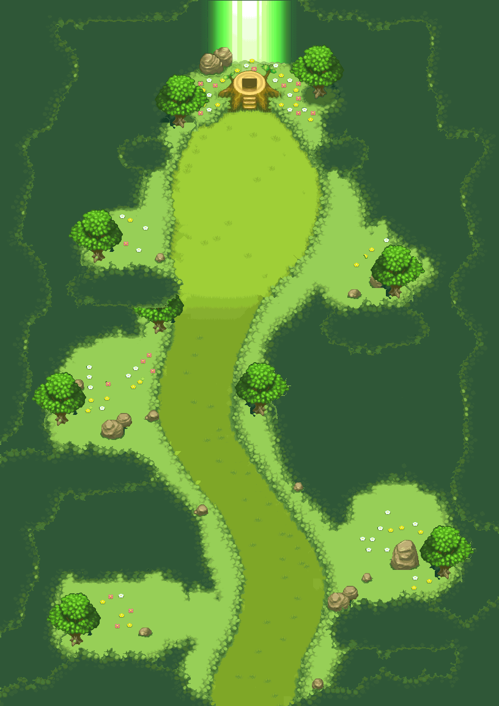

# Jardin secret v1 — layout agrandi, textures canoniques de la référence

**816 × 1152 px (102 × 144 cellules de 8 px)**, soit environ 2 × 2,8 fois `secretgarden.png` (408 × 408). Galerie : [`apercu_jardin_secret_v1.html`](../../apercu_jardin_secret_v1.html).

## Layout
Arrivée **au sud** par un tunnel de feuillage ; couloir de tapis d'herbe sinueux (4 bandes d'ombre comme la référence) bordé de pelouse et de haies festonnées ; **quatre alcôves en quinconce** (fleurs, rochers, arbres) ; au nord, la **clairière sacrée** : souche-sanctuaire à escalier, prairie fleurie, deux arbres et rayon de lumière, reposés à l'identique. Cadre de **feuillage immersif** au premier plan sur les bords, en haut autour de la trouée du rayon, sur les fermetures d'alcôves et à l'entrée.

## Calques (bas → haut), jour `calques/` et nuit `nuit/`
| Fichier | Contenu |
|---|---|
| `JSEC_V1_01_sol.png` | sous-bois, frange de feuilles, pelouse, haies, tapis (opaque) |
| `JSEC_V1_02_fleurs.png` | fleurs (sous le joueur) |
| `JSEC_V1_03_rochers.png` | rochers + ombres portées |
| `JSEC_V1_04_souche.png` | souche-sanctuaire |
| `JSEC_V1_05_arbres_troncs.png` | troncs + ombres au sol (sous le joueur) |
| `JSEC_V1_06_arbres_cimes.png` | cimes (au-dessus du joueur) |
| `JSEC_V1_07_rayon.png` | rayon de lumière (au-dessus) |
| `JSEC_V1_08_feuillage_avant.png` | feuillage immersif (au-dessus de tout) |

Aussi : `JSEC_V1_composition_{jour,nuit,sans_feuillage}.png`, `JSEC_V1_{jour,nuit}.ora` (OpenRaster multicalque), `JSEC_V1_provenance_src_yx.npz` (pour chaque calque et chaque pixel : coordonnées y, x dans la référence), `manifest.json`, `verification.json`.

**Import PMDO Dev** : « PNG to Tileset », tuiles **8 px** ; noms uniques `JSEC_V1_*`. Collisions, warps et point d'arrivée à dessiner dans l'éditeur.

## Méthode (textures canoniques)
Synthèse guidée par patchs depuis la **seule** référence : chaque pixel est **copié** d'un pixel source (coupes minimales entre patchs, aucun mélange ni filtrage). Objets détourés et translatés. Le sol caché sous la souche, les arbres et le rayon est reconstitué avec la même matière. Nuit : filtre Abyss exact, une fois par calque.

## Vérifications (`verification.json`, all_pass)
Dimensions multiples de 8 ; alpha binaire ; sol opaque ; **chaque pixel opaque = son pixel source** (8/8 calques) ; aucune couleur hors référence ; recomposition exacte ; nuit = filtre des calques ; noms uniques ; parcours praticable (gabarit 9 px) de l'entrée sud au pied de l'escalier ; objets posés sur la pelouse.

## Limites
- Pixels issus de PMD Sky ; la géométrie est nouvelle, ce n'est pas un décor officiel.
- La référence est une capture aplatie : pas d'animation (rayon et fleurs statiques, rien d'inventé).
- « 0 différence de pixel » prouve l'origine, pas la qualité artistique : inspection visuelle faite à 1×, **aucun test dans PMDO**.
