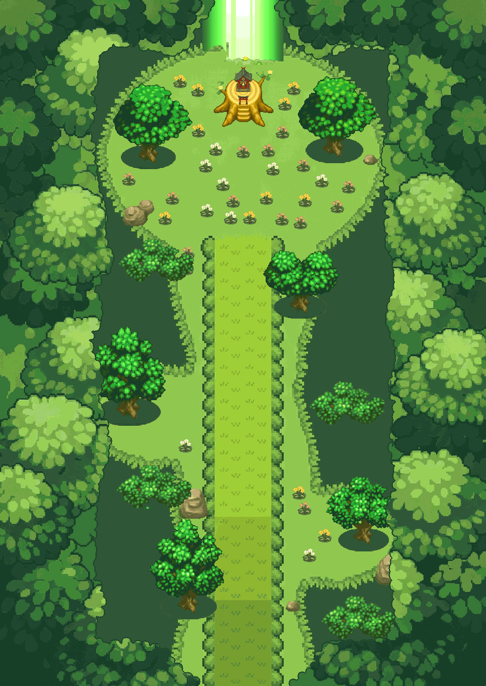

# Jardin secret v2 — chemin droit, feuillage immersif, hokora de Celebi

**816 × 1152 px (102 × 144 cases de 8 px)**, jour + nuit Abyss. Galerie animée : [`apercu_jardin_secret_v2.html`](../../apercu_jardin_secret_v2.html).



## Méthode « spriter » (générateur magenta + assemblage + outils)
1. **Maquette** (`source/jardin_secret_v2/maquette.py`) : chemin **droit** sud → clairière, pelouse à bords organiques, deux baies décalées, cadre de feuillage.
2. **Générateur** : un appel par calque/planche, **sur fond magenta #FF00FF** (sauf le sol, plein cadre), avec la maquette comme guide de placement et `secretgarden.png` comme référence de style. Bruts dans `source/jardin_secret_v2/bruts/` (essais rejetés dans `bruts/rejetes/`).
3. **Détourage + échelle canonique** (`extract_v2.py`) : clé magenta + frange rosée 3 px ; réduction « pixel artist » (moyenne des seuls pixels opaques, alpha ≥ 50 %).
   - **Arbres à la taille Halcyon** : cime ramenée à **126 px**, soit la cime de l'arbre Vast Steppe 144×120 (`native_tree_complete.png`). Les 3 cimes seules font 126×74, contre 126×72 pour l'arbre natif.
   - **Fleurs 24×24**, format de `Vast_Steppe_Flower_Animations.png`.
   - **Souche** : 100 px de large, comme dans secretgarden.png. Le hokora mesure environ 30 px (miniature).
4. **Palette** : sol, feuillage, arbres et rochers sont ramenés aux **139 couleurs de secretgarden.png**. Le temple (28 couleurs) et les fleurs (20 couleurs) ont une palette limitée propre, car le rouge et le jaune n'existent pas dans la référence.
5. **Assemblage multicalque** (`compose_v2.py`, translation seule) et **corrections aux outils** :
   - feuillage : le générateur débordait sur les baies et l'entrée. Il est recoupé sur la maquette, avec un bord festonné (demi-disques de 7 à 11 px), un contour sombre de 1 px et une ombre intérieure ;
   - sol : les îlots clairs perdus dans le sous-bois sont effacés ;
   - fleurs : la base de feuilles est fixée sur la pose neutre ;
   - arbres : séparation troncs/cimes.

## Calques (bas → haut)
| Fichier | Contenu | Joueur |
|---|---|---|
| `calques/JSEC2_01_sol.png` | sous-bois, lisière, pelouse, haies, chemin droit | sous |
| `fleurs_anim/JSEC2_02_fleurs_cXX_pY.png` | **fleurs animées** : 3 horloges (XX = 08/10/14) × 3 poses (Y = 0/1/2) | sous |
| `calques/JSEC2_03_rochers.png` | rochers | sous |
| `calques/JSEC2_04_souche_temple.png` | souche + **hokora miniature de Celebi** (petit torii, shimenawa, miroir) | sous |
| `calques/JSEC2_05_arbres_troncs.png` | troncs + ombres | sous |
| `calques/JSEC2_06_arbres_cimes.png` | cimes, dont cimes de lisière façon Halcyon | au-dessus |
| `calques/JSEC2_07_rayon.png` | rayon de lumière (**natif**, secretgarden.png) | au-dessus |
| `calques/JSEC2_08_feuillage_avant.png` | feuillage immersif | au-dessus |

Nuit : `nuit/*_nuit.png` et `fleurs_anim/nuit/`. On a aussi les compositions jour, nuit et sans feuillage, les fichiers `JSEC2_{jour,nuit}.ora` (un calque par pose de fleur), `JSEC2_fleurs_animation_clairiere.webp` (cycle complet de 1 120 frames de jeu, 18,7 s), `JSEC2_planche_fleurs_poses_x6.png`, les sprites dans `sprites/`, puis `manifest.json` et `verification.json`.

## Import PMDO
« PNG to Tileset », tuiles **8 px**, noms uniques `JSEC2_*`. Les fleurs demandent **un calque animé par horloge**, avec les images `p0, p1, p0, p2`, chacune affichée **8, 10 ou 14 frames de jeu** (cadences Halcyon Vast Steppe). Collisions, warps et arrivée restent à dessiner dans l'éditeur : souche, troncs et rochers sont solides, le chemin et la pelouse sont praticables.

## Vérifications (`verification.json`, all_pass)
Grille de 8 px ; alpha binaire ; sol opaque ; **0 pixel magenta résiduel** ; recomposition exacte depuis les PNG ; nuit = filtre Abyss des calques ; noms uniques ; base des fleurs fixe entre les poses ; fleurs hors du chemin ; **parcours praticable (gabarit 24 px) du bord sud au pied des marches du temple** ; pieds des arbres sur la pelouse.

## Limites
- **Pixels générés** d'après références (secretgarden.png, Halcyon) : ce ne sont pas des pixels natifs certifiés, **sauf le rayon**.
- Le générateur produit des pixels un peu moins réguliers qu'un sprite DS. La réduction et la palette resserrent le rendu, sans le rendre identique au jeu.
- Aucun test dans PMDO (moteur absent). Validation visuelle faite à 1× et ×3.

## Reconstruction
```
.venv/bin/python source/jardin_secret_v2/maquette.py
.venv/bin/python source/jardin_secret_v2/extract_v2.py
.venv/bin/python source/jardin_secret_v2/export_v2.py
```
