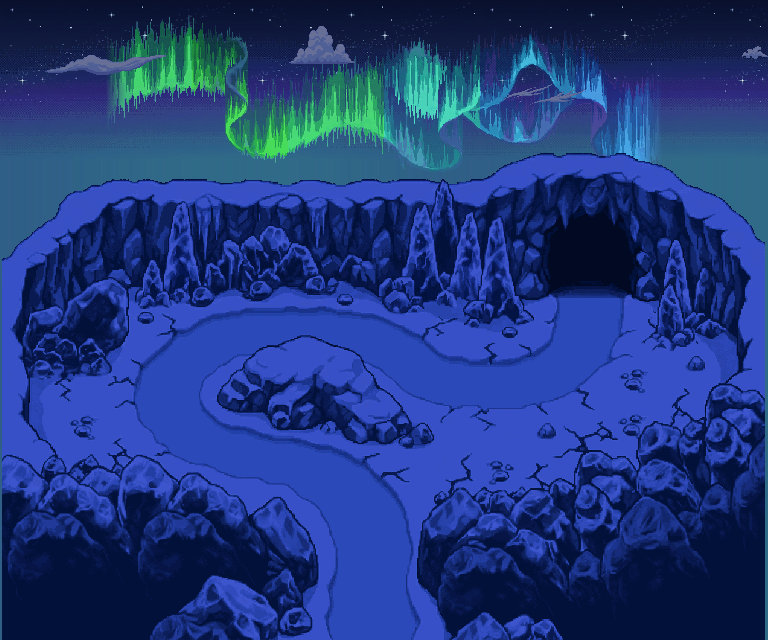

# Anse des Neiges — nouvelle onde boréale

**WebP en boucle,4s :** couleurs et légère ondulation. Nuages fixes dans cette boucle courte.

**[Extrait8s avec les nuages réellement en mouvement](GLACE_BOREALE_V2_02_anse_des_neiges_nuages_wrap_extrait_8s.webp)** — une seule lecture, pas de raccord artificiel. Recharger l’image pour le rejouer.

[Scène jour PNG](GLACE_BOREALE_V2_02_anse_des_neiges_scene_jour.png) · [Scène nuit PNG](GLACE_BOREALE_V2_02_anse_des_neiges_scene_nuit.png) · [Projet ORA9calques](GLACE_BOREALE_V2_02_anse_des_neiges_nuit.ora) · [Atelier](../index.html)

Terrain et ciel de V1 conservés. Le chemin rejoint la grotte depuis le sud. Candidat référencé PMD, pas un Ground intégré ; collisions et échelle non validées en jeu.

## Calques PNG

| Plan | Jour | Nuit |
|---|---|---|
| 01_sol_avec_chemin | [PNG](GLACE_BOREALE_V2_02_anse_des_neiges_01_sol_avec_chemin_jour.png) | [PNG](GLACE_BOREALE_V2_02_anse_des_neiges_01_sol_avec_chemin_nuit.png) |
| 02_profondeur_grotte | [PNG](GLACE_BOREALE_V2_02_anse_des_neiges_02_profondeur_grotte_jour.png) | [PNG](GLACE_BOREALE_V2_02_anse_des_neiges_02_profondeur_grotte_nuit.png) |
| 03_cliffs_reliefs | [PNG](GLACE_BOREALE_V2_02_anse_des_neiges_03_cliffs_reliefs_jour.png) | [PNG](GLACE_BOREALE_V2_02_anse_des_neiges_03_cliffs_reliefs_nuit.png) |
| 04_immersion_gauche | [PNG](GLACE_BOREALE_V2_02_anse_des_neiges_04_immersion_gauche_jour.png) | [PNG](GLACE_BOREALE_V2_02_anse_des_neiges_04_immersion_gauche_nuit.png) |
| 05_immersion_droite | [PNG](GLACE_BOREALE_V2_02_anse_des_neiges_05_immersion_droite_jour.png) | [PNG](GLACE_BOREALE_V2_02_anse_des_neiges_05_immersion_droite_nuit.png) |

Ciel, étoiles, nuages : [`../climat/`](../climat/). Onde indépendante : [`../aurore/`](../aurore/).

##32frames de composition en PNG

[00](frames_nuit/GLACE_BOREALE_V2_02_anse_des_neiges_scene_00.png) · [01](frames_nuit/GLACE_BOREALE_V2_02_anse_des_neiges_scene_01.png) · [02](frames_nuit/GLACE_BOREALE_V2_02_anse_des_neiges_scene_02.png) · [03](frames_nuit/GLACE_BOREALE_V2_02_anse_des_neiges_scene_03.png) · [04](frames_nuit/GLACE_BOREALE_V2_02_anse_des_neiges_scene_04.png) · [05](frames_nuit/GLACE_BOREALE_V2_02_anse_des_neiges_scene_05.png) · [06](frames_nuit/GLACE_BOREALE_V2_02_anse_des_neiges_scene_06.png) · [07](frames_nuit/GLACE_BOREALE_V2_02_anse_des_neiges_scene_07.png) · [08](frames_nuit/GLACE_BOREALE_V2_02_anse_des_neiges_scene_08.png) · [09](frames_nuit/GLACE_BOREALE_V2_02_anse_des_neiges_scene_09.png) · [10](frames_nuit/GLACE_BOREALE_V2_02_anse_des_neiges_scene_10.png) · [11](frames_nuit/GLACE_BOREALE_V2_02_anse_des_neiges_scene_11.png) · [12](frames_nuit/GLACE_BOREALE_V2_02_anse_des_neiges_scene_12.png) · [13](frames_nuit/GLACE_BOREALE_V2_02_anse_des_neiges_scene_13.png) · [14](frames_nuit/GLACE_BOREALE_V2_02_anse_des_neiges_scene_14.png) · [15](frames_nuit/GLACE_BOREALE_V2_02_anse_des_neiges_scene_15.png) · [16](frames_nuit/GLACE_BOREALE_V2_02_anse_des_neiges_scene_16.png) · [17](frames_nuit/GLACE_BOREALE_V2_02_anse_des_neiges_scene_17.png) · [18](frames_nuit/GLACE_BOREALE_V2_02_anse_des_neiges_scene_18.png) · [19](frames_nuit/GLACE_BOREALE_V2_02_anse_des_neiges_scene_19.png) · [20](frames_nuit/GLACE_BOREALE_V2_02_anse_des_neiges_scene_20.png) · [21](frames_nuit/GLACE_BOREALE_V2_02_anse_des_neiges_scene_21.png) · [22](frames_nuit/GLACE_BOREALE_V2_02_anse_des_neiges_scene_22.png) · [23](frames_nuit/GLACE_BOREALE_V2_02_anse_des_neiges_scene_23.png) · [24](frames_nuit/GLACE_BOREALE_V2_02_anse_des_neiges_scene_24.png) · [25](frames_nuit/GLACE_BOREALE_V2_02_anse_des_neiges_scene_25.png) · [26](frames_nuit/GLACE_BOREALE_V2_02_anse_des_neiges_scene_26.png) · [27](frames_nuit/GLACE_BOREALE_V2_02_anse_des_neiges_scene_27.png) · [28](frames_nuit/GLACE_BOREALE_V2_02_anse_des_neiges_scene_28.png) · [29](frames_nuit/GLACE_BOREALE_V2_02_anse_des_neiges_scene_29.png) · [30](frames_nuit/GLACE_BOREALE_V2_02_anse_des_neiges_scene_30.png) · [31](frames_nuit/GLACE_BOREALE_V2_02_anse_des_neiges_scene_31.png)
