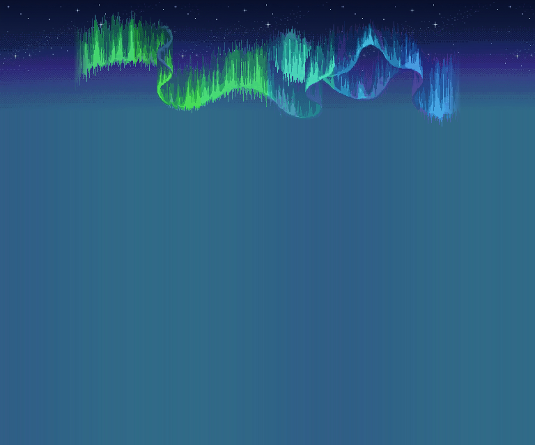
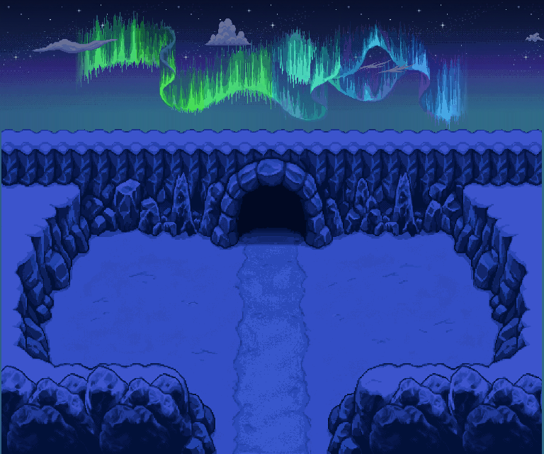
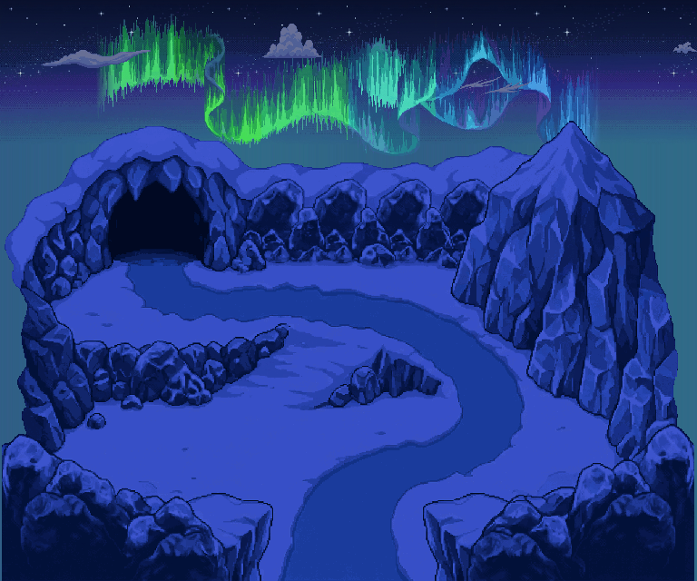

# Une onde boréale — couleurs et légère ondulation sur le ciel validé

**[Voir la planche PNG](PLANCHE_ONDE_ET_TROIS_ZONES.png)** · **[Atelier interactif](index.html)** · **[32 PNG de l’onde seule](aurore/README.md)**

Nouvelle demande : **générer l’onde seule**, puis l’animer avec changement de couleur et légère ondulation, et la poser sur **notre ciel nocturne validé**. Les trois layouts de grotte glacée et la correction des falaises existaient déjà dans `dfa2ac83` ; ils sont préservés, pas régénérés.

## L’onde sur notre ciel — WebP animé

**[Ouvrir le WebP](GLACE_BOREALE_V2_sur_ciel_nuit.webp)** · [PNG](GLACE_BOREALE_V2_sur_ciel_nuit.png) · [WebP transparent, onde seule](aurore/GLACE_BOREALE_V2_onde_transparente.webp)

Le ciel et les étoiles sont les fichiers validés de V1, **identiques octet pour octet**. Aucune nouvelle peinture de ciel et aucun fond Caps/Terrasses ou Arène V3 ajouté derrière l’effet. Le nouveau dessin d’aurore est généré d’après `aurorepmdsky.png` : il ne s’agit **pas** de pixels canoniques extraits ni du cycle officiel du jeu.

## Trois compositions directement visibles sur GitHub

### 01 — Seuil du Givre

[PNG jour](01_seuil_du_givre/GLACE_BOREALE_V2_01_seuil_du_givre_scene_jour.png) · [PNG nuit](01_seuil_du_givre/GLACE_BOREALE_V2_01_seuil_du_givre_scene_nuit.png) · **[Tous les calques et32PNG de composition](01_seuil_du_givre/README.md)** · [Extrait8s, nuages mobiles](01_seuil_du_givre/GLACE_BOREALE_V2_01_seuil_du_givre_nuages_wrap_extrait_8s.webp)

### 02 — Anse des Neiges

[PNG jour](02_anse_des_neiges/GLACE_BOREALE_V2_02_anse_des_neiges_scene_jour.png) · [PNG nuit](02_anse_des_neiges/GLACE_BOREALE_V2_02_anse_des_neiges_scene_nuit.png) · **[Tous les calques et32PNG de composition](02_anse_des_neiges/README.md)** · [Extrait8s, nuages mobiles](02_anse_des_neiges/GLACE_BOREALE_V2_02_anse_des_neiges_nuages_wrap_extrait_8s.webp)

### 03 — Col des Aiguilles

[PNG jour](03_col_des_aiguilles/GLACE_BOREALE_V2_03_col_des_aiguilles_scene_jour.png) · [PNG nuit](03_col_des_aiguilles/GLACE_BOREALE_V2_03_col_des_aiguilles_scene_nuit.png) · **[Tous les calques et32PNG de composition](03_col_des_aiguilles/README.md)** · [Extrait8s, nuages mobiles](03_col_des_aiguilles/GLACE_BOREALE_V2_03_col_des_aiguilles_nuages_wrap_extrait_8s.webp)

## Animation : une seule onde cohérente

- **Un dessin maître généré retenu**, détouré et normalisé uniformément en nearest-neighbor, posé dans un canevas transparent **768×640**, à `(0,0)` pour le placement moteur.
- **32 frames ×125ms =4s**. Les32frames sont des étapes d’animation du même dessin, pas32dessins générés séparément.
- **Couleurs mobiles :** plan fixe d’indices, 32couleurs du dessin ×8groupes de phase =256entrées. Les32palettes font évoluer progressivement le vert, le cyan et le bleu-violet le long de l’onde. La saturation et la valeur HSV de chaque teinte restent constantes, à l’arrondi RGB près : pas de flash global de luminosité.
- **Légère ondulation :** déplacement vertical par colonne, maximum **±2px**. Pas de scroll, pas de wrap, aucune translation horizontale de l’aurore. La forme demeure la même avec une déformation douce.
- **Boucle exacte :** l’étape32 reconstruite est identique à l’étape0 ; transition31→0 de même amplitude que les transitions intérieures.
- L’alpha suit l’ondulation ; le fond reste entièrement transparent, y compris les trous internes. Aucun ciel/étoile/nuage n’est cuit dans les frames de l’onde.

Le [plan d’indices](aurore/GLACE_BOREALE_V2_indices.png), l’[alpha avant ondulation](aurore/GLACE_BOREALE_V2_alpha.png) et les [palettes + déplacements](aurore/GLACE_BOREALE_V2_palettes.json) sont fournis pour reconstruire le cycle. Ce sont des fichiers auxiliaires, pas un format d’animation PMDO directement importable.

## Calques conservés

Chaque layout a les mêmes cinq plans de terrain qu’en V1, **jour et nuit byte-identiques** :

1. sol complet avec chemin ;
2. profondeur de grotte ;
3. cliffs et reliefs ;
4. bordure d’immersion gauche ;
5. bordure d’immersion droite.

Ciel, étoiles, six familles de nuages : [`climat/`](climat/), copies byte-identiques de V1, sources **Guilde/Sharpedo c16efe12**, via `source/ciels_valides.py`. Le dossier [`aurore/`](aurore/) contient uniquement le nouvel effet et ses paramètres.

Les trois ORA nocturnes recomposent **neuf calques** : ciel, étoiles, nouvelle onde phase0, cinq plans terrain, nuages phase0. Ils sont statiques ; les effets animés sont les PNG/WebP et la recette du manifest.

## Nuages : vrai wrap, sans faux raccord court

- Dans l’atelier : bande native **1440×208**, vitesse **−4px/s**, copies jointives, période **360s** indépendante de l’aurore4s. Les deux cycles se referment ensemble en360s.
- Les WebP `*_boucle_onde.webp` sont des boucles d’aurore **4s**. Les nuages y restent fixes à la phase0 pour ne pas imposer un saut artificiel de16px au retour.
- Les WebP `*_nuages_wrap_extrait_8s.webp` montrent **64frames /8s de vrai déplacement**, simultanément à la nouvelle onde. **Une seule lecture**, sans prétendre boucler un cycle de360s en8s. Recharger pour rejouer.
- L’onde sur ciel seul boucle4s ; elle ne comporte aucun nuage.

## PNG, import et limites

- **32PNG RGBA de l’effet seul** dans `aurore/`, et **32PNG de composition par zone** dans chaque `frames_nuit/`.
- Plans de terrain et effet :768×640, grille d’importPNG **8px** (96×80cellules), pas de lissage. Garder les noms uniques pour éviter les écrasements.
- Bande de nuages : overlay de fond répétable, pas tileset de terrain.
- Les matières de glace de V1 sont des **dessins générés guidés par Ice Road / Ice Arena et quantifiés à leurs couleurs**, pas une reconstruction native pixel-exacte. Le sol caché reste généré ; les faces cachées des reliefs ne sont pas complétées.
- Pas de Ground, collision, warp, destination de grotte ou test de rendu moteur ajouté. Échelle et praticabilité à valider en jeu.

**41 contrôles PASS** : provenance et préservation des39fichiers V1, indices/palettes, amplitude, boucle, alpha, PNG, huit WebP avec décodage exact des pixels visibles, neuf plans des ORA et vraie recette de wrap. Les suites précédentes passent également :60contrôles falaises et140entrées V1. Ce ne sont pas des validations artistiques ou moteur.

[Manifest et empreintes](manifest.json) · [Rapport](../../source/onde_boreale_glace_v2/verification.json) · [Méthode et reproduction](../../source/onde_boreale_glace_v2/README.md) · [Layouts V1 / jour-nuit](../entrees_glace_v1/README.md) · [Falaises Métano corrigées](../cliffs_metano_v1/README.md).
