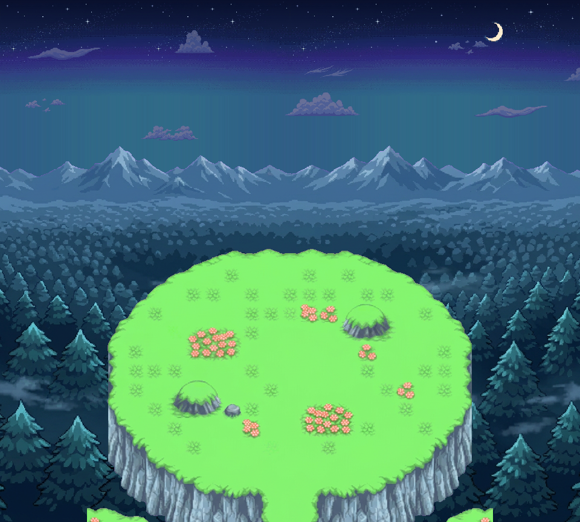

# Sky Peak — prairie du sommet, nuit

Un plateau herbeux dans la texture verte de Sky Peak, au sommet d’une falaise ; en contrebas une mer de forêt qui descend jusqu’à une chaîne de montagnes lointaine ; ciel de nuit étoilé, croissant de lune et nuages natifs en overlay, dans l’esprit de la référence fournie (lune sur ciel bleu nuit avec nuages). Galerie : `index.html` (servir par HTTP) — nuages mobiles, calques commutables. [Extrait animé 24 s](SkyPeakPrairieV1_extrait_nuages_24s.webp) · [ORA](SkyPeakPrairieV1_editable.ora).

## Calques 960 × 864, tous en (0,0)
| # | Calque | Origine |
|---|---|---|
| 01 | `01_ciel_natif` | ciel nuit validé (`ciels_valides.py`, c16efe12), répétition réfléchie, non redimensionné |
| 02 | `02_etoiles_natives` | planche d’astres native, lune retirée |
| 03 | `03_lune_native` | croissant natif isolé, boîte (812,32)-(836,63) |
| 04 | `04_nuages_lointains` | bande native 1440 px, alpha 70 %, −2 px/s |
| 05 | `05_panorama_montagnes_foret` | **généré** (montagnes + mer de forêt jusqu’au bord bas) |
| 06 | `06_nuages_overlay` | même bande native, 100 %, −6 px/s, passe devant le panorama |
| 07 | `07_plateau_herbe` | **généré**, partition herbe du terrain |
| 08 | `08_paroi_rocheuse` | **généré**, partition roche du terrain |

`calques/SkyPeakPrairieV1_terrain_complet.png` = 07 + 08. `SkyPeakPrairieV1_bande_nuages_native_1440.png` sert au wrap (dessiner à x et x+1440). Les nuages ne sont pas remis à zéro : périodes 720 s et 240 s ; le WebP est un extrait de 24 s, pas une boucle parfaite.

## Ce qui est natif / ce qui ne l’est pas
- Ciel, étoiles, lune, nuages : pixels natifs approuvés, non redimensionnés (vérifié contre l’aide `ciels_valides`).
- Terrain et panorama : **dessins générés** guidés par la frame 0 du GIF Sky Peak (`source/sky_peak_v1/gif_0.png`) et l’image de référence fournie. Réduction uniforme au plus proche voisin (1024→672 ; 1376→1200 puis recadrage 960), détourage magenta, aucune recoloration. Ce ne sont pas des tuiles Sky Peak copiées ; la palette et le motif d’herbe en sont très proches mais non certifiés canoniques.
- Bruts conservés dans `bruts/` : `terrain_prairie.png` (premier essai, corridor plutôt que sommet, écarté), `terrain_prairie_v2.png` (retenu), `panorama_foret_montagnes.png` (rebord/souche au premier plan, écarté), `panorama_foret_montagnes_v2.png` (retenu).
- Herbe/roche = partition des pixels visibles, pas de sol caché reconstruit. Pas d’import PMDO, collisions, caméra ni test moteur.

`verify.py` : 19 contrôles PASS (tailles, ciel/étoiles/lune/nuages égaux aux sources natives, recomposition = composition = ORA, partition herbe/roche, aucun magenta résiduel, forêt jusqu’au bord bas, extrait de 24 s). Scripts : `source/sky_peak_prairie_v1/`.
