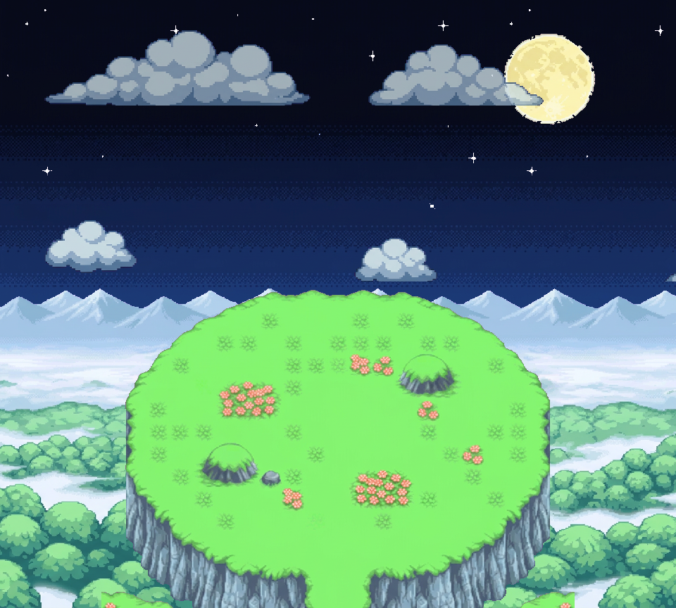

# Sky Peak — prairie du sommet, nuit — V2

Correction demandée : **le fond (mer de forêt + chaîne de montagnes) est rendu dans le style Sky Peak** (montagnes pastel enneigées dans la brume, mer de nuages, canopées vertes rondes comme les buttes d’herbe du GIF), et **le ciel est généré**, avec **étoiles + lune** et **nuages** sur des calques séparés, dans l’esprit de la référence fournie. Le plateau du sommet est le même que V1. La V1 (ciel/lune/nuages natifs) est conservée dans le dossier parent.

Galerie : `index.html` (servir par HTTP) — calques commutables, nuages mobiles. [Extrait animé 24 s](SkyPeakPrairieV2_extrait_nuages_24s.webp) · [ORA](SkyPeakPrairieV2_editable.ora).

## Calques 960 × 864, tous en (0,0) — tout est généré
| # | Calque | Note |
|---|---|---|
| 01 | `01_ciel_genere` | dégradé nuit généré, ajusté en largeur (dernière ligne prolongée, pas d’étirement) |
| 02 | `02_etoiles_generees` | champ d’étoiles généré, planche réduite ×½ (le générateur dessinait à 2 px), halo de lune retiré |
| 03 | `03_lune_generee` | pleine lune 129 × 129 isolée, posée en (716,48) ; sprite seul `_lune_sprite.png` |
| 04 | `04_nuages_lointains` | 3 grands nuages générés, bande wrap 1440 px, alpha 80 %, −2 px/s |
| 05 | `05_panorama_skypeak_foret_montagnes` | panorama généré façon Sky Peak (1584→1200 puis recadrage 960), jusqu’au bord bas |
| 06 | `06_nuages_overlay` | 3 petits nuages, bande wrap 1440 px, 100 %, −6 px/s, devant le panorama |
| 07 | `07_plateau_herbe` | partition herbe du plateau généré (comme V1) |
| 08 | `08_paroi_rocheuse` | partition roche |

Bandes de nuages : `_bande_nuages_lointains_1440.png` et `_bande_nuages_overlay_1440.png` (dessiner à x et x+1440). Bruts dans `../bruts/` : `ciel_nuit_genere.png`, `etoiles_lune_generees.png`, `nuages_generes.png`, `panorama_skypeak_v3.png`, `terrain_prairie_v2.png`.

## Limites
Aucun pixel de cette V2 n’est natif certifié : ciel, astres, nuages, panorama et terrain sont des dessins générés guidés par le GIF Sky Peak (`source/sky_peak_v1/gif_0.png`, extrait d’horizon `references/skypeak_horizon_native.png`) et la référence lune/nuages fournie. Réductions uniformes au plus proche voisin uniquement, détourage magenta, aucune recoloration. Herbe/roche = partition des pixels visibles. Pas de test PMDO. Le WebP est un extrait de 24 s (périodes de wrap 720 s / 240 s).

`verify_v2.py` : 21 contrôles PASS (tailles, ciel opaque, étoiles/lune disjointes et lune à sa position déclarée, bandes de nuages, recomposition = composition = ORA, partition herbe/roche, aucun magenta résiduel, forêt verte jusqu’au bord bas, extrait 24 s).
