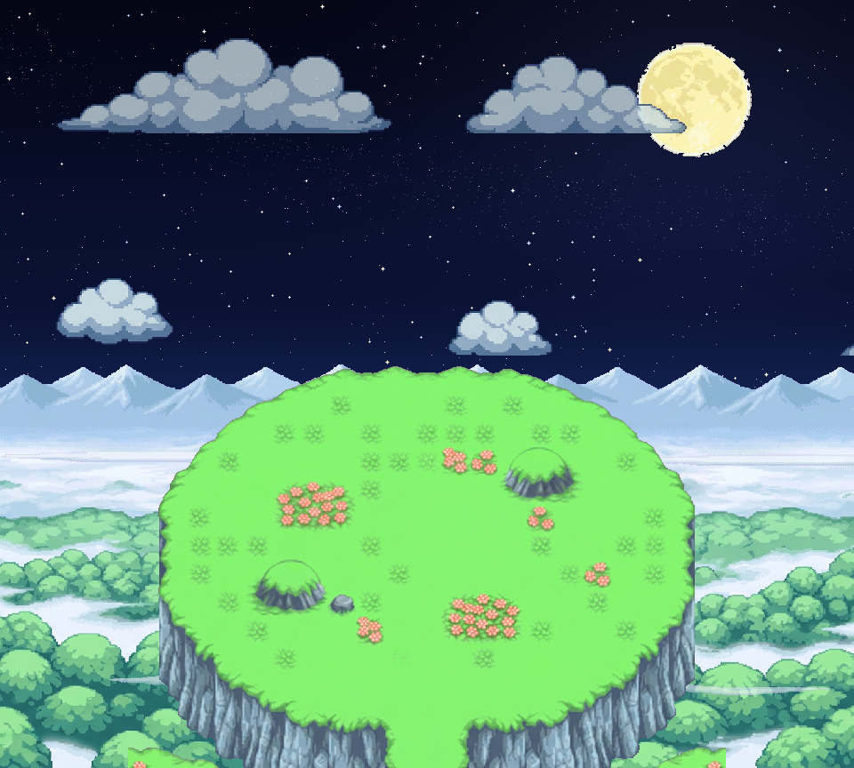

# Sky Peak — prairie du sommet, nuit — V3 : ciel profond et étoiles animées

Correction demandée : un **ciel sans motif**, qui donne vraiment l’impression de profondeur et de lointain, et de **vraies animations d’étoiles travaillées façon PMD**, chacune sur son calque, **étoiles filantes comprises**. Panorama Sky Peak, brume, nuages, lune et plateau sont repris de la V2 à l’identique.

Galerie : `index.html` (servir par HTTP) — chaque calque animé garde sa propre horloge, pause, mode Nuit Abyss. [Étoiles seules, boucle 8 s](SkyPeakPrairieV3_etoiles_8s.webp) · [Étoiles filantes seules, 12 s](SkyPeakPrairieV3_etoiles_filantes_12s.webp) · [Extrait complet 24 s](SkyPeakPrairieV3_extrait_24s_nuit.webp) · [Extrait Nuit Abyss](SkyPeakPrairieV3_extrait_24s_nuit_abyss.webp) · [ORA](SkyPeakPrairieV3_editable.ora).

## Calques 960 × 864, tous en (0,0)
| # | Calque | Contenu |
|---|---|---|
| 01 | `01_ciel_profond` | dégradé dessiné par le script, **aucun motif** : indigo très sombre au zénith → bleu sarcelle lumineux à l’horizon lointain (5 paliers lissés), très léger halo autour de la lune, tramage Bayer 4×4 pour éviter les bandes |
| 02 | `02_etoiles_phase0` + `etoiles_frames/` | **64 phases à 8 i/s (boucle 8 s)** : 220 étoiles scintillantes à motifs PMD (point 1 px → croix 3 px → croix 5 px avec diagonales), chacune avec sa période (6–14 phases) et son décalage ; 4 teintes (blanc, bleuté, crème, bleu pâle) ; 320 étoiles fixes fines et une **voie lactée** diffuse de 700 points ; aucune étoile sur la lune |
| 02b | `02b_etoiles_filantes_vide` + `etoiles_filantes_frames/` | **360 phases à 30 i/s (boucle 12 s)** : 4 étoiles filantes (trajectoires, longueurs, teintes et vitesses différentes), traînée continue qui s’estompe, tête en croix, fondu final |
| 03–08 | lune, nuages lointains, panorama, brume, nuages overlay, plateau, paroi | **identiques à la V2** (bandes de wrap incluses) |

Ordre de rendu : ciel → étoiles → étoiles filantes → lune → nuages lointains → panorama → brume → nuages proches → plateau → paroi. Les étoiles restent au-dessus de y = 470 (au-dessus de la crête).

## Nuit Abyss
Même règle qu’en V2 : filtre exact `tile_night` sur panorama, brume, nuages, plateau, paroi ; ciel, étoiles, étoiles filantes et lune inchangés (`_composition_nuit_abyss.png`, extrait animé ; la galerie filtre à la volée).

## Limites
Tout est dessiné par le script ou généré (aucun pixel natif certifié). Les motifs d’étoiles sont **inspirés** du style PMD, pas copiés d’une planche native. Les périodes (8 s / 12 s / nuages 720–240 s / brume 9–7–5,5 s) sont indépendantes : les WebP « extrait » ne bouclent pas parfaitement, seuls les WebP « étoiles » et « étoiles filantes » sont de vraies boucles. Pas de test PMDO.

`verify_v3.py` : **23 contrôles PASS** (ciel opaque et lisse sans motif, 64 phases d’étoiles toutes différentes et bornées au ciel, lune épargnée, 360 phases de filantes majoritairement vides, calques V2 réutilisés inchangés, recompositions = ORA = Abyss exact, durées de boucles).

Reproduction : `.venv/bin/python source/sky_peak_prairie_v1/build_v3.py --full` (≈ 7 min pour les extraits) puis `verify_v3.py`.
