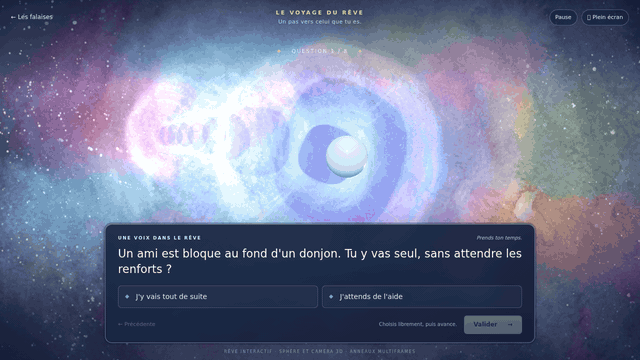

# Le voyage du rêve — test de personnalité

Une scène **plein viewport**, inspirée de la direction aquarelle/cosmique de PMD DX : sphère lumineuse en vraie 3D, anneaux circulaires multiframes en profondeur, poussières et fond multicolore en parallaxe.

[Ouvrir le test autonome](../apercu_reve.html) · [Voir la preview GIF](../previews/reve_personnalite.gif) · [Audit des dimensions de référence](AUDIT_REFERENCE.md)



## Fonctionnement

- **8 questions tirées sans répétition** dans la banque de 18 questions du projet de référence.
- Une question n’avance **que sur validation**. L’animation et le déplacement de souris ne répondent jamais à la place du joueur.
- À chaque validation, la sphère avance dans le rêve et la caméra perspective passe alternativement à gauche et à droite. La transition dure 1,7 s ; une double validation pendant le mouvement est bloquée.
- La nébuleuse n’est pas un fond noir : trois vitesses de défilement, couleurs évolutives et réaction au point de vue créent la parallaxe.
- Les anneaux ont **36 phases RGBA**, cycle de 6 s avec interpolation. Un halo proche accompagne la sphère ; les autres anneaux sont placés dans la profondeur 3D.
- Les poids restent internes. Seuls la question, ses réponses et la nature finale sont affichés. Le retour à la question précédente annule correctement son poids.
- Clavier : flèches pour choisir, Entrée pour valider ; boutons accessibles et navigation tactile.
- Le mode de mouvement réduit démarre en pause. Dans ce mode, changer de question applique le nouveau point de vue sans trajet animé.

Le bouton plein écran utilise l’API du navigateur. Si une iframe l’interdit, un message le signale ; le rendu remplit déjà tout l’espace disponible dans cette iframe.

## Références et portée

Le code et les données de `meromoonmeri/mypmdproject`, branche `arena/01a083a8-mypmdproject`, ont été consultés comme référence, au commit `e3fa166525d08202503200c77482a2c1cc9cabad`. Le commit artistique fourni est `319d10f69605331a07c817227c85ec8d0aba3dab`.

**Ce dépôt contient la nouvelle version web autonome et ses ressources. Le dépôt `mypmdproject` n’a pas été modifié.** Le module n’est pas une intégration native PMDO. Les données du quiz et les natures sont reprises ici avec leur provenance ; le contrôleur web reproduit la pondération, l’annulation des réponses et le départage déterministe. Le tirage utilise un PRNG web reproductible, pas le même algorithme de tirage que NumPy.

## Intégration

L’API publique `window.REVE` permet de sélectionner, valider, revenir, recommencer, mettre en pause et lire l’état visible. Elle ne retourne pas les poids internes.

Événements :

- `dream-question-changed` : `{question, total}` après une validation ou un retour.
- `personality-result` : `{id, fr, rgb, accent}` à la fin du test.

Le mode `REVE.capture` sert uniquement aux captures déterministes. Il ne lance aucun défilement automatique des questions en usage normal.

## Sources et reconstruction

Les textures sont générées puis préparées par Python. Les sources du rendu et de l’interface sont dans `source/reve/`. Three.js est embarqué localement dans le bundle ; l’HTML ne charge aucun CDN, aucune police externe et aucun service réseau.

```bash
pip install -r source/requirements-reve.txt
npm ci --prefix source/reve
python source/prepare_reve.py
npm run build --prefix source/reve
python source/build_preview_reve.py
python source/verify_reve.py
python source/export_previews_gif.py
# Optionnel : serveur de prévisualisation
python source/serve_exterieurs.py --page apercu_reve.html
```

Playwright et son navigateur sont nécessaires pour les contrôles/captures. `imageio-ffmpeg` fournit l’encodeur GIF. Les dépendances JavaScript sont verrouillées par le fichier package-lock du module.

Les ressources comprennent la nébuleuse, l’atlas circulaire, une phase de référence, le manifeste et le bundle autonome. La licence de Three.js est dans `licenses/THREE.txt`.

## Contrôles

`controle_qualite.json` consigne les essais : vrai rendu WebGL, voyage de la sphère, alternance des points de vue, 36 phases distinctes, résultats conformes aux données, annulation des réponses, absence de score affiché, fonctionnement hors ligne/en iframe, mouvement réduit et plein viewport de **320 × 568 à 1920 × 1080**, y compris paysage mobile.
