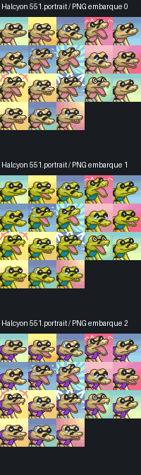

# Profil de production — portraits et sprites Pokémon PMD

**Préparé le 16 septembre 2026.** Les deux présentations fournies ont été lues dans leur version HTML complète (42 et 30 diapositives). Le README, la configuration et le code de validation SpriteBot ont été consultés, ainsi que les branches `master` et `working-copy` de Halcyon. Les références techniques sont figées dans `contract.json` et l’inventaire Halcyon.

## Ce qui est configuré — et ce qui ne l’est pas

Ce dossier configure **notre méthode de travail dans ce projet** : brief, prompts, contraintes d’export, précontrôles et critères artistiques. Il ne modifie ni n’entraîne le modèle d’image. Ses sorties restent des brouillons à reconstruire/retoucher en pixel art ; demander « 40 × 40, 15 couleurs » dans un prompt ne garantit pas ces propriétés.

Aucun nouveau Pokémon n’est généré ici : l’espèce, la forme, les accessoires, les émotions et l’étendue des animations restent à choisir. Aucun fichier d’un mod actif n’est remplacé.

**Destination par défaut : personnage personnalisé pour ton mod PMDO.** Un format compatible SpriteCollab n’est pas une approbation artistique de SpriteCollab. Les documents fournis n’établissent pas l’admissibilité des contributions assistées par IA : demander confirmation aux mainteneurs avant toute soumission publique, avec provenance transparente.

## 1. Portraits : contrat strict

- **40 × 40 pixels par émotion**, avec **15 couleurs visibles maximum par émotion, fond compris**. Ce n’est pas une palette globale de 15 couleurs pour toute la planche.
- Une case présente est **entièrement opaque**. Une case absente est **entièrement transparente**. Pas de détourage magenta dans le portrait final, de trous transparents, de pixels semi-transparents, ni de fond rajouté après le contrôle de palette.
- Le fond participe à la narration de l’émotion et reprend les conventions PMD. Réserver environ trois couleurs de fond et une couleur de liaison sujet/fond, selon l’anatomie et l’émotion.
- Vue neutre en trois-quarts, regard lisible, cadrage sur la tête sans supprimer ses traits d’identification. Silhouette, museau, oreilles, yeux et marquages restent cohérents entre émotions.
- Palette réduite ≠ dessin simpliste : contours foncés colorés plutôt que noir pur systématique, ombres et lumières en groupes de pixels, anti-aliasing **manuel en couleurs opaques de la palette**. Pas de flou automatique ni de dégradés alpha.

### Ordre exact de la planche SpriteCollab

| Rangée | Col. 1 | Col. 2 | Col. 3 | Col. 4 | Col. 5 |
|---|---|---|---|---|---|
| 1 | Normal | Happy | Pain | Angry | Worried |
| 2 | Sad | Crying | Shouting | Teary-Eyed | Determined |
| 3 | Joyous | Inspired | Surprised | Dizzy | Special0 |
| 4 | Special1 | Sigh | Stunned | Special2 | Special3 |

Une planche standard complète fait **200 × 160** ; les vues inversées occupent les quatre rangées suivantes, soit **200 × 320** avec les deux sens. Les 16 émotions hors `Special0`–`Special3` sont nécessaires au niveau « fully featured ». Une soumission partielle peut être recadrée sur les cellules utiles, toujours en multiples de 40 et sans décaler leur emplacement logique.

Pour une anatomie asymétrique, chaque émotion présente a sa vue inverse corrigée : **un miroir automatique ne suffit pas** pour un accessoire porté d’un seul côté. Le dépôt stocke les fichiers par nom (`Normal.png`, `Happy.png`, `Normal^.png`, etc.) ; la planche de soumission est un autre format de présentation de ces mêmes cellules.

### Fonds canoniques ajoutés par l’utilisateur

Le commit utilisateur `bee49f0` (« Portrait fond canonique »), arrivé pendant cette préparation, a été fusionné sans écraser les fichiers :

- `template.png` : **200 × 320**, grille 5 × 8 de cellules 40 × 40 ; référence prioritaire pour les fonds d’émotion.
- `Extra_Backgrounds.png` : **280 × 240**, atlas 7 × 6 de fonds supplémentaires ; sélectionner une cellule explicitement plutôt que supposer un ordre d’émotions identique au template.
- Empreintes, palettes et alphas par cellule : `references/user_backgrounds.json`.

Ces fichiers sont des **sources de fond, pas des portraits finaux à soumettre**. Le contrôle a relevé quatre cellules `Special` partiellement transparentes dans le template ; la cellule du slot `Special2` comporte 17 couleurs visibles avant même d’ajouter un personnage. Il faut composer ces motifs sur un fond opaque et choisir/optimiser la palette finale sujet + fond dans la limite de 15, sans altérer les originaux. Ne pas annoncer le template brut comme une planche conforme de portraits finis. Les fonds supplémentaires utilisent jusqu’à six couleurs par cellule : les prévoir dans le budget de palette.

### Méthode artistique retenue

1. Références canoniques + exemples Chunsoft pertinents ; noter proportions, anatomie, palette, fonds d’émotion et asymétries. Les modèles 3D servent à comprendre les volumes, pas à imposer un rendu 3D.
2. Dessin/génération de référence d’une émotion à la fois, avec composition pensée pour 40 × 40. Brouillon de travail autour de 400 × 400, conservé séparément.
3. Trois à cinq angles de tête si utiles : neutre, tête baissée, tête relevée, penché pour crier, inclinaison latérale. Les yeux, sourcils et bouche restent éditables séparément.
4. Une réduction bilinéaire peut fournir un **guide**, conformément à TawnySoup. Ensuite : reconstruction/retouche à 40 × 40, palette choisie, contours, yeux et bouche ajustés pixel par pixel. Une simple réduction + quantification ne vaut pas finition.
5. Vérifier d’abord `Normal`, `Happy`, `Angry`, `Sad` à **100 %**, puis étendre les émotions après validation du modèle. Les expressions doivent être distinctes dans le visage et la posture, pas seulement par le fond.
6. Vérifier palette et opacité sur chaque export final ; produire planche 1×, agrandissement nearest-neighbor de contrôle et sources éditables.

## 2. Sprites : contrat strict

- **15 couleurs visibles maximum pour l’ensemble du personnage et de ses animations**, plus la transparence. Les images techniques Offsets/Shadow ne sont pas comptées dans cette palette artistique.
- Alpha **0 ou 255 uniquement**, jamais les halos et fondus semi-transparents employés pour nos décors.
- Taille de cellule définie dans l’XML ; pas de « 40 × 40 universel » pour les sprites. Les multiples de 8 sont une convention conseillée, **pas une interdiction technique des autres tailles** dans les guides/le bot consultés. Chaque animation peut avoir sa propre cellule.
- En multi-sheet : **une ou huit rangées**, colonnes = phases. Ordre des huit directions : **Down, DownRight, Right, UpRight, Up, UpLeft, Left, DownLeft**.
- `<Durations>` est exprimé en **ticks de 1/60 seconde**, pas en millisecondes. Le nombre de durées doit correspondre aux colonnes. Notre précontrôle exige des durées positives.

### Format source de soumission multi-sheet

```text
AnimData.xml
Idle-Anim.png
Idle-Offsets.png
Idle-Shadow.png
Walk-Anim.png
Walk-Offsets.png
Walk-Shadow.png
... autres animations déclarées dans l’XML
```

Les trois PNG d’une animation ont exactement les mêmes dimensions. `AnimData.xml` contient notamment `ShadowSize` (0/1/2), `Anims`, `Name`, `Index`, les dimensions de cellules et les durées. `RushFrame`, `HitFrame`, `ReturnFrame` et `CopyOf` sont traités explicitement. Les références `CopyOf` doivent exister et ne pas former un cycle.

**Ancres techniques, non visibles en jeu :** noir = tête ; vert = centre du corps ; rouge = main droite ; bleu = main gauche. Le blanc dans Shadow indique le centre de l’ombre. Les canaux peuvent se superposer quand des ancres coïncident : ne pas traiter une couleur combinée comme une couleur artistique. L’ombre de moteur n’est pas peinte dans le PNG du personnage.

### Niveaux d’animation

- Minimum actuel de la configuration SpriteCollab : **Idle**. Ce n’est pas un personnage prêt pour toutes les actions d’un donjon.
- Niveau donjon : **Idle, Walk, Sleep, Hurt, Attack, Charge, Swing, Double, Rotate, Hop**.
- Niveau complet : ce groupe, plus les actions de starter listées dans `contract.json`, dont `EventSleep`, `Wake`, `Eat`, `Pose`, `Nod`, `Faint`, etc. Certaines poses n’exigent qu’un sous-ensemble de directions ; les copies nécessaires doivent être contrôlées dans le modèle de référence.

**Attention à deux indexations différentes :** la position d’un nom dans `sprite_config.json/actions` n’est PAS son `<Index>` XML. Correspondances fixes retenues : Walk 0, Attack 1, Sleep 5, Hurt 6, Idle 7, Swing 8, Double 9, Hop 10, Charge 11, Rotate 12. Les autres indices viennent du modèle adapté et du mapping du moteur, pas d’un numéro inventé à partir de la liste.

### Méthode artistique retenue

1. Choisir une référence Chunsoft de morphologie, taille et locomotion proches. Comparer à des sprites natifs à leur échelle réelle, pas à la taille théorique en mètres.
2. Établir la palette commune, le volume, les marques et les accessoires dans Idle et les directions nécessaires. Ne pas tenter de faire produire toute la planche finale en une génération.
3. Employer les générations comme références ; créer/retoucher des poses enregistrées sur un ancrage stable. Contrôler symétrie, membres, proportions, contact des pieds, centre de gravité, queues, ailes et accessoires.
4. Animer intentionnellement les étapes : anticipation, contact, récupération, déplacement du corps et éléments secondaires. Pas de déformation automatique de ligne ni de simple translation d’un sprite pour simuler une marche.
5. Conserver offsets et ombres séparés ; tester rotations, marche et attaques avec les ancres superposées. Ne pas recalculer chaque ancre au centroïde apparent, ce qui ferait trembler le personnage.
6. Importer et vérifier dans PMDO, utiliser si nécessaire Standardize Alignment / Collapse Offsets, puis **réexporter**. Garder les exports single-sheet (`Anim.png`, `Offsets.png`, `FrameData.xml`) et multi-sheet dans deux dossiers différents.

Le ZIP de soumission contient directement les fichiers attendus à sa racine, sans dossier parent, calques de travail, captures, crédits ou README supplémentaires. Les crédits restent à côté dans le dossier de livraison ; suivre le nom fourni par SpriteBot.

## 3. Comment Halcyon range réellement ses personnages

Constat sur `master` **da6c2130…** et `working-copy` **1522c7a8…** :

```text
Halcyon/
  Mod.xml
  Content/
    Chara/<IndexNum>.chara
    Chara/index.idx
    Portrait/<IndexNum>.portrait
    Portrait/index.idx
  Data/Monster/<species_key>.json
  Data/Script/CharacterEssentials.lua
```

`Content/Portrait` et `Content/Chara` contiennent les ressources compilées du mod, y compris ses variantes personnalisées. Ce ne sont pas uniquement des portraits/sprites « customs » et ce ne sont pas les PNG sources de SpriteCollab.

### Exemple vérifié : Mascaïman à écharpe

- `Data/Monster/sandile.json` : `IndexNum: 551`, forme 0 `Sandile`, forme 1 **Scarfed Sandile**.
- `Data/Script/CharacterEssentials.lua` : personnage Sandile/Thwait, `form = 1`, commentaire `he is scarfed`.
- `Content/Portrait/551.portrait` et `Content/Chara/551.chara` existent dans le dépôt.
- Les trois atlas PNG embarqués dans `551.portrait` ont été extraits pour **inspection visuelle seulement** : on y voit les variantes avec/sans écharpe. Ces atlas internes font 200 × 200 ; leur packing n’est pas celui de la planche de soumission SpriteCollab. Cela ne constitue pas un décodage complet des sous-index ni un import en moteur.



### Organisation que nous adopterons

```text
source/pokemon_custom/<personnage>/
  brief.json, references/, generation/, work/, palettes/, provenance.md
exports/pokemon_custom/<personnage>/
  portraits_individual/     # Normal.png, Happy.png, vues ^ si nécessaires
  portrait_sheet/          # planche SpriteCollab, vérifiée
  sprite_multisheet/       # XML et triplets PNG seulement
  sprite_singlesheet/      # export PMDO distinct, si utilisé
  review/                 # aperçus, tests, crédits et rapports
<MOD_PMDO_CIBLE>/
  Content/Portrait/<IndexNum>.portrait
  Content/Chara/<IndexNum>.chara
  Data/Monster/<species_key>.json
```

Les derniers fichiers sont produits par **l’importeur/éditeur PMDO** dans un mod cible identifié. Ne jamais renommer un PNG en `.portrait`/`.chara`, fabriquer un `.idx`, recopier aveuglément tout Halcyon ou remplacer une espèce existante pour ajouter un accessoire. Affecter le bon IndexNum, la forme, le skin et le genre, préserver les sous-entrées existantes et régénérer les index avec le moteur.

Ce dépôt graphique n’a pas encore de mod PMDO cible déclaré pour ces futurs personnages : **aucun Content/Data de production n’est créé à l’aveugle**.

## 4. Contrôles et utilisation

- `contract.json` : règles structurées et versions des sources.
- `request.example.json` : brief à remplir pour chaque Pokémon.
- `make_prompt.py` : prépare un prompt contextualisé ; il n’appelle pas le générateur.
- `validate.py` : précontrôle local PNG/XML, palette, alpha, tailles, directions, noms, durées, ancres essentielles et paires de portraits.
- `test_validate.py` : tests positifs/négatifs, sans prétendre valider l’esthétique.
- `references/halcyon_inventory.json` : chemins et empreintes Git réellement trouvés.

```bash
.venv/bin/python source/pmd_character_pipeline/make_prompt.py MON_BRIEF.json portrait --emotion Normal
.venv/bin/python source/pmd_character_pipeline/make_prompt.py MON_BRIEF.json sprite --direction Down
.venv/bin/python source/pmd_character_pipeline/validate.py portrait MA_PLANCHE.png --level full --asymmetric
.venv/bin/python source/pmd_character_pipeline/validate.py sprite MON_DOSSIER_MULTI --level dungeon
.venv/bin/python source/pmd_character_pipeline/test_validate.py
```

Le précontrôle **ne remplace pas tout SpriteBot** : vérification des ressources verrouillées, équivalence des offsets de frames identiques, pertinence anatomique et style restent à contrôler. Ses résultats séparent `technical_precheck`, `artistic_review`, `runtime_PMDO` et `SpriteCollab_acceptance`. Un PASS technique ne transforme pas un dessin en ressource approuvée.

### Porte de sortie artistique obligatoire

Lisibilité à 1× ; design canonique fidèle ; émotions distinctes ; proportions stables ; asymétries correctes ; palette et contours maîtrisés ; pas de parasites de réduction ; animations sans tremblement, glissement involontaire ou rupture de volume ; offsets adaptés ; comparaison côte à côte avec les références. Puis validation utilisateur et test PMDO avant intégration déclarée terminée.

## Sources, droits et limites

1. [SpriteCollab : README et politiques](https://github.com/PMDCollab/SpriteCollab/tree/69a8eabf11e03e737bc64007fd5fc3da18fd9058) ; [configuration technique](https://github.com/PMDCollab/SpriteCollab/blob/69a8eabf11e03e737bc64007fd5fc3da18fd9058/sprite_config.json).
2. [Emmuffin — How to Make PMD Sprites for SkyTemple, 42 diapositives](https://docs.google.com/presentation/d/1SH2onT2yttVuznohr4yi3Uh07y4lNLcLlHGT_YWNGmo/edit), notamment restrictions, formats, indices, ancrage, asymétrie et contrôles.
3. [TawnySoup — PMD Portraits Guide for SkyTemple, 30 diapositives](https://docs.google.com/presentation/d/1eM1j_tWP-PHzxzpyIYVe819RxYWr9Ow3CF4vVwdMtmw/edit), notamment 40 × 40 / 15 couleurs, fonds, bases de tête, nettoyage et preview 1×. Sa proposition sur le procédé historique Chunsoft est présentée comme une **hypothèse**, pas un fait établi.
4. [SpriteBot : vérification des fichiers](https://github.com/PMDCollab/SpriteBot/blob/8a502bf4553b816d6d3bc2c0d5f2bfd8550690ef/SpriteUtils.py) : `getStatsFromTree`, `verifySprite`, `verifyPortrait`, `getEmotionFromTilePos`. Le bot prévoit certaines dérogations discutées avec les approvers ; notre profil conserve volontairement le plafond strict de 15 couleurs.
5. [Halcyon master](https://github.com/Palikadude/Halcyon/tree/da6c2130d641507447e6386a5e47a296e8cb4c71) ; [variante Scarfed Sandile](https://github.com/Palikadude/Halcyon/blob/da6c2130d641507447e6386a5e47a296e8cb4c71/Data/Monster/sandile.json) ; [sélection des personnages](https://github.com/Palikadude/Halcyon/blob/da6c2130d641507447e6386a5e47a296e8cb4c71/Data/Script/CharacterEssentials.lua).

Préserver les crédits et provenance des bases. SpriteCollab impose l’usage non commercial et le crédit selon sa politique CC BY-NC ; cela n’efface pas les droits des assets officiels. Ses ressources Chunsoft/verrouillées ne doivent pas être écrasées. Une variante personnelle à accessoire peut convenir à **notre mod** sans être éligible au dépôt public, qui n’accepte pas toutes les formes non officielles. Aucune autorisation de réutilisation d’un personnage custom de Halcyon n’est déduite de sa simple présence sur GitHub ; ses atlas ici servent uniquement à l’inspection de l’organisation.
