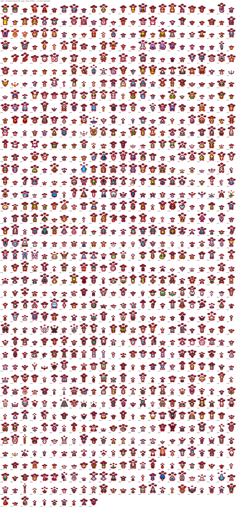


# sprite/ — sprites Dynamax de tous les Pokémon animés de SpriteCollab





**979 espèces**, 882,297 cases, 666 Mo — toutes celles dont le dossier `sprite/<dex>/` du dépôt
[PMDCollab/SpriteCollab](https://github.com/PMDCollab/SpriteCollab) (commit `db1928346e45`) contient un
`AnimData.xml` (forme de base, apparence normale ; le gabarit `0000` Missingno est laissé de côté), plus Falinks
(escouade) et Zarude de ce dépôt (`personnages/`), absents de SpriteCollab. Pour chacune, **toutes ses animations**
sont reprises (noms, index, `CopyOf`, durées, `RushFrame` / `HitFrame` / `ReturnFrame`, déplacements de l'ancre) et
transformées en version Dynamax :

1. **agrandissement × 3** au plus proche voisin — aucun pixel du Pokémon redessiné ;
2. **aura rouge animée** collée à la silhouette (anneau plein + anneau tramé dont le motif remonte à chaque image
   + langues extérieures) — deux couleurs ajoutées, (232, 40, 72) et (255, 144, 128) ;
3. **trois nuages-cyclones rouges** qui tournent au-dessus de la tête (un tiers de tour par cycle d'animation : la
   boucle est continue ; volute à trois phases ; la moitié arrière de l'anneau passe derrière le corps ; ils suivent
   le point le plus haut de chaque image, donc les sauts et le sommeil) — contour = couleur la plus sombre du sprite ;
   petits nuages (gabarit **M**) si le corps fait moins de 24 px de large ou de 20 px de haut à l'échelle 1, grands (**L**) sinon ;
4. repères d'Offsets et ancre de Shadow replacés à l'échelle, gabarit d'ombre agrandi, `ShadowSize` 2 ;
5. cases élargies par pas de 8, ancre au repos en (largeur / 2, hauteur / 2 + 4).

Chaque dossier `sprite/<dex>_<slug>/` (slug = nom français) contient `AnimData.xml`, `<Anim>-Anim.png` /
`-Offsets.png` / `-Shadow.png` (PNG indexés, mêmes pixels qu'en RGBA) et `credits.txt` (crédits SpriteCollab repris
tels quels + ligne Dynamax). `index.json` résume tout (nom, animations, cases, couleurs, gabarit, licence, taille).

## La transformation : `vfx/`

L'**animation de transformation** est un VFX à part, **sans personnage ni fond**, dessiné image par image
(12 images, 1 s) en deux gabarits : [`vfx/`](vfx/README.md). En jeu : `Transformation-<gabarit>` à l'ancre du sprite
normal → image 3 : masquer le sprite normal → image 9 (`HitFrame`) : afficher le sprite Dynamax de ce dossier (il
porte déjà aura et nuages) → image 12 : fin du VFX. Le gabarit d'une espèce est dans `index.json` (`petits_nuages`
= M).

## Reproduire, vérifier

```
python3 source/sprite/build_dynamax.py --tous            # clone SpriteCollab en sparse dans /tmp/spritecollab, ~1 h sur 2 cœurs
python3 source/sprite/build_dynamax.py 0025 0297         # quelques espèces
python3 source/sprite/build_vfx.py                       # le VFX de transformation
python3 source/sprite/verify_dynamax.py --tous           # contrôles (règles SpriteBot + chaque pixel source retrouvé × 3)
python3 source/sprite/apercu.py                          # cette planche, le GIF, ce README
```

Le vérificateur rejoue les contrôles du SpriteBot (index, `CopyOf`, tailles de feuilles, 1 ou 8 lignes, colonnes =
durées, alpha binaire, un blanc par case, un pixel par repère) et vérifie que chaque pixel de l'origine se retrouve
agrandi à sa place (seuls les pixels recouverts par un nuage de premier plan diffèrent : moins de 8 % du corps sur
l'espèce, jamais plus de 35 % sur une image ; avertissement au-delà de 20 % — ailes déployées, sommeil à plat), que
l'ancre et les repères sont ceux de l'origine × 3, que durées, index et `CopyOf` sont identiques, et que la palette
= palette d'origine + aura. Résumé dans `controle_qualite.json`.

## Licences

Les sprites dérivent de SpriteCollab et cumulent les licences des contributions en vigueur de leur original
(reprises ligne à ligne dans `credits.txt` ; colonne « Licence » de `especes.md`, « + » = plusieurs auteurs) :
Unspecified : 488, CC_BY-NC_4 : 340, PMDCollab_1 : 265, PMDCollab_2 : 119. « Unspecified » = sprite original des
jeux (CHUNSOFT / Spike Chunsoft), usage de fan non commercial uniquement ; PMDCollab_1 / PMDCollab_2 / CC BY-NC 4.0 =
usage non commercial avec crédit des auteurs (politique de SpriteCollab : CC BY-NC 4.0). Les formes Dynamax ne sont pas
des formes officielles acceptées par SpriteCollab : ces sprites n'y ont été ni soumis ni approuvés.

## Espèces

La liste complète (dossier, nom, animations, cases, couleurs, gabarit, licence) est dans [`especes.md`](especes.md) ;
la même chose en données dans `index.json`.
