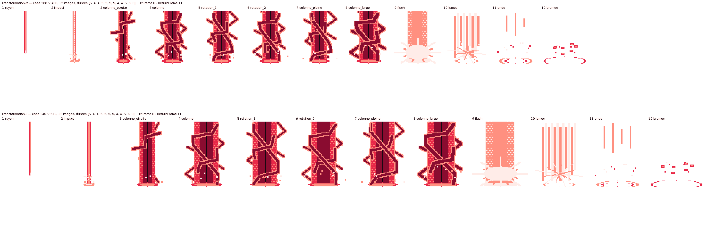

# VFX Transformation Dynamax — image par image, effet seul

Effet de transformation joué **par-dessus** n'importe quel sprite quand la Dynamax s'active : **aucun personnage,
aucun fond** — 12 images dessinées une à une à l'échelle 1 et agrandies × 3 comme les sprites de
`sprite/`. Deux gabarits : `Transformation-M` (corps < 24 px de large ou < 20 px de haut à l'échelle 1) et `Transformation-L`
(au-delà) ; `sprite/index.json` donne `petits_nuages` (= gabarit M) pour chaque espèce. Cases : Transformation-M : 200 × 408 px · Transformation-L : 240 × 512 px.
Durée totale 60 ticks (1/60 s) ≈ 1.0 s.

| # | Image | Ticks | Contenu |
| --- | --- | --- | --- |
| 1 | `rayon` | 5 | rayon fin qui descend du ciel, pointe blanche au-dessus de la tête |
| 2 | `impact` | 4 | le rayon touche le sol : impact clair, éclat à hauteur de tête, premières étincelles |
| 3 | `colonne_etroite` | 4 | la colonne s'élève (étroite), premier éclair épais — **masquer le sprite normal** |
| 4 | `colonne` | 5 | colonne large, deux éclairs en hélice qui s'abattent |
| 5 | `rotation_1` | 5 | les éclairs tournent d'un quart de tour, disque d'énergie au pied |
| 6 | `rotation_2` | 5 | un demi-tour, étincelles projetées plus haut |
| 7 | `colonne_pleine` | 5 | trois quarts de tour, troisième éclair court en haut |
| 8 | `colonne_large` | 4 | la colonne s'élargit, éclairs au plus épais |
| 9 | `flash` | 4 | **FLASH** (`HitFrame`) : colonne blanche, éclat en étoile — **afficher le sprite Dynamax** |
| 10 | `lames` | 5 | la colonne se dissout en lames de lumière qui montent |
| 11 | `onde` | 6 | onde de choc au sol, dernières lames |
| 12 | `brumes` | 8 | brumes rouges qui montent vers la tête (`ReturnFrame` : le VFX rend la main) |

## Séquence en jeu

1. Le Pokémon (sprite SpriteCollab normal) est à l'arrêt. Lancer `Transformation-<gabarit>` avec l'**ancre sur son
   sol** (pixel blanc de sa feuille Shadow), dessinée par-dessus.
2. Image 3 : la colonne est opaque → **masquer le sprite normal**.
3. Image 9 (`HitFrame` = 8) : le flash → **afficher le sprite Dynamax** de `sprite/<dex>_<slug>/`, même ancre.
   Il porte déjà l'aura rouge animée et les trois nuages qui tournent : rien d'autre à superposer.
4. Image 12 (`ReturnFrame` = 11) : le VFX se termine sur des brumes qui montent vers les nuages du sprite.

## Format

Palette : 5 couleurs opaques — sombre (20, 8, 16), cramoisi (138, 12, 48), rouge (232, 40, 72), claire
(255, 144, 128), blanc (255, 236, 232) ; aucune transparence partielle, fond alpha 0. Feuilles à une ligne (un VFX
n'a pas d'orientation) ; `AnimData.xml` façon SpriteCollab (index 13 et 14, hors des index réservés) ;
`*-Offsets.png` (centre vert) et `*-Shadow.png` (pixel blanc) portent l'ancre pour les lecteurs SpriteCollab /
SkyTemple ; `apercu.png` (les douze images, étiquetées) et `apercu.gif` (lecture M et L côte à côte) sont sur fond
transparent. Reconstruire : `python3 source/sprite/build_vfx.py`.
