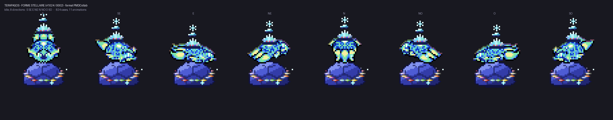

# Terapagos — Forme Stellaire (#1024, forme 0002)

Sprite au format **PMDCollab / SpriteCollab** pour la forme Stellaire de
Terapagos, qui n'existe pas dans le dépôt officiel. Le dossier
`sprite/1024/0002/` est prêt à être déposé tel quel dans une arborescence
SpriteCollab.



| | |
|---|---|
| Animations | 11 planches + 2 alias `CopyOf` (`Strike`, `SpAttack`) |
| Cases | 824, en 8 directions |
| `ShadowSize` | 2 (grande — le dôme couvre une large emprise au sol) |
| Fichiers | `AnimData.xml`, et par animation `-Anim.png`, `-Offsets.png`, `-Shadow.png` |
| Sources éditables | `aseprite/<Animation>.aseprite`, 7 calques séparés |

## Comment il a été construit

Les sources officielles sont explicites : en forme Stellaire, **le corps de
Terapagos est identique à celui de sa forme Terastal**. Ce qui change est ce
qui l'entoure. Le sprite est donc composé sur les planches Terastal de
SpriteCollab (`sprite/1024/0001/`), avec sept couches générées par-dessus :

| Calque | Contenu |
|---|---|
| `gemmes_arriere` | les gemmes de type passées derrière le dôme |
| `dome` | dôme de cristal indigo à facettes hexagonales, posé au sol |
| `corps` | le corps Terastal, symboles de type virés au cyan, liseré irisé |
| `couronne` | la gemme centrale de la carapace prolongée en couronne sertie |
| `astre` | Terapagos miniature en cristal et symbole Terastal, en lévitation |
| `gemmes_avant` | les gemmes de type passées devant le dôme |
| `etincelles` | scintillements |

Chaque élément est placé à partir des données du format, pas à la main :

* **Le dôme** est ancré sur le pixel blanc de `Shadow.png`, qui donne le centre
  au sol de la case. Il suit donc automatiquement le Pokémon quand il bondit ou
  se déplace dans sa case (`Hop`, `Attack`, `Double`).
* **Le corps** est remonté pour poser sur la calotte. Le décalage est calculé
  une fois **par direction**, puis appliqué à toutes les images de cette
  direction : le mouvement propre de l'animation est intégralement conservé.
* **Les dix-huit gemmes** tournent autour du dôme, une par type, dans les
  couleurs canoniques. Leur phase suit l'index de l'image, et celles dont
  l'orbite passe derrière sont dessinées sous le dôme.
* **La couronne et l'astre** sont ancrés sur le sommet de la silhouette du
  corps, avec une lévitation sinusoïdale indexée sur l'animation.
* **`Offsets.png`** reprend les quatre marqueurs de la forme Terastal, décalés
  exactement comme le corps : tête, centre et mains restent justes.
* **`Shadow.png`** est reconstruit à l'emprise du dôme, avec ses trois zones
  (petite, normale, grande) et le pixel blanc de centre au sol.

La grille est agrandie de 8 px à gauche et à droite, 22 px en haut et 8 px en
bas, pour loger le dôme et la couronne. Toutes les dimensions restent paires,
comme l'exige le format.

## Vérification

```
ShadowSize: 2
  Walk       56x78   6x8   OK        Idle       56x78  13x8   OK
  Attack     88x86  17x8   OK        Swing     104x102  9x8   OK
  Shoot      56x70  10x8   OK        Double     80x86  16x8   OK
  Sleep      56x62   8x1   OK        Hop        56x118 10x8   OK
  Hurt       64x78   2x8   OK        Charge     56x70  10x8   OK
  Rotate     56x70   9x8   OK
conformité: OK — 824 cases
```

Contrôles passés : dimensions paires, les trois planches d'une animation
strictement de même taille, grille exacte, une durée par colonne, 1 ou 8
lignes, **un unique pixel de chaque marqueur par case** pour les quatre
couleurs d'`Offsets.png`, et un unique pixel blanc de centre au sol par case
dans `Shadow.png`.

## Régénérer

```bash
export SPRITECOLLAB=~/sc_tmp
python3 ../foulards_pmd/outils/terapagos_stellaire.py
```

Le script ne vide que `sprite/` et `aseprite/`, les deux dossiers qu'il produit :
le README et les aperçus sont préservés d'un appel à l'autre.

## Portée et limites

* Le corps réutilise les planches Terastal de SpriteCollab. C'est fidèle aux
  sources officielles, mais cela signifie que la forme Stellaire hérite des
  poses de la Terastal : elle ne lévite pas *différemment*, elle ne fait que
  flotter au-dessus de son dôme.
* Les animations absentes de la forme Terastal (`Faint`, `Sleep` étendu, etc.)
  le restent ici.
* Ce sprite est un **ajout non officiel**. La politique de SpriteCollab
  n'accepte pas les formes non officielles ; la forme Stellaire est bien
  officielle, mais une soumission au dépôt passerait par leur circuit de
  validation et demanderait vraisemblablement un travail à la main.

## Licence et crédits

Le corps dérive des planches Terastal de **PMDCollab/SpriteCollab**, publiées
sous **CC BY-NC 4.0** — usage non commercial, attribution obligatoire. Les
crédits d'origine sont conservés dans `sprite/1024/0002/credits.txt`. Le dôme,
la couronne, les gemmes, l'astre et les étincelles sont une création originale
de ce dépôt.

Terapagos et la série Pokémon Mystery Dungeon appartiennent à Spike Chunsoft /
The Pokémon Company / Nintendo.

La lecture du design s'appuie sur l'artwork officiel de la forme Stellaire.
Aucun pixel de fan art tiers n'a été repris.
