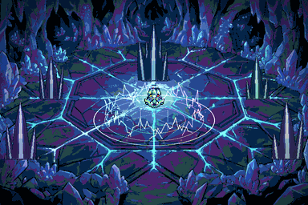

# Sanctuaire de Terapagos — zone de boss

Décor et effets visuels de l'arène où Terapagos passe de sa forme Terastal à
sa forme Stellaire. Tout est généré ici, rien n'est repris d'un pack existant :
sol, piliers, cercle, effets et sons sont produits par
`outils/generer_zone.py` et `outils/sons.py`.



## Contenu

| Dossier | Contenu |
|---|---|
| `decor/` | un PNG par calque, plus `arene.png` composée et `piliers_variantes.png` |
| `vfx/` | feuilles de sprites : `transformation`, `sphere`, `cercle_foudre`, `colonne_lumiere` |
| `aseprite/` | sources éditables, **multi-calques et multi-images** |
| `sons/` | six effets de synthèse en WAV 16 bits 44,1 kHz stéréo |
| `apercus/` | GIF de contrôle |
| `sources_ia/` | planches peintes servant de base au décor, avant pixelisation |

L'arène fait **768 × 512**, multiple de la grille 8 px du projet
(`kit.json: grille_px = 8`), et suit la convention de nommage des calques des
salles existantes.

## De la peinture au pixel art

Le fond de la caverne part d'une planche peinte (`sources_ia/fond_caverne.png`),
convertie par `outils/pixelisation.py`. Une image générée n'est pas du pixel
art : elle est lissée, dégradée et compte des milliers de couleurs. La chaîne
fait quatre choses, dans cet ordre, et l'ordre compte :

1. **Cadrage** au rapport de la salle, puis réduction à 768 × 512 — un pixel de
   l'image devient un pixel du jeu.
2. **Recalage colorimétrique** : la génération tire au magenta ; la dominante
   est ramenée vers l'indigo et la luminosité baissée. Sans ce passage le fond
   jure avec la palette de Terapagos et écrase les effets posés dessus.
3. **Filtre médian puis postérisation** : le médian retire le moucheté, la
   postérisation écrase les dégradés en paliers francs.
4. **Quantification adaptative sur 30 couleurs, sans tramage.** Le tramage est
   volontairement désactivé : à cette échelle il produit un bruit qui ne se lit
   pas comme du pixel art.

Les **veines lumineuses** ne sont pas redessinées : elles sont extraites de la
planche peinte par détection des pixels cyan clairs, puis animées là où le
peintre les a placées. Le procédural épouse ainsi le dessin au lieu de le
contredire.

Les piliers, eux, restent procéduraux : la découpe automatique de la planche de
références n'a pas su les isoler proprement, et les grappes générées se
composent mieux avec la caverne peinte.

## Les onze calques de l'arène

| Calque | Rôle |
|---|---|
| `00_vide` | néant bleuté du fond, dégradé vers le centre |
| `01_sol_cristal` | dallage de cristal |
| `02_veines` | veines lumineuses qui courent dans les arêtes — **animé** |
| `03_piliers_arriere` | piliers du fond |
| `04_cercle_rituel` | cercle au sol, 18 repères de type — **animé** |
| `05_boss` | Terapagos |
| `06_piliers_avant` | piliers du premier plan |
| `07_colonnes_lumiere` | colonnes arc-en-ciel et halos des piliers — **animé** |
| `08_cercle_foudre` | anneau de foudre autour du boss — **animé** |
| `09_sphere` | sphère d'enveloppement, vide hors transformation |
| `10_eclairage` | vignette froide, posée en dernier |

### Ce que contient réellement le fichier Aseprite

`aseprite/arene.aseprite` n'est pas un simple empilement d'images. L'écrivain
du dépôt a été étendu pour produire :

* **des groupes de calques** — `DECOR`, `SCENE`, `LUMIERE` — repliables ;
* **des modes de fusion par calque** : les veines, le cercle rituel, les
  colonnes, la foudre et la sphère sont en **Addition**, l'éclairage en
  **Multiply**. La lumière s'accumule donc réellement dans Aseprite, comme dans
  le moteur, au lieu d'être aplatie à l'export ;
* **des opacités par calque** (sphère à 235, éclairage à 210) ;
* **une palette embarquée** : les 30 couleurs du décor plus 12 teintes
  arc-en-ciel de référence ;
* **des tags d'animation**. `arene.aseprite` porte le tag `ambiance` sur ses
  12 images ; `transformation.aseprite` porte **un tag par phase** — `appel`,
  `montee`, `enveloppe`, `suspens`, `eclat`, `revelation` — donc chaque temps
  de la séquence se rejoue isolément depuis la barre de tags.

Le rendu PNG composé applique les mêmes modes de fusion que le fichier
Aseprite, les deux restent donc cohérents.

## Comment le décor est fabriqué

* **Le sol** est un pavage de Voronoï sur une grille perturbée : chaque cellule
  reçoit sa propre valeur, ses arêtes sont creusées d'un ton très sombre et une
  lèvre claire est posée d'un seul côté. C'est cette asymétrie qui fait lire
  « cristal taillé » plutôt que « dallage de pierre ». L'éclairement décroît
  vers les bords, ce qui recentre le regard sur l'aire de combat.
* **Les piliers** ne sont pas des cônes mais des **grappes** : trois à cinq
  éclats de hauteurs, largeurs et inclinaisons tirées au sort, plantés dans un
  socle de débris, l'éclat maître dessiné en dernier. Chacun est facetté
  verticalement avec un cœur lumineux, puis cerné d'un contour sombre — sans ce
  contour le cristal se dilue dans le sol.
* **Le cercle rituel** superpose trois anneaux tournant à des vitesses et dans
  des sens différents, dix-huit repères — un par type — et un hexagramme
  intérieur. Les teintes défilent, ce qui suffit à l'animer sans redessiner.
* **Les colonnes de lumière** et **l'anneau de foudre** sont en mélange
  **additif** : la lumière s'accumule au lieu de recouvrir. L'anneau retire une
  graine aléatoire différente à chaque image, d'où le grésillement.

## La transformation

`vfx/transformation-Anim.png` — 32 images de 208 × 248, une par colonne.
La séquence est découpée en six phases :

| Phase | Images | Ce qui se passe | Son, à partir de |
|---|---|---|---|
| appel | 6 | le cercle s'allume, l'énergie converge | 0,00 s |
| montée | 6 | Terapagos s'élève, des traits jaillissent | 0,00 s |
| enveloppe | 6 | la sphère de cristal se referme sur lui | 1,80 s |
| suspens | 3 | tout se fige, l'image blanchit | 2,85 s |
| éclat | 4 | la sphère se fracture, les éclats partent | 3,10 s |
| révélation | 7 | la forme Stellaire, colonnes et foudre | 3,30 s |

Le calage est donné pour `sons/transformation.wav` à 110 ms par image.

## Les sons

Synthèse intégrale au signal, sans échantillon : partiels **inharmoniques** à
décroissances séparées pour le cristal — les aigus s'éteignent plus vite, c'est
ce qui donne le timbre —, balayages de fréquence pour la montée, salves de
bruit filtré pour la foudre, et réverbération par convolution.

| Fichier | Durée | Usage |
|---|---|---|
| `ambiance_arene.wav` | 13,3 s | nappe de fond, **bouclable** |
| `transformation.wav` | 7,8 s | la séquence complète |
| `cercle_foudre.wav` | 2,7 s | anneau de foudre, **bouclable** |
| `colonne_lumiere.wav` | 4,0 s | jaillissement d'une colonne |
| `pilier_resonance.wav` | 4,6 s | impact sur un pilier |
| `impact_stellaire.wav` | 5,4 s | l'attaque du boss |

Les deux nappes bouclables ont leur queue fondue sur leur début, elles
s'enchaînent donc sans couture.

## Régénérer

```bash
export SPRITECOLLAB=~/sc_tmp
python3 outils/generer_zone.py     # décor, effets, aseprite, aperçus et sons
```

Dépendances : `Pillow`, `numpy`. Environ 50 s.

## Limites

* Le sol est une image de fond, pas un tileset : la salle est fixe, comme les
  douze salles de la guilde. Un découpage en tuiles réutilisables demanderait
  de contraindre le Voronoï à se répéter aux bords.
* La sphère et les éclats sont calculés pixel par pixel en Python ; c'est le
  poste le plus lent de la génération.
* Les sons sont des maquettes fonctionnelles, pas un travail de sound design
  final : ils sont justes en timbre et en calage, mais un vrai mixage gagnerait
  à passer par un outil dédié.

## Crédits

Décor, effets et sons : création originale de ce dépôt. Le sprite de Terapagos
en forme Stellaire vient de `../terapagos_stellaire/`, lui-même dérivé des
planches Terastal de **PMDCollab/SpriteCollab** (CC BY-NC 4.0). Terapagos et la
série Pokémon Mystery Dungeon appartiennent à Spike Chunsoft / The Pokémon
Company / Nintendo.
