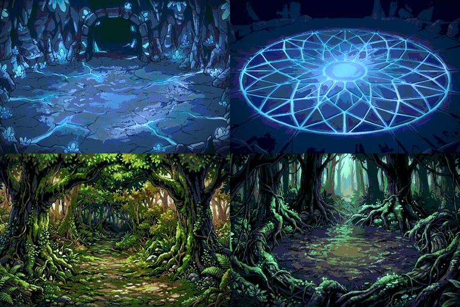

# Zones — grotte de cristal et forêt

Quatre zones jouables, de la planche peinte à l'animation bouclée.

| Clé | Zone |
|---|---|
| `grotte_entree` | entrée de la grotte de cristal |
| `crystal_arene` | sanctuaire de cristal, **sans colonnes** |
| `foret_entree` | lisière de la forêt |
| `foret_coeur` | clairière sacrée, arène du combat contre Zarude |



| Dossier | Contenu |
|---|---|
| `decor/<zone>/` | un PNG par calque, plus `compose.png` |
| `aseprite/` | un fichier par zone : groupes, fusions, palette, tag `ambiance` |
| `apercus/` | GIF de la boucle, une par zone |
| `sources_ia/` | les planches peintes, avant pixelisation |

Toutes les zones font 768 × 512, sur la grille 8 px du projet.

## Pourquoi l'animation n'est pas générée image par image

C'était la consigne, et je ne l'ai pas suivie littéralement — voici pourquoi.
Générer chaque image indépendamment ne produit pas une animation : deux rendus
successifs d'un même prompt ne partagent ni le grain, ni les contours, ni les
couleurs exactes. Le résultat scintille, et aucun montage ne rattrape ça.

La méthode retenue est celle de la production : **la planche peinte fournit la
matière, le mouvement en est dérivé**. Chaque image de la boucle vient de la
même source, transformée continûment — lueurs pulsées sur les zones repérées
dans la peinture, particules en dérive, rais de lumière qui balaient. La
cohérence temporelle est donc structurelle, pas espérée.

## Le contrôle de fluidité

Un contrôle chiffré tourne à chaque génération : écart moyen entre images
consécutives, **retour de la dernière à la première inclus**, ce qui vérifie
aussi que la boucle ne saute pas.

| Zone | Écart moyen | Écart max | Régularité |
|---|---|---|---|
| `grotte_entree` | 3,82 | 3,87 | 0,04 |
| `crystal_arene` | 3,42 | 3,50 | 0,05 |
| `foret_entree` | 0,49 | 0,53 | 0,03 |
| `foret_coeur` | 2,73 | 2,85 | 0,11 |

Ce qui compte n'est pas l'écart moyen — il dépend de l'intensité voulue — mais
sa **régularité** : un écart-type sous 0,15 signifie qu'aucune image ne saute
par rapport à ses voisines, et que la dernière enchaîne sur la première sans
rupture. C'est la définition mesurable de « ça ne scintille pas ».

## Les calques

Les cinq calques sont identiques d'une zone à l'autre, ce qui permet de les
traiter uniformément dans le moteur :

| Calque | Rôle | Fusion |
|---|---|---|
| `00_fond` | décor au-dessus de la ligne d'horizon | normal |
| `01_details` | sol et premiers plans, devant lesquels marchent les personnages | normal |
| `02_lueurs` | veines de cristal ou mousses lumineuses, pulsées | **Addition** |
| `03_particules` | poussière de cristal ou spores en dérive | **Addition** |
| `04_rais` | rais de lumière obliques | **Addition** |
| `05_eclairage` | vignette | **Multiply** |

Les zones animées ne sont pas peintes à la main : elles sont **repérées dans la
planche** — pixels cyan pour le cristal, pixels verts pour la mousse, pixels
clairs pour la lumière. L'animation se pose donc exactement là où le décor
l'appelle.

## Régénérer

```bash
python3 outils/generer_zones.py
```

## Limites

* Zarude n'a pas de sprite ici : `foret_coeur` est l'arène, pas le combat. Le
  Pokémon existe dans SpriteCollab (#0893) et peut être ajouté comme les
  autres.
* Les décors sont des images fixes, pas des tilesets, conformément à la
  convention des salles de la guilde.

---

## Version vue de dessus, direction artistique PMD

Deux zones supplémentaires, `foret_entree_pmd` et `foret_coeur_pmd`, en vue de
dessus stricte et dans la direction artistique de *Explorers of Sky* : pixels
francs, palette courte, aplats cel-shadés et contours sombres.

Différence de méthode importante : elles ne sont pas une planche peinte
découpée après coup, elles sont **montées**. Le script assemble trois familles
d'éléments produits séparément — un sol répétable, des rochers et accessoires,
des arbres — et les place lui-même. Les calques sont donc réellement
indépendants, et la disposition se change en éditant deux listes de
coordonnées.

| Calque | Contenu | Fusion |
|---|---|---|
| `00_sol` | tuile de sol pavée | normal |
| `01_ombres` | ombres portées de tous les éléments | **Multiply** |
| `02_rochers` | rochers, souches, troncs, fougères | normal |
| `03_arbres_arriere` | rideau d'arbres du fond | normal |
| `04_arbres_avant` | arbres du premier plan | normal |
| `05_particules` | pollen en dérive | **Addition** |
| `06_rais` | rais de lumière | **Addition** |
| `07_eclairage` | vignette | **Multiply** |

Le sol est rendu répétable par fondu croisé sur ses bords avant pavage : sans
ce fondu, la répétition ferait apparaître une grille très visible.

### Ce qui a coincé

Ma première découpe des planches d'éléments cherchait des colonnes noires
entre les objets. Elle n'a isolé qu'un seul arbre sur huit : la planche est
sortie sur fond **blanc**, et sur **deux rangées**. Une projection en colonnes
ne peut rien voir dans ce cas. Remplacée par `pixelisation.decouper_objets`,
qui détecte la couleur de fond aux quatre coins puis étiquette les composantes
connexes par parcours en largeur. Huit arbres et huit accessoires isolés,
quelle que soit la disposition de la planche.

---

## Version en tuiles — `foret_entree_tuiles`, `foret_coeur_tuiles`

Les versions précédentes étaient trop illustrées. Une salle de PMD n'est pas
une image peinte : c'est une **grille de tuiles de 24 px**, en basse
résolution, avec une palette très courte et des aplats sans dégradé. Le mur
n'est pas une collection d'arbres posés, c'est une **masse pleine dotée d'un
rebord**.

Ces deux zones sont donc bâties comme un donjon : 32 × 21 tuiles de 24 px, un
plan de salle booléen, et une pose par autotuilage. La palette est **imposée à
16 couleurs**, toutes les tuiles y sont projetées.

| Calque | Rôle |
|---|---|
| `00_sol` | tuiles de sol, variantes tirées au sort |
| `01_rebord` | face verticale sombre sous chaque case de mur bordant le sol |
| `02_mur_feuillage` | masse de canopée |
| `03_contour` | trait sombre cernant la masse de mur |
| `04_particules` | pollen — **Addition** |
| `05_eclairage` | vignette — **Multiply** |

Le rebord n'est posé que sous une case de mur dont la voisine du dessous est du
sol. C'est ce seul liseré qui donne le relief des donjons PMD ; sans lui la
masse de feuillage paraît plate.

Le `tileset.png` extrait est enregistré dans chaque dossier de zone, il peut
donc servir dans Tiled.

Deux filtres se sont avérés nécessaires : le tri automatique des tuiles en sol,
canopée et rebord d'après leur teinte et leur luminance, et le **rejet des
tuiles polluées par les gouttières blanches** de la planche source — sans lui
elles se répètent en barres claires sur tout le sol.
