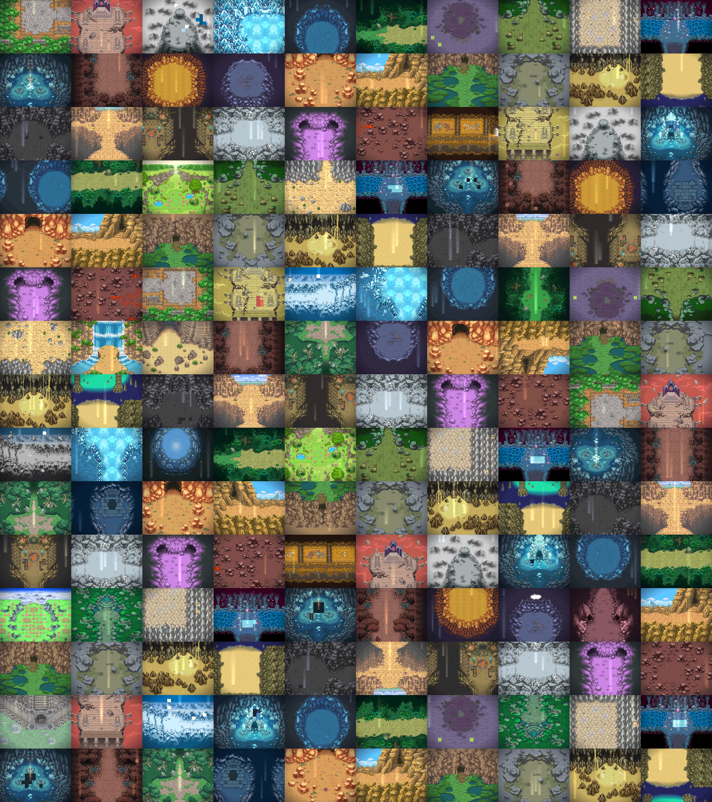

# 150 zones PMD — tuiles d'origine, animation par rotation de palette

150 salles jouables dans la direction artistique exacte de *Pokémon Mystery
Dungeon: Explorers of Sky*, en calques séparés, avec eau, lave, lumière et
poussière animées à la manière des consoles Nintendo.



| Dossier | Contenu |
|---|---|
| `zones/<NNN>_<donjon>_<variante>/` | 7 calques PNG, `compose.png`, `zone.aseprite`, `cycles.json` |
| `apercus/` | 16 GIF de démonstration et la planche des 150 |
| `manifeste.json` | biome, donjon source, liquide, taux de praticabilité de chaque zone |
| `outils/` | `banque.py`, `generer_zones_pmd.py` |

Chaque zone fait **480 × 360**, soit 20 × 15 tuiles de 24 px — le pas de
tuile réel de PMD.

## D'où vient la texture

Les rendus de PMD Sky présents dans `PMD-SKY-PMDO-PORT` sont de **vraies
tilemaps** : les 257 cartes examinées sont toutes alignées sur 24 px, sans
exception. Chaque zone est donc **prélevée dans une carte réelle** — une
fenêtre de 20 × 15 tuiles, éventuellement retournée ou pivotée — puis enrichie
de calques d'effets.

### Pourquoi pas une reconstruction tuile par tuile

C'était la première approche, et elle a échoué. L'idée était d'apprendre
l'autotuilage depuis les cartes : classer chaque tuile en sol, lisière ou
masse, ranger les lisières par signature de voisinage sur 8 bits, puis
reposer le tout sur un plan de salle neuf. Le mécanisme fonctionnait, mais la
classification, elle, ne tenait pas : sur les sols variés — herbe fleurie,
gravier, mousse — aucune tuile n'est assez fréquente pour être reconnue comme
sol, tout part dans le sac « mur », et la salle produite devient un patchwork.

Trois filtres successifs ont été tentés avant d'abandonner cette voie. Le code
reste dans `banque.py`, il sert toujours à extraire les accessoires isolés.

Prélever une fenêtre garantit au contraire une cohérence parfaite : l'agencement
vient du jeu lui-même. La variété vient du nombre de cartes, des positions de
découpe et des symétries.

## L'animation, à la manière du matériel

Rien n'est redessiné d'une image à l'autre : c'est la **palette qui tourne**.
Les liquides et les puits de lumière sont convertis en couleurs indexées,
triées par luminance, et chaque image permute un petit groupe d'indices. C'est
la technique d'origine du GBA et de la DS — coût quasi nul, et c'est
exactement ce scintillement qui signe l'eau et la lave de ces jeux.

Chaque zone livre son `cycles.json` :

```json
{
  "principe": "rotation de palette, une permutation par image",
  "images": 8, "duree_ms": 110,
  "liquide": { "type": "eau", "palette": ["#1A3A5E", "…"],
               "plage_cyclee": [3, 10], "pas_par_image": 1 },
  "lumiere": { "plage_cyclee": [4, 8], "pas_par_image": 0.5 }
}
```

Le moteur n'a donc qu'à faire tourner ces indices : aucune image
supplémentaire à charger. C'est aussi pour cette raison que le `.aseprite` ne
contient **qu'une seule image** — les huit dupliquaient le calque de sol et
faisaient passer le dossier de 38 à 124 Mo sans rien apporter.

## Les sept calques

| Calque | Contenu | Fusion |
|---|---|---|
| `00_sol` | la salle prélevée : terrain, murs, décor peint | normal |
| `01_liquide` | nappe d'eau ou de lave | normal, **palette cyclée** |
| `02_mur` | réservé aux ajouts manuels | normal |
| `03_decor` | accessoires isolés appris sur les cartes | normal |
| `04_lumiere` | puits de lumière teintés par biome | **Addition**, palette cyclée |
| `05_particules` | poussière en dérive | **Addition** |
| `06_eclairage` | vignette | **Multiply** |

Les accessoires ne sont pas dessinés : ce sont les tuiles qui, dans les cartes
d'origine, apparaissent **entourées de huit cases de sol** — donc des objets
posés, rochers ou plantes, et non des morceaux de mur.

## Biomes

Les 459 rendus sont classés automatiquement par statistiques de teinte, de
saturation et de luminance. La répartition obtenue :

| Biome | Zones | | Biome | Zones |
|---|---|---|---|---|
| désert | 41 | | glace | 12 |
| lave | 40 | | eau | 12 |
| forêt | 30 | | cristal | 10 |
| pierre | 5 | | | |

Le biome pilote la teinte de la lumière, celle de la poussière, et le type de
liquide autorisé.

## Trois garde-fous, tous nés d'un défaut constaté

* **Cartes de remplissage.** Certaines cartes du jeu sont des aplats unis. Un
  contrôle de richesse rejette toute découpe comptant moins de 10 tuiles
  distinctes ou moins de 55 % de pixels non noirs, et retente ailleurs.
* **Décors de scène.** Les cartes de village et de cinématique sont des
  illustrations uniques, pas des tilemaps. Seuls les noms en `d<numéro>p<numéro>`
  sont retenus, et la dominance de leur tuile de sol doit rester dans une
  fourchette : trop basse, c'est une illustration ; trop haute, un aplat.
* **Liquide flottant.** Une tuile d'eau n'est posée que si au moins sept de ses
  huit voisines sont praticables. Sans cette vérification, des carrés d'eau
  apparaissaient au milieu des murs. Si moins de quatre tuiles passent, la
  nappe est annulée.

## Régénérer

```bash
export PMD_PREVIEWS=~/sky_port/output/Previews
python3 outils/generer_zones_pmd.py 150
```

Environ deux minutes. Le nombre de zones est l'argument.

## Limites

* Le plan des salles n'est pas inventé : il vient des cartes d'origine. Les
  dix générateurs de plan écrits pour la première approche — ovale, croix,
  couloir, grotte, anneau, spirale, labyrinthe… — sont conservés dans le code
  et redeviendront utiles le jour où la reconstruction tuile par tuile sera
  fiabilisée.
* Le calque `02_mur` est vide : dans une salle prélevée, les murs font déjà
  partie de `00_sol`. Il est laissé en place pour les ajouts manuels.

## Crédits

Les tuiles proviennent de *Pokémon Mystery Dungeon: Explorers of Sky*,
propriété de Spike Chunsoft, The Pokémon Company et Nintendo, via le port
PMDO du dépôt `meromoonmeri/PMD-SKY-PMDO-PORT`. Usage en fan game non
commercial. Les calques d'effets, la chaîne de production et les cycles de
palette sont une création originale de ce dépôt.
